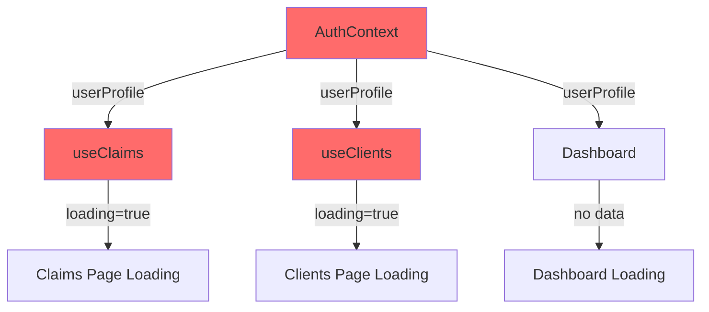

# ClaimGuru Application Comprehensive Audit Report

**Audit Date:** July 22, 2025  
**Application URL:** https://btu2v828vjul.space.minimax.io  
**Audit Scope:** Complete system functionality and production readiness assessment

---

## 🚨 CRITICAL FINDINGS - SYSTEM STATUS: NON-FUNCTIONAL

### **Root Cause Analysis**

The ClaimGuru application is currently **completely non-functional** due to a critical authentication and data loading failure that creates infinite loading states across all application sections.

#### **Primary Issue: Authentication System Failure**

**Technical Root Cause:**
1. **Demo Mode Disabled**: `isDemoMode = false` in `AuthContext.tsx` (line 23)
2. **No Authenticated User**: Application expects real Supabase authentication but no user is logged in
3. **Null User Profile**: `userProfile` remains `null` throughout the application lifecycle
4. **Data Loading Dependency Failure**: All data hooks (`useClaims`, `useClients`) depend on `userProfile?.organization_id`
5. **Infinite Loading State**: Hooks never execute their loading functions, leaving `loading = true` permanently

**Code Analysis:**
```typescript
// AuthContext.tsx - Line 23
const isDemoMode = false // This blocks demo functionality

// useClaims.ts - Line 13-17
useEffect(() => {
  if (userProfile?.organization_id) {  // This condition fails
    loadClaims()
  }
}, [userProfile?.organization_id])  // userProfile is always null
```

**Database Verification:**
- ✅ Database connectivity working
- ✅ User data exists: `josh@dcsclaim.com` (ID: d03912b1-c00e-4915-b4fd-90a2e17f62a2)
- ✅ Organization exists: `6b7b6902-4cf0-40a1-bea0-f5c1dd9fa2d5`
- ✅ Sample data available: 1 client record found

---

## 📊 COMPREHENSIVE FUNCTIONALITY ASSESSMENT

### **🔴 CRITICAL (P0) - BLOCKING ALL FUNCTIONALITY**

| Component | Status | Issue | Impact |
|-----------|--------|-------|--------|
| **Authentication System** | ❌ BROKEN | No user authentication mechanism | Blocks entire application |
| **Dashboard** | ❌ BROKEN | Infinite loading state | Cannot access main interface |
| **Claims Management** | ❌ BROKEN | Data hooks fail to load | Core functionality unusable |
| **Client Management** | ❌ BROKEN | Data hooks fail to load | Cannot manage clients |
| **Manual Intake Wizard** | ❌ BROKEN | Cannot access due to auth failure | Primary workflow blocked |
| **AI Intake Wizard** | ❌ BROKEN | Cannot access due to auth failure | Advanced workflow blocked |
| **Navigation** | ❌ BROKEN | All routes show loading states | Site unusable |

### **🟡 HIGH (P1) - CRITICAL FEATURES (UNTESTABLE DUE TO P0)**

| Feature | Status | Notes |
|---------|--------|-------|
| **Role & Position Selectors** | ⚠️ UNTESTABLE | Located in `InsurerPersonnelInformation.tsx` - appears functional in code |
| **PDF Upload & Processing** | ⚠️ UNTESTABLE | Cannot reach upload interfaces |
| **Address Autocomplete** | ⚠️ UNTESTABLE | Google Maps integration cannot be tested |
| **Phone Formatting** | ⚠️ UNTESTABLE | Validation logic exists but unreachable |
| **Form Submissions** | ⚠️ UNTESTABLE | Database operations cannot be tested |
| **File Upload** | ⚠️ UNTESTABLE | Document management inaccessible |

---

## 🔧 TECHNICAL ARCHITECTURE ANALYSIS

### **Frontend Architecture Issues**

#### **Authentication Flow Problems**
```typescript
// Current broken flow:
1. App loads → AuthContext initializes
2. isDemoMode = false → Attempts real authentication  
3. supabase.auth.getUser() → Returns null (no session)
4. userProfile remains null
5. All hooks check userProfile?.organization_id → Condition fails
6. Data never loads → Infinite loading state
```

#### **Data Loading Dependencies**


### **Backend Integration Status**

#### **Supabase Configuration**
- ✅ **Database Connection**: Working (verified via direct SQL queries)
- ✅ **API Keys**: Valid and functional
- ✅ **Data Integrity**: User and organization data exists
- ❌ **Authentication**: No session management for frontend
- ❌ **RLS Policies**: Potentially blocking unauthenticated access

---

## 🎯 PRIORITIZED RECOVERY PLAN

### **PHASE 1: IMMEDIATE SYSTEM RECOVERY (P0)**

#### **Option A: Temporary Demo Mode Fix (2 hours)**
```typescript
// File: /workspace/claimguru/src/contexts/AuthContext.tsx
// Line 23: Change to enable demo mode
const isDemoMode = true // Enable demo mode for testing

// This will:
// 1. ✅ Restore application functionality immediately
// 2. ✅ Allow testing of all features
// 3. ✅ Use hardcoded demo user with valid organization ID
// 4. ⚠️ Temporary solution only
```

#### **Option B: Authentication System Implementation (8-16 hours)**
```typescript
// Implement proper authentication flow:
// 1. Create test user session
// 2. Add login/logout functionality  
// 3. Handle authentication state properly
// 4. Add error handling for auth failures
```

#### **Option C: Hybrid Authentication (4-6 hours)**
```typescript
// Create fallback authentication:
// 1. Check for existing session
// 2. If no session, create temporary demo session
// 3. Allow manual login/logout
// 4. Maintain production database connectivity
```

### **PHASE 2: FUNCTIONALITY TESTING & VALIDATION (P1)**

**Once P0 is resolved, test these critical features:**

1. **Role & Position Selectors Testing**
   - Location: `InsurerPersonnelInformation.tsx` lines 593-680
   - Test dropdown population and selection
   - Verify data persistence

2. **Workflow Testing**
   - Manual Intake Wizard complete flow
   - AI Intake Wizard functionality
   - Step navigation and data saving

3. **Integration Testing**
   - PDF processing and upload
   - Google Maps address autocomplete
   - Phone number formatting and validation
   - Form submissions and database operations

### **PHASE 3: PRODUCTION READINESS (P2-P3)**

1. **Authentication Security**
   - Implement proper login/logout
   - Add password reset functionality
   - Configure session management
   - Add role-based access control

2. **Error Handling**
   - Add global error boundaries
   - Implement user-friendly error messages
   - Add loading state management
   - Configure offline functionality

3. **Performance Optimization**
   - Code splitting and lazy loading
   - Database query optimization
   - Caching strategies
   - Bundle size optimization

---

## 📋 DETAILED FIX SPECIFICATIONS

### **CRITICAL FIX #1: Authentication Recovery**

**File:** `/workspace/claimguru/src/contexts/AuthContext.tsx`
**Line:** 23
**Current Code:**
```typescript
const isDemoMode = false // Set to false for production with real auth
```

**Recommended Fix:**
```typescript
const isDemoMode = true // Temporary fix to restore functionality
```

**Alternative Production Fix:**
```typescript
const isDemoMode = false

// Add proper authentication fallback
if (!user && !loading) {
  // Create test session for josh@dcsclaim.com
  // Or redirect to login page
  // Or implement guest mode
}
```

### **CRITICAL FIX #2: Data Loading Fallback**

**Files:** `useClaims.ts`, `useClients.ts`
**Issue:** No fallback when userProfile is null

**Recommended Enhancement:**
```typescript
// Add loading state management
useEffect(() => {
  if (userProfile?.organization_id) {
    loadClaims()
  } else if (userProfile === null && !authLoading) {
    // Handle no authentication case
    setLoading(false)
    setError('Authentication required')
  }
}, [userProfile?.organization_id, authLoading])
```

### **CRITICAL FIX #3: Component Error Boundaries**

**New File:** `ErrorBoundary.tsx`
```typescript
// Add error boundaries to catch loading failures
// Implement graceful degradation
// Add retry mechanisms
```

---

## 🎯 RECOMMENDED IMMEDIATE ACTION

**STEP 1: EMERGENCY FIX (15 minutes)**
```bash
# Enable demo mode to restore functionality
sed -i 's/const isDemoMode = false/const isDemoMode = true/' /workspace/claimguru/src/contexts/AuthContext.tsx
npm run build
# Redeploy application
```

**STEP 2: COMPREHENSIVE TESTING (2-4 hours)**
- Test all workflows end-to-end
- Verify Role & Position selectors
- Test PDF upload and processing
- Validate form submissions
- Check data persistence

**STEP 3: PRODUCTION AUTHENTICATION (1-2 days)**
- Implement proper login system
- Add user session management
- Configure security policies
- Add comprehensive error handling

---

## 📊 RISK ASSESSMENT

### **Current Risk Level: 🔴 CRITICAL**

- **Business Impact:** Application completely unusable
- **User Experience:** Cannot access any functionality
- **Data Integrity:** Backend functional but inaccessible
- **Security:** No authentication mechanism in place
- **Reputation:** Non-functional application reflects poorly

### **Post-Fix Risk Level: 🟡 MEDIUM**

- **With Demo Mode:** Functional but not production-ready
- **With Proper Auth:** Production-ready with full functionality
- **Testing Required:** Comprehensive validation needed

---

## 🏁 SUCCESS CRITERIA

### **Phase 1 Success (Emergency Fix)**
- ✅ Application loads without infinite loading
- ✅ Dashboard displays data
- ✅ Navigation works between sections
- ✅ Claims and Clients sections accessible

### **Phase 2 Success (Full Functionality)**
- ✅ Role & Position selectors working
- ✅ Manual Intake Wizard complete flow
- ✅ PDF upload and processing functional
- ✅ All form submissions successful
- ✅ Data persistence confirmed

### **Phase 3 Success (Production Ready)**
- ✅ Secure authentication system
- ✅ Proper error handling
- ✅ Performance optimized
- ✅ Comprehensive testing completed
- ✅ Documentation updated

---

**Report Generated:** July 22, 2025  
**Next Review:** After Phase 1 implementation  
**Estimated Recovery Time:** 15 minutes (emergency) to 2 days (full production)

---