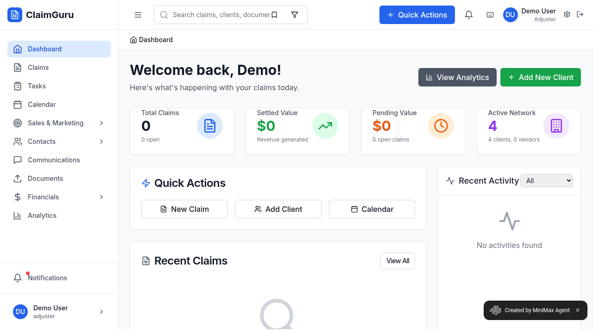

# ClaimGuru Dashboard Analysis Report

**Date:** 2025-09-24 05:49:01  
**URL:** https://q1nxtcolpt1b.space.minimax.io/dashboard  
**User:** Demo User (Adjuster role)

## Current State Overview

The ClaimGuru dashboard is currently in an empty/new user state with no active data or claims. While the interface is functional and properly loaded, the dashboard presents several "empty state" conditions that could be perceived as issues.

## Screenshot Evidence

## Identified Issues

### 1. **Complete Empty State Dashboard**
- **Issue:** All key performance metrics show zero values
- **Details:**
  - Total Claims: 0 (0 open)
  - Settled Value: $0
  - Pending Value: $0
  - Only 4 clients in network, 0 vendors

### 2. **No Recent Claims Data**
- **Issue:** "Recent Claims" section displays loading indicator/placeholder with no actual data
- **Message:** "No claims yet. Get started by creating your first claim."
- **Impact:** Makes the dashboard appear non-functional to new users

### 3. **No Recent Activity**
- **Issue:** Recent Activity section shows "No activities found"
- **Impact:** Contributes to overall empty appearance of the dashboard

### 4. **Potential User Experience Issues**
- **Navigation Redundancy:** Calendar appears both in sidebar navigation and Quick Actions
- **Empty Dashboard Engagement:** Lacks engaging onboarding content for new users
- **No Welcome Guidance:** Limited guidance for new users on how to get started

## Functional Elements Working Properly

✅ **Navigation:** All sidebar navigation links are present and functional  
✅ **Search:** Search bar with filter options is available  
✅ **Quick Actions:** New Claim, Add Client, Calendar buttons are accessible  
✅ **User Profile:** Demo User profile shows correctly with adjuster role  
✅ **Layout:** Two-column layout with sidebar and main content area renders properly  
✅ **Notifications:** Notification and message icons are present  

## Technical Assessment

- **Page Load:** ✅ Page loads successfully without errors
- **UI Rendering:** ✅ All interface elements render correctly
- **Interactive Elements:** ✅ 28 interactive elements identified and functional
- **Data Display:** ⚠️ Empty state - no claims or activity data present
- **Error Messages:** ❌ No system errors detected, but empty state messages present

## Recommendations

1. **Onboarding Improvement:** Add guided tour or tutorial for new users
2. **Sample Data:** Consider showing sample/demo data for new accounts
3. **Call-to-Action Enhancement:** Make the "get started" process more prominent
4. **Empty State Design:** Improve empty state messaging with more engaging content
5. **Quick Setup:** Provide a streamlined initial setup process

## Conclusion

The ClaimGuru dashboard is technically functioning correctly with no system errors or broken functionality. The primary "issues" are related to user experience in an empty state rather than actual technical problems. The dashboard successfully loads all components and provides proper navigation and quick action capabilities.

The empty state is likely intended behavior for a new demo account, but could benefit from improved onboarding and user guidance to help users understand how to populate the dashboard with relevant data.