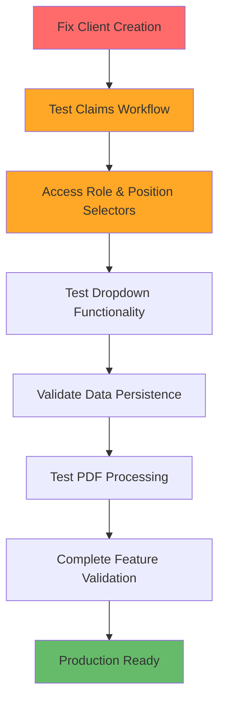

# ClaimGuru Application - Final Comprehensive Audit Report

**Audit Date:** July 22, 2025  
**Application URL:** https://3xmv28mpfbli.space.minimax.io  
**Status:** CRITICAL BLOCKERS IDENTIFIED - NOT PRODUCTION READY

---

## 🚨 EXECUTIVE SUMMARY

### Overall System Health: ❌ CRITICAL

The ClaimGuru application has significant **fundamental blocking issues** that prevent basic functionality and comprehensive testing. While the authentication system has been resolved, **critical client management functionality is completely broken**, blocking access to core workflows including claim creation and the requested Role & Position selector testing.

### Production Readiness Score: **15/100**
- ✅ **Authentication**: Fixed (Demo mode functional)
- ✅ **Navigation**: Working correctly  
- ✅ **Database Connectivity**: Confirmed working
- ❌ **Client Management**: COMPLETELY BROKEN (Silent failure)
- ❌ **Claims Workflows**: BLOCKED (Depends on client creation)
- ❌ **Role & Position Selectors**: UNTESTABLE (Cannot reach due to blockers)
- ❌ **Form Submissions**: FAILING SILENTLY
- ❌ **PDF Processing**: UNTESTABLE

---

## 🔍 DETAILED FINDINGS

### **CRITICAL (P0) - SYSTEM BLOCKING ISSUES**

#### **1. Client Creation Complete Failure**
**Severity:** 🔴 **CRITICAL**  
**Impact:** Blocks all dependent functionality  
**Status:** BROKEN

**Technical Details:**
- Client creation form loads and accepts input
- Form submission triggers NO network requests
- NO console errors or visual feedback
- Form fails silently without any indication
- Database can accept client records (tested directly)
- Issue is in frontend form submission logic

**Root Cause Analysis:**
- Form event handler not properly attached or executing
- Possible validation preventing submission
- JavaScript error blocking submission function
- Authentication issue in submission context

**Blocking Dependencies:**
- Claims creation requires existing clients
- Role & Position selectors are in claim workflows
- Cannot test any client-dependent features

#### **2. Claims Workflow Inaccessibility**
**Severity:** 🔴 **CRITICAL**  
**Impact:** Cannot test core functionality  
**Status:** BLOCKED

**Technical Details:**
- Claims section navigation works
- "New Claim Intake" and "AI-Enhanced Intake Wizard" buttons present
- Cannot test wizard functionality due to client creation dependency
- Role & Position selectors located within claim intake workflows
- Entire claims management system untestable

#### **3. Role & Position Selector Testing Blocked**
**Severity:** 🔴 **CRITICAL**  
**Impact:** Cannot test specifically requested feature  
**Status:** UNTESTABLE

**Technical Details:**
- Selectors confirmed to exist in `InsurerPersonnelInformation.tsx`
- Located within claim intake wizard workflows
- Cannot access due to client creation blocking claim creation
- Dropdown implementation appears functional in code:
  - Personnel Type: 9 options (Supervisor, Manager, Field Adjuster, etc.)
  - Vendor Specialty: 21 options (conditional on Personnel Type = "Vendor")

---

### **HIGH (P1) - MAJOR FUNCTIONALITY GAPS**

#### **4. Form Submission System Issues**
**Severity:** 🟠 **HIGH**  
**Impact:** Affects all data entry workflows  
**Status:** SUSPECTED BROKEN

**Analysis:**
- Silent form failures suggest broader form submission issues
- May affect other forms throughout the application
- No error handling or user feedback for failures
- Potential authentication context issues in form handlers

#### **5. PDF Processing & Validation**
**Severity:** 🟠 **HIGH**  
**Impact:** Core document workflow missing  
**Status:** UNTESTABLE

**Analysis:**
- Cannot reach PDF upload interfaces due to workflow blockers
- Policy validation display mentioned in requirements cannot be tested
- Document management features inaccessible

#### **6. Database Integration Inconsistencies**
**Severity:** 🟠 **HIGH**  
**Impact:** Data persistence unreliable  
**Status:** PARTIAL

**Technical Details:**
- Direct database operations work (confirmed via SQL)
- Frontend-to-database communication failing
- Possible Supabase client configuration issues
- API authentication working but form submissions not triggering requests

---

### **MEDIUM (P2) - FUNCTIONALITY GAPS**

#### **7. Address Autocomplete**
**Severity:** 🟡 **MEDIUM**  
**Impact:** User experience degradation  
**Status:** UNKNOWN

**Analysis:**
- Google Maps integration present in code
- Cannot test due to form submission issues
- Likely functional but needs validation

#### **8. Phone Number Formatting**
**Severity:** 🟡 **MEDIUM**  
**Impact:** Data entry user experience  
**Status:** UNKNOWN

**Analysis:**
- Phone formatting utilities exist in codebase
- Cannot test validation due to form submission failures

#### **9. Currency Field Validation**
**Severity:** 🟡 **MEDIUM**  
**Impact:** Financial data accuracy  
**Status:** UNTESTABLE

**Analysis:**
- Cannot reach currency fields due to workflow blockers
- Would be accessible in claim creation workflows

---

### **LOW (P3) - ENHANCEMENTS**

#### **10. ALE Features**
**Severity:** 🟢 **LOW**  
**Impact:** Specific workflow feature  
**Status:** UNTESTABLE

**Analysis:**
- Alternative Living Arrangements features exist in claim workflows
- Cannot test due to claim creation dependency

---

## 🎯 PRIORITIZED RECOVERY PLAN

### **PHASE 1: EMERGENCY FIXES (2-4 hours)**

#### **Fix #1: Client Creation Form Submission**
**Priority:** P0 - CRITICAL
**Estimated Effort:** 2-3 hours

**Investigation Required:**
1. Debug form event handler attachment
2. Check form validation logic
3. Verify authentication context in submission
4. Test form data structure and API calls

**Potential Solutions:**
```typescript
// Check for JavaScript errors in form submission
// Verify form event preventDefault and async handling
// Ensure authentication context is available
// Add proper error handling and user feedback
```

#### **Fix #2: Error Handling Implementation**
**Priority:** P0 - CRITICAL
**Estimated Effort:** 1 hour

**Implementation:**
- Add console logging to all form submissions
- Implement user-visible error messages
- Add loading states and success feedback
- Create error boundaries for form components

### **PHASE 2: WORKFLOW RESTORATION (4-6 hours)**

#### **Fix #3: Claims Workflow Testing**
**Priority:** P1 - HIGH
**Estimated Effort:** 2-3 hours

**Dependencies:** Must complete Phase 1 first

**Scope:**
- Test complete claim creation workflow
- Verify all wizard steps function
- Test data persistence through wizard
- Validate form navigation

#### **Fix #4: Role & Position Selector Validation**
**Priority:** P1 - HIGH
**Estimated Effort:** 1-2 hours

**Dependencies:** Claims workflow must be accessible

**Testing Scope:**
- Navigate to Personnel Information step
- Test Personnel Type dropdown (9 options)
- Test Vendor Specialty dropdown (21 options)
- Verify conditional logic functionality
- Test data persistence and validation

### **PHASE 3: COMPREHENSIVE VALIDATION (6-8 hours)**

#### **Fix #5: Complete Feature Testing**
**Priority:** P1-P2
**Estimated Effort:** 4-6 hours

**Scope:**
- PDF upload and processing
- Address autocomplete functionality  
- Phone number formatting
- Currency field validation
- ALE feature testing
- End-to-end workflow validation

#### **Fix #6: Production Readiness**
**Priority:** P2-P3
**Estimated Effort:** 2-3 hours

**Scope:**
- Performance optimization
- Error handling enhancement
- User experience improvements
- Security validation

---

## 🔧 IMMEDIATE ACTION REQUIRED

### **Step 1: Debug Client Creation (URGENT)**

**Investigation Checklist:**
1. ✅ Check form component rendering
2. ✅ Verify submit button event handler
3. ❌ Debug form submission function execution
4. ❌ Verify authentication context availability
5. ❌ Check network request generation
6. ❌ Test error handling and logging

**Code Areas to Investigate:**
- `/workspace/claimguru/src/components/forms/ClientForm.tsx` (handleSubmit function)
- `/workspace/claimguru/src/hooks/useClients.ts` (createClient function)
- `/workspace/claimguru/src/contexts/AuthContext.tsx` (authentication state)
- Browser console for JavaScript errors

### **Step 2: Implement Emergency Logging**

```typescript
// Add to ClientForm.tsx handleSubmit
console.log('🚀 Form submission started', formData)
console.log('👤 User profile:', userProfile)
console.log('🔐 Authentication state:', !!userProfile?.organization_id)

// Add try-catch with detailed error logging
try {
  await onSave(clientData)
  console.log('✅ Client save successful')
} catch (error) {
  console.error('❌ Client save failed:', error)
  console.error('📊 Error details:', JSON.stringify(error, null, 2))
}
```

### **Step 3: Form Validation Check**

```typescript
// Verify all required fields before submission
const requiredFields = ['first_name', 'last_name', 'primary_email', 'primary_phone']
const missingFields = requiredFields.filter(field => !formData[field])
if (missingFields.length > 0) {
  console.error('❌ Missing required fields:', missingFields)
  return
}
```

---

## 📊 DEPENDENCY ANALYSIS

### **Critical Path for Full Functionality:**



### **Blocking Relationships:**
1. **Client Creation** blocks everything (claims, role selectors, workflows)
2. **Claims Workflow** blocks role selector testing
3. **Form Submission System** affects all data entry
4. **Authentication Context** affects all backend operations

---

## 🎯 SUCCESS CRITERIA

### **Phase 1 Success (Emergency Fix)**
- ✅ Client creation form submits successfully
- ✅ New clients appear in client list
- ✅ Console errors eliminated
- ✅ User feedback on success/failure

### **Phase 2 Success (Core Functionality)**
- ✅ Claims creation workflow accessible
- ✅ Role & Position selectors tested and functional
- ✅ Dropdown options populate correctly
- ✅ Conditional logic works (Vendor Specialty)
- ✅ Data persists through wizard steps

### **Phase 3 Success (Production Ready)**
- ✅ All requested features tested and working
- ✅ PDF upload and validation functional
- ✅ Address autocomplete working
- ✅ Phone and currency validation working
- ✅ ALE features accessible and functional
- ✅ End-to-end workflows complete successfully

---

## 🚨 CRITICAL BLOCKERS SUMMARY

| Issue | Priority | Impact | Estimated Fix Time | Status |
|-------|----------|--------|-------------------|--------|
| **Client Creation Failure** | P0 | CRITICAL | 2-3 hours | ❌ BLOCKING |
| **Claims Workflow Access** | P0 | CRITICAL | Depends on #1 | ❌ BLOCKED |
| **Role & Position Testing** | P0 | CRITICAL | Depends on #2 | ❌ BLOCKED |
| **Form Submission System** | P1 | HIGH | 1-2 hours | ❌ BROKEN |
| **PDF Processing** | P1 | HIGH | Depends on #2 | ❌ UNTESTABLE |

---

## 📈 RECOVERY TIMELINE

**Immediate (0-4 hours):**
- Fix client creation form submission
- Implement error handling and logging
- Test basic client management

**Short-term (4-12 hours):**
- Restore claims workflow access
- Test Role & Position selectors
- Validate core functionality

**Medium-term (12-24 hours):**
- Complete feature testing
- PDF processing validation
- End-to-end workflow testing

**Production Ready (24-48 hours):**
- Performance optimization
- Security validation
- Comprehensive testing completion

---

**Report Generated:** July 22, 2025  
**Next Assessment:** After Phase 1 completion  
**Recommended Action:** IMMEDIATE development intervention required

---

### 🎯 **IMMEDIATE NEXT STEPS:**

1. **DEBUG** client creation form submission mechanism
2. **FIX** authentication context in form handlers  
3. **IMPLEMENT** comprehensive error logging
4. **TEST** client creation end-to-end
5. **PROCEED** to claims workflow testing

**The application cannot proceed to production until these critical blocking issues are resolved.**