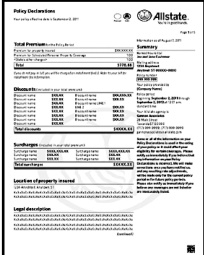
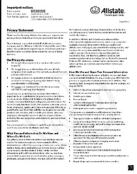
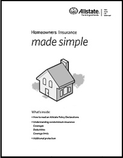
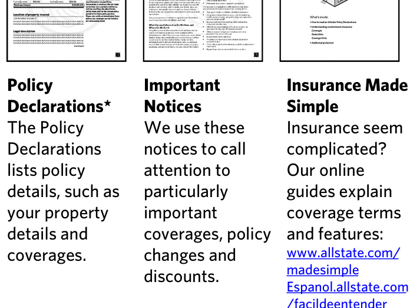

AFFTFFDFAFATDTDDTAATFADFFDFTTFDTDTATDDAFTAFDDDAAAFFDDTTTFAAAFAAFT  
JOSUE DERAS & MARIA DERAS  
415 GAMEWOOD DR  
SPRING TX 77386-1211  
Your Allstate agency is  
South Central  
(800) 474-1377  
OPERATIONSGULF@GOOSEHEAD.CO  
M  

# Help Protect Your Most Personal Asset—Your Identity  

Thank you for choosing Allstate Vehicle and Property Insurance Company—we’re delighted to have you with us!  

We're pleased to once again offer you the chance to continue your House & Home policy for another twelve months. With your policy about to renew, now is the perfect time for you to determine whether the coverage you have is suited to the risks you face today.  

# Have You Considered Our Identity Theft Expenses Coverage?  

That’s why we'd like you to know about our affordable Identity Theft Expenses Coverage option. It’s designed to help reimburse you for covered expenses and the hassles of restoring your good name if your identity is stolen with this increasingly common type of theft.  

Identity theft is a relatively new but growing crime that can lead to refused loans, lost job opportunities, and even arrest for crimes never committed. Now you can purchase our optional coverage to help restore your identity if you become a victim of this crime.  

# $\pmb{\530}$ a Year—A Small Price Now Can Help with Higher Costs Later  

For just $\mathtt{530}$ a year and no deductible, we’ll reimburse you for covered expenses you incur to help restore your identity, up to a coverage limit of $\mathtt{\oint}25,000$ . While some products out there today may provide less reimbursement and leave you to deal with creditors, banks, and government agencies on your own, Allstate goes a step further. We may also refer you to an identity theft restoration services company that can help you sort out the effects of an identity theft\* with creditors and government agencies.  

# Do You Have the Protection You Need?  

As you review your Declarations Page, consider whether you’d like to update your policy to include Identity Theft Expenses Coverage. To add this coverage, or to make any changes to your policy, feel free to call us at (800) 474-1377.  

For more detailed information about Identity Theft Expenses Coverage, please refer to the enclosed “Identity Theft Expenses Coverage—Coverage for Identity Theft Victims” information at the back of this mailing.  

# We Appreciate Your Business  

Thank you again for choosing Allstate to help protect you today and prepare you for the future. We're glad you’re with us.  

# Your Insurance Coverage Checklist  

We’re happy to have you as an Allstate customer! This checklist outlines what’s in this package and provides answers to some basic questions, as well as any “next steps” you may need to take.  

# £ What’s in this package?  

See the guide below for the documents that are included. Next steps: review your Policy Declarations to confirm you have the coverages, coverage limits, premiums and savings that you requested and expected. Read any Endorsements or Important Notices to learn about new policy changes, topics of special interest, as well as required communications. Keep all of these documents with your other important insurance papers.  

# £ Am I getting all the discounts I should?  

Confirm with your Allstate Agent that you’re benefiting from all the discounts you’re eligible to receive.  

# £ What about my bill?  

Unless you’ve already paid your premium in full, we’ll send your bill separately. Next steps: please pay the minimum amount by the due date listed on it.  

You can also pay your bill online at Allstate.com/support or through the Allstate mobile app. If you’re enrolled in the Allstate® Easy Pay Plan, we’ll send you a statement detailing your payment withdrawal schedule. Para español, Ilamar al 1-800-979-4285.  

# £ What if I have questions?  

Visit Allstate.com/support to browse our list of frequently asked questions and find information regarding billing or policy documents. You can also create an online account to access and manage your policies. Para español, Ilamar al 1-800-979-4285.  

# A guide to your renewal package  

  

  

  

  

# IMPORTANT NOTICE  

# AVISO IMPORTANTE  

# Have a complaint or need help?  

If you have a problem with a claim or your premium, call your insurance company first. If you can't work out the issue, the Texas Department of Insurance may be able to help.  

Even if you file a complaint with the Texas Department of Insurance, you should also file a complaint or appeal through your insurance company. If you don't, you may lose your right to appeal.  

# ¿Tiene una queja o necesita ayuda?  

Si tiene un problema con una reclamación o con su prima de seguro, llame primero a su compañía de seguros. Si no puede resolver el problema, es posible que el Departamento de Seguros de Texas (Texas Department of Insurance, por su nombre en inglés) pueda ayudar.  

Aun si usted presenta una queja ante el Departamento de Seguros de Texas, también debe presentar una queja a través del proceso de quejas o de apelaciones de su compañía de seguros. Si no lo hace, podría perder su derecho para apelar.  

# Allstate Insurance Company  

To get information or file a complaint with your insurance company:  

# Call: Toll Free at 1-800 Allstate® (1-800-255-7828)  

Email:   
allstatecustomerservicesupport@allstate.com   
Mail:   
P. O. Box 660598, Dallas, TX 75266-0598  

# Allstate Insurance Company  

Para obtener información o para presentar una queja ante su compañía de seguros:  

# Llame a: Teléfono gratuito al 1-800-255-7828  

Correo electrónico:   
allstatecustomerservicesupport@allstate.com   
Dirección postal:   
P. O. Box 660598, Dallas, TX 75266-0598  

# The Texas Department of Insurance  

To get help with an insurance question or file a complaint   
with the state: Call with a question: 1-800-252-3439 File a complaint: www.tdi.texas.gov Email: ConsumerProtection@tdi.texas.gov Mail: MC 111-1A, P.O. Box 149091, Austin, TX 78714-9091  

# El Departamento de Seguros de Texas  

Para obtener ayuda con una pregunta relacionada con los   
seguros o para presentar una queja ante el estado: Llame con sus preguntas al: 1-800-252-3439 Presente una queja en: www.tdi.texas.gov Correo electrónico: ConsumerProtection@tdi.texas.gov Dirección postal: MC 111-1A, P.O. Box 149091, Austin, TX 78714-9091  

# INSURANCE WEBSITE NOTICE  

# To compare policies and prices:  

Visit HelpInsure.com to compare prices and coverages on home and auto insurance policies. The website is a service of the Texas Department of Insurance and the Office of Public Insurance Counsel.  

# AVISO DEL SITIO WEB DE SEGURA  

Para comparar pólizas y precios:  

Visite HelpInsure.com para comparar precios y coberturas en pólizas de seguro para el hogar y automóvil. El sitio web es un servicio del Departamento de Seguros de Texas y de la Oficina del Asesor Público de Seguros (Office of Public Insurance Counsel, por su nombre en inglés).  

# Allstate’s got you covered.  

At Allstate, we know how important it is to you to have the right protection at the right price. That’s why we’ve included some savings tips and services you have access to below:  

Review your coverages Make sure your protection fits your current needs.  

Allstate® mobile app  

Download Allstate Mobile, where you can get tools and help, like ID cards ¹, Allstate Identity Protection and 24/7 Roadside Assistance.  

# Find more ways to save  

Discover more about your money-saving options², like Full Pay, Drivewise® or Easy Pay, by visiting Allstate Mobile or allstate.com/myaccount.  

¹Digital ID cards not accepted as proof of insurance in every state.   
²Subject to terms, conditions, and availability.  

# Renewal House & Home Policy Declarations  

Your policy effective date is November 16, 2023  

Total Premium for the Policy Period   

<html><body><table><tr><td colspan="2">Premium for property insured $2,254.58</td></tr><tr><td>RecoupmentFeeVolunteer Rural Fire DepartmentAssistance Program</td><td>1.54</td></tr><tr><td>Total</td><td>$2,256.12</td></tr></table></body></html>

Your total premium for this policy period has increased by at least 10%  

Discounts (included in your total premium)   

<html><body><table><tr><td>Protective eDevice</td><td>$21.16</td><td>MultiplePolicy</td><td>$398.07</td></tr><tr><td>Claim Free</td><td>$307.56</td><td>EarlySigning</td><td>$17.45</td></tr><tr><td>Loyalty Welcome</td><td>$91.00 $91.00</td><td>ResponsiblePayment</td><td>$515.66</td></tr><tr><td>Total discount savings</td><td></td><td></td><td>$1,441.90</td></tr></table></body></html>  

Information as of October 2, 2023  

# Summary  

Named Insured(s)   
Josue  Deras, Maria  Deras   
Mailing address   
415 Gamewood Dr   
Spring TX 77386-1211   
Policy number  

# Insured property details\*  

Please review and verify the information regarding your insured property. Please refer to the Important Notice (X73182-1) for additional coverage information. Contact us if you have any changes.  

# 429 540 184  

Location of property insured: 415 Gamewood Dr, Spring, TX 77386-1211  

Your policy provided by   
Allstate Vehicle and Property   
Insurance Company   
Policy period   
Beginning November 16, 2023 through November 16, 2024 at 12:01 a.m.   
standard time   
Your Allstate agency is   
South Central   
1202 Ne McClain Road   
Bentonville AR 72712-3875   
(800) 474-1377   
OPERATIONSGULF@GOOSEHEAD.CO M Location zone: N3012653W09542024   
Your location zone is based on the location of the insured property and is one of many factors used in determining your rate.  

Dwelling Style: Built in 1973; 1 family; 1683 sq. ft.; ranch - 1 story  

Foundation: Slab at grade, $100\%$  

Some or all of the information on your Policy Declarations is used in the rating of your policy or it could affect your eligibility for certain coverages. Please notify us immediately if you believe that any information on your Policy Declarations is incorrect. We will make corrections once you have notified us, and any resulting rate adjustments, will be made only for the current policy period or for future policy periods. Please also notify us immediately if you believe any coverages are not listed or are inaccurately listed.  

Interior details: One builders grade kitchen  

Exterior wall types: $20\%$ wood siding  

Interior wall partition: $100\%$ drywall  

Heating and cooling: Central air - same ducts, $100\%$  

Two builders grade full baths  

$80\%$ brick on frame  

# Insured property details\* (continued)  

<html><body><table><tr><td>Additionaldetails: Standardwoodsashwithglass,100% Twoexteriorwooddoors</td><td>Interiorwallheight-8ft,100%</td></tr><tr><td>Fireprotectiondetails: Fire department subscription-no Roof surface material type:</td><td>2milestofiredepartment</td></tr><tr><td colspan="2">Composition ·100% asphalt/fiberglassshingle</td></tr><tr><td colspan="2">Roof details: Predominantroof type:Composition Ageofroof-11years Roofgeometry-Hip</td></tr></table></body></html>  

Mortgagee   
WELLS FARGO BANK NA 708 ITS SUCCESSORS &/OR ASSIGNS   
P O Box 5708, Springfield, OH 45501-5708   
Loan number: 0375756376  

Additional Interested Party - None \*This is a partial list of property details. If the interior of your property includes custom construction, finishes, buildup, specialties or systems, please contact your Allstate representative for a complete description of additional property details.  

Coverage detail for the property insured   

<html><body><table><tr><td>Coverage</td><td>Limits of Liability</td><td>ApplicableDeductible(s)</td></tr><tr><td>Dwelling Protection</td><td>$240,000</td><td>· $4,800 Tropical Cyclone · $4,800 Windstorm and Hail · $2,400 All other perils</td></tr><tr><td>OtherStructuresProtection</td><td>$24,000</td><td>· $4,800 Tropical Cyclone · $4,800 Windstorm and Hail ·$2,400 All other perils</td></tr><tr><td>Personal PropertyProtection</td><td>$120,000</td><td>· $4,800 Tropical Cyclone ·$4,800 Windstorm and Hail ·$2,400 Allotherperils</td></tr><tr><td>Additional Living Expense</td><td>Up to 24 months not to exceed $72,000</td><td></td></tr><tr><td>FamilyLiabilityProtection</td><td>$500,000 each occurrence</td><td></td></tr><tr><td>Guest Medical Protection Foundation Water Damage</td><td>$5,000 each person</td><td></td></tr><tr><td>Building Codes</td><td>$5,000</td><td></td></tr><tr><td>Building Structure Reimbursement</td><td>Not purchased*</td><td></td></tr><tr><td>Extended Limits</td><td>Not purchased*</td><td></td></tr><tr><td>Roof Surfaces Extended Coverage</td><td>Included</td><td></td></tr><tr><td>Water Back-Up</td><td>$5,000</td><td>·$500 Water Back-Up</td></tr><tr><td>Residence Glass</td><td>Not purchased*</td><td></td></tr></table></body></html>  

# Other Coverages Not Purchased:  

• Additional Fire Department Charges\*   
• Building Materials Theft\*   
• Country Endorsement\*   
• Dwelling in the Course of Construction\*   
• Electronic Data Recovery\*   
• Extended Coverage on Cameras\*   
• Extended Coverage on Jewelry, Watches and Furs\*   
• Extended Coverage on Musical Instruments\*   
• Extended Coverage on Sports Equipment\*   
• Fair Rental Income\*   
• Golf Cart\*   
• Green Improvement\*   
• Home Day Care\*   
• Identity Theft Expenses\*   
• Increased Coverage on Business Property\*   
• Increased Coverage on Theft of Silverware\*   
• Loss Assessments\*   
• Residence Glass\*   
• Secondary Residence\*   
• Yard and Garden\*  

\* This coverage can provide you with valuable protection. To help you stay current with your insurance needs, contact your agent to discuss available coverage options and other products and services that can help protect you.  

# Scheduled Personal Property Coverage  

Your policy does not include Scheduled Personal Property Coverage. This coverage can provide you with valuable protection. To help you stay current with your insurance needs, contact your agent to discuss available coverage options and other products and services that can help protect you.  

# Your policy documents  

Your House & Home policy consists of the Policy Declarations, any Policy Declarations Addendum, and the following documents. Please keep them together.  

• AVPIC House & Home Policy  – AVP91   
• Windstorm and Hail Deductible Endorsement – AVP82   
• Water Back–Up Endorsement – AVP98-1   
• Roof Surfaces Extended Coverage Endorsement – AVP144-1   
• Depreciation Amendatory Endorsement – AP4970   
• Tropical Cyclone Deductible Endorsement – APC548-1   
• Texas Amendatory Endorsement – AVP348   
• Texas Amendatory Endorsement – AVP345  

# Important payment and other information  

Here is some additional, helpful information related to your coverage and paying your bill:  

„ Coverage A - Dwelling Protection Limit includes an approximate  of Unknown due to the property insurance adjustment using the Marshall & Swift Boeckh Publications Building Cost Index. Coverage B - Other Structures Protection, Coverage C - Personal Property Protection, and Tropical Cyclone Deductible amount adjusted accordingly.  

„ Do not pay.  Mortgagee has been billed.  

William Hill President  

Susan L. Lees Secretary  

# Your Estimated Home Replacement Cost  

Allstate has determined that the estimated cost to replace your home is: \$236,300.  

We based your estimated cost on information provided by you and selected data that was available to us, which is described in the “Insured property details” section of your Declarations Page. Please review all the information in this section to ensure the accuracy of the information used to determine the estimated replacement cost of your home.  

The enclosed Declarations Page shows the limit of liability applicable to Dwelling Protection–Coverage A of your homeowners insurance policy. The estimated replacement cost of your home is the minimum amount for which we will insure your home.  

The decision regarding the limit applicable to your Dwelling Protection–Coverage A is your decision to make, as long as, at a minimum, your limit equals the estimated replacement cost as determined by Allstate and does not exceed maximum coverage limitations established by Allstate.  

It is important to keep in mind that your Coverage A limits reflect a replacement cost that is only an estimate based on data that was available to us when we made this estimate (this information is described in the “Insured property details” section of your Declarations Page). The actual amount it will cost to replace your home cannot be known until after a covered total loss has occurred. Please keep in mind that we do not guarantee the adequacy of the estimate to cover any future loss(es).  

# How Is the Replacement Cost Estimated?  

Many factors can affect the cost to replace your home, including its age, size, and type of construction. For example, the replacement cost uses construction data, such as labor and materials, that are available to us when we made this estimate. This estimate is also based on characteristics of the home, which include information that you provided to us. You might have chosen to insure your home for a higher amount than the estimated replacement cost shown above.  

# Note to Customers Renewing Their Policy  

The estimated replacement cost for your home may have changed since the last time we communicated this information to you. This is because, at renewal, Allstate uses the home characteristics that you have provided to us to recalculate and update the estimated replacement cost. Using updated labor and material rates for your zip code, Allstate takes the home characteristics you have provided and determines the updated estimated replacement cost. The information about your  

home’s characteristics is provided in the “Insured property details” section of your Declarations Page.  

# Please note: Your Dwelling information is used to estimate your home replacement cost. It’s important to review and update this information so we’re using the most accurate details to estimate your home’s replacement value.  

If the information about your home shown in your Declarations Page requires any change or if you have any questions or concerns about the information contained in this Important Notice, please contact your Allstate representative, or call us at 1-800-ALLSTATE.  

# Additional Information About Dwelling Protection Limits  

Your policy includes a feature called "Property Insurance Adjustment" (PIA).  PIA reflects changes in construction costs in your area that may have occurred during the policy period.  This information is useful in estimating the amount of insurance coverage needed to cover the cost of rebuilding your home in the event of a covered total loss.  

We would like you to know that your policy's PIA recently indicated that certain construction costs in your market have declined.  Based on this information, you may decide to lower your Dwelling Protection limits.  If you choose to lower your Dwelling Protection-Coverage A limits, your premium will decrease accordingly.  Please note that decreasing your Dwelling Protection limits may result in decreases in other coverages that are tied to your Coverage A limits and could lower your premium.  

It is important for you to understand that PIA estimates are only estimates and lowering your Dwelling Protection limits may leave you with insufficient coverage in the event of a loss. For example, if you have done any remodeling to your home which has not been updated in our records, your home's replacement cost may be higher than our current records indicate.  In that case, you may want to maintain or even increase your limits.  Conversely, there is a possibility that your current limits may provide coverage in excess of the actual replacement cost of your home not only based on the PIA estimate, but on other considerations.  For example, if you originally decided to insure your home at an amount that exceeded the estimated replacement cost, you may want to call your Allstate representative to discuss the current value of your home and the possibility of lowering your limits.  

If you have any questions about PIA, or your policy in general, please contact your Allstate representative.  

# X73182-1  

# Information Regarding Flood Damage Coverage  

Texas law requires that we provide you with this notice regarding flood damage coverage.  

Please read this notice carefully. In addition, it is important to read all of your property policy documents to confirm the coverage your policy provides.  

# NOTICE  

Flood Insurance: You may also need to consider the purchase of flood insurance. Your insurance policy does not include coverage for damage resulting from a flood even if hurricane winds and rain caused the flood to occur. Without separate flood insurance coverage, you may have uncovered losses caused by a flood. Please discuss the need to purchase separate flood insurance coverage with your insurance agent or insurance company, or visit www.floodsmart.gov.  

If you have any questions about this notice or your policy coverage, you can contact your Allstate Agent or representative, call 1-800 ALLSTATE® (1-800-255-7828), or visit www.allstate.com. We’re here to help!  

XC7124  

# Please Check Your Policy Coverage Limits  

When we first issued your Allstate policy, you selected specific coverages and coverage limits to protect your property. However, your property’s value may have changed since that time. We’d like to remind you that it is your responsibility to carefully review your coverages and coverage limits at each policy renewal and make sure they provide you with adequate coverage.  

Please take a few minutes to review your policy. If you have any questions about your insurance coverage, or if you wish to change your policy limits, please contact your Allstate representative.  

X73175  

# Identity Theft Expenses Coverage— Coverage for Identity Theft Victims  

While modern technology has made our lives easier, it has also made it easier for thieves to commit identity theft.  

Thieves begin by gaining access to personal information such as your Social Security Number, date of birth and driver’s license number. They then use this information to set up fake accounts, open loans, rent housing, secure employment or even obtain medical care—all without you even knowing.  

As this crime grows increasingly common, consumers need options for dealing with the costs and hassles related to identity theft—that’s why we’re offering Identity Theft Expenses Coverage.  

# For Just $\pmb{\530}$ per Year, You Can Get Help to Restore Your Good Name  

Now Allstate has a product that can help you if your identity is stolen. You can add this optional coverage to your property policy for just a few dollars a month—a small price to pay for peace of mind—especially when you consider that while other insurance companies typically require a deductible for similar protection, with Allstate there is no deductible.  

# Allstate Takes Identity Theft Expenses Coverage a Step Further  

If you purchase this coverage, we’ll reimburse you for covered expenses you incur to restore your identity up to a $\mathfrak{S}25$ ,000 coverage limit. That’s more than most companies offer for this type of coverage. This coverage includes reimbursement for:  

Attorneys fees (subject to applicable coverage limits)—in case you need to hire an attorney to defend you if lawsuits are brought against you by merchants or collection agencies, if you need help to remove criminal or civil judgments wrongly entered against you, or to challenge information contained in your credit report. Lost wage recovery (up to $\mathtt{5250}_{\ }$ /day with a $\mathbb{S}5,000$ cap)—this will help cover wages or salary you may lose if you need to take time off work to complete affidavits or meet with law enforcement agencies, financial institutions, credit grantors, credit reporting agencies or attorneys.  

Loan reapplication fees—this covers your expenses if you need to reapply for loans denied you solely because the lender received incorrect information due to identity theft. Other expenses—covers other expenses involved in restoring your identity, such as mailing costs, notary expenses and long-distance phone calls.  

# You Can Get Help If You Become a Victim  

If you become a victim of identity theft, you probably won’t know all that is involved in restoring your name. There are many issues you would need help with, including:  

— Understanding your rights as an identity theft victim.   
— Filling out paperwork, including police reports. Issuing a Fraud Alert to the three major credit bureaus, as well as Social Security Administration, Federal Trade Commission, and U.S. Postal Service. Obtaining copies of your credit bureau reports.   
— Working with the three major credit bureaus to restore the accuracy of your credit history. Reviewing your credit history to verify if fraud includes items such as public records (liens, judgments, bankruptcies); credit accounts; or errors with addresses/ prior employment. Issuing a fraud alert to affected financial institutions and credit card companies. Tracing Social Security Numbers and notifying and working with the Department of Motor Vehicles, collection agencies for creditors, and law enforcement personnel.  

This may seem overwhelming, but our Identity Theft Expenses Coverage can help. With it, if you decide to hire a firm to help you address identity theft issues such as these, you will have up to $\mathtt{52}\mathrm{,000}$ available to pay for their services. In addition, we may refer you to a firm that specializes in addressing the effects of identity theft.\* In either case, if you have this coverage you’ll have peace of mind knowing you can get help to restore your identity.  

# Are You in Good Hands®?  

With Allstate you’re getting more than great products and service. You get a team of people who know insurance and give you the freedom to manage your insurance your way. To sign up for Identity Theft Expenses Coverage, or for more information, just call your Allstate representative or log on to allstate.com.  

# Additional Protection for Your Most Valuable Possessions  

Property insurance covers many belongings, but some items may require higher coverage limits than those in a standard property policy.  

Scheduled Personal Property (SPP) coverage gives you additional protection against loss or damage to your valuables. It’s protection not typically provided with standard property coverage. SPP benefits typically include:  

No deductibles to meet — Coverage for lost or damaged items Coverage for valuables kept in a storage location outside your home  

# Items That May Need the Extra Protection  

SPP coverage provides protection for an array of valuable personal property. Here are some of the items you can protect by purchasing SPP coverage through Allstate:  

Jewelry (including wedding rings and precious or semi-precious stones) Furs Cameras (digital, still, movie, video and related equipment) Silverware and antiques (including furniture) Musical instruments   
— Collections (stamps, coins, music) Fine art works (including paintings, etchings, vases and sculptures) Manuscripts or books   
— Home-office equipment (laptop, computer, audio/visual) Sports equipment (such as golf clubs)  

# Affordable Protection for Your Valuables  

The cost of SPP coverage varies, but the value of your property is the best way to determine how much coverage you need. The rates are generally a small percentage of the total value of the items you’re insuring. This means that your valuables are being protected for only a fraction of the cost.  

# Regularly Review Your SPP Coverage  

Even if you currently have SPP coverage, it’s a good idea to review it annually. It’s possible that the value of your property has changed or that you’ve purchased new items that have not been added to your coverage.  

To learn more about SPP coverage, or if you have any questions about your insurance policy in general, contact your Allstate representative, or visit us at allstate.com.  

# X73169  

# What You Should Know About Flood Insurance  

Most homeowners, renters and commercial insurance policies do not provide coverage for flood damage. In fact, protection against floods is generally available only through a separate policy.  

That’s why Allstate is a participant in the National Flood Insurance Program (NFIP) and offers standard flood insurance policies.\* A flood insurance policy can help complete the insurance protection for your property and help protect your financial well-being.  

# You May Have More Risk from Flood Than You Think  

Approximately 90 percent of all disasters in the U.S. are flood related. While you may think that it couldn’t happen to you, over 25 percent of all flood losses occur in low- to moderate-risk areas.  

What’s more, flood damage is often accompanied by other damage, such as wind and hail (which is typically covered under a property policy). So if you purchase your NFIP coverage through Allstate, you would have the convenience and peace of mind that comes with working with just one claim adjuster and one agent, instead of two or more for a flood claim.  

# Flood Coverage Is Affordable  

The federal government sets the rates for flood insurance, so there’s typically no difference in rates from policy to policy. You can switch to an NFIP flood insurance policy administered by Allstate for the same amount of premium you may be paying elsewhere. If you choose Allstate, you can have the quality service you’ve come to expect from us.  

For more information about flood insurance, or if you have any questions about your policy in general, please contact your Allstate representative or visit us at allstate.com.  

# How We Compensate Our Agencies  

The company listed below uses local independent insurance agencies to provide customers with information and high-quality service in connection with their insurance buying decisions. These independent insurance agencies represent the company and provide numerous services to customers on the company’s behalf. Independent insurance agencies are paid a commission by the company for selling and servicing the company’s insurance policies and may be eligible to receive additional compensation and rewards based on performance. Any questions about the nature of this compensation can be directed to the independent insurance agency.  

Allstate Vehicle and Property Insurance Company  

X72007-1  

# Add the Enhanced Package to Your Policy and Save Even More  

Consider adding the Enhanced Package to your House & Home policy for even greater value.  

The Enhanced Package gives you all of these benefits:  

Claim RateGuard®—Allows you to keep your Claim-Free Discount (if you qualify for the discount) and protects your rate from going up just because you file a claim.   
Claim-Free Bonus—Gives you up to a $5\%$ premium credit each year you go without a claim.   
Deductible Reward—You may qualify for an immediate $\mathtt{5700}$ off a qualified deductible when you add the Enhanced Package. Then you’ll get an additional $\mathtt{5700}$ each   
designated twelve month period you don’t have a   
chargeable claim—up to $\mathtt{5500}$ total.  

If you’d like to add the Enhanced Package to your House & Home policy or have any questions about these features, please contact your Allstate representative. All Enhanced Package features are subject to policy terms and conditions.  

Thank you for choosing Allstate. We value you, respect your privacy and work hard to protect your personal information.  

This statement is provided on behalf of Allstate Insurance Company and the affiliates (“Allstate”) listed at the end of this notice. We would like to explain how we collect, use and share the information we obtain about you in the course of doing business.  

# Our Privacy Assurance  

We do not sell your personal or medical information to anyone.   
We do not share your information with non-affiliate   
companies that would use it to contact you about their own products and services, unless permitted pursuant to a joint marketing agreement.   
We require persons or organizations that represent or assist us in servicing your policy and claims to keep your information confidential.   
We require our employees to protect your personal   
information and keep it confidential.  

As you can see, protecting your personal information is important to us. In addition to the practices described above, we use a variety of physical, technical and administrative security measures that help to safeguard your information. For Social Security Numbers (SSN), this includes restricting access to our employees, agents and others who use your SSN only as permitted by law: to comply with the law, to provide you with products and services, and to handle your claims. Also, our employees’ and agents’ access to and use of your SSN are limited by the law, our policies and standards, and our written agreements.  

Our privacy practices continue to apply to your information even if you cease to be an Allstate customer.  

# What Personal Information Do We Have and Where Do We Get It  

We gather personal information from you and from outside sources for business purposes. Some examples of the information we collect from you may include your name, phone number, home and e-mail addresses, driver’s license number, Social Security Number, marital status, family member information and healthcare information. Also, we maintain records that include, but are not limited to, policy coverages, premiums, and payment history. We also collect information from outside sources including, but not limited to, insurance support organizations that assemble or collect information about individuals for the purpose of providing to insurance companies. This information may include, but is not limited to, your driving record, claims history, medical information and credit information.  

In addition, Allstate and its business partners gather information through Internet activity, which may include, for example, your operating system, links you used to visit allstate.com, web pages you viewed while visiting our site or applications, Internet Protocol (IP) addresses, and cookies. We use cookies, analytics and other technologies to help:  

Evaluate our marketing campaigns Analyze how customers use our website and applications — Develop new services Know how many visitors have seen or clicked on our ads  

Also, our business partners assist us with monitoring information including, but not limited to, IP addresses, domain names and browser data, which can help us to better understand how visitors use allstate.com.  

# How We Use and Share Your Personal Information  

In the course of normal business activities, we use and share your personal information. We may provide your information to persons or organizations within and outside of Allstate. This would be done as required or permitted by law. For example, we may do this to:  

Fulfill a transaction you requested or service your policy   
— Market our products   
— Handle your claim   
— Prevent fraud Comply with requests from regulatory and law enforcement authorities Participate in insurance support organizations  

The persons or organizations with whom we may share your personal information may include, among others:  

— Your agent, broker or Allstate-affiliated companies Companies that perform services, such as marketing, credit card processing, and performing communication services on our behalf Business partners that assist us with tracking how visitors use allstate.com Other financial institutions with whom we have a joint marketing agreement Other insurance companies that play a role in an insurance transaction with you Independent claims adjusters A business or businesses that conduct actuarial or research studies Those who request information pursuant to a subpoena or court order Repair shops and recommended claims vendors  

# The Internet and Your Information Security  

We use cookies, analytics and other technologies to help us provide users with better service and a more customized web experience. Additionally, our business partners use tracking services, analytics and other technologies to monitor visits to allstate.com. The website may also use Web beacons (also called “clear GIFs” or “pixel tags”) in conjunction with cookies. If you prefer, you can choose to not accept cookies by changing the settings on your web browser. Also, if you would like to learn about how we gather and protect your information over the Internet, please see our online privacy statement located at the bottom of the allstate.com homepage.  

To learn more, the allstate.com Privacy Statement provides information relating to your use of the website. This includes, for example, information regarding:  

1) How we collect information such as IP address (the number assigned to your computer when you use the Internet), browser and platform types, domain names, access times, referral data, and your activity while using our site;   
2) Who should use our website;   
3) The security of information over the Internet; and   
4) Links and co-branded sites.  

# How You Can Review and Correct Your Personal Information  

You can request to review your personal information contained in our records at any time. To do this, please send a letter to the address below requesting to see your information for the previous two years. If you believe that our information is incomplete or inaccurate, you can request that we correct it. Please note we may not be able to provide information relating to investigations, claims, litigation, and other matters. We will be happy to make corrections whenever possible.  

Please send requests to:   
Allstate Insurance Company Customer Privacy Inquiries   
PO Box 660598   
Dallas, TX 75266-0598  

# Your Preference for Sharing Personal Information  

We would like to share your personal information with one or more Allstate affiliates in order to make you aware of different products, services and offers they can provide. However, you can request that Allstate and its affiliate companies not share your personal information with our affiliates for marketing products and services.  

To request that we not allow other Allstate affiliates to use your personal information to market their products and services, you can contact us by calling 1-800-856-2518 twenty-four hours a day, seven days a week. Please keep in mind that it may take up to four weeks to process your request.  

If you previously contacted us and asked us not to allow other Allstate affiliates to use your personal information, your previous choice still applies and you do not need to contact us again. If you would like to change your previous choice please call the number above at any time.  

# We Appreciate Your Business  

Thank you for choosing Allstate. We understand your concerns about privacy and confidentiality, and we hope this notice has been helpful to you. We value our relationship with you and look forward to keeping you in Good Hands®.  

If you have questions or would like more information, please don’t hesitate to contact your Allstate agent or call the Allstate Customer Information Center at 1-800-ALLSTATE.  

We reserve the right to change our Privacy practices, procedures, and terms.  

Allstate Insurance Company  

Allstate entities on which behalf this notice is provided and amongst which information may be shared:  

The Allstate family of companies, LSA Securities, Deerbrook General Agency, Inc., Deerbrook Insurance Company, North Light Specialty Insurance Company, Northbrook Indemnity Company.  

Please Note: Allstate affiliates American Heritage Life Insurance Company, Castle Key Insurance Company and Castle Key Indemnity Company participate in information sharing with the affiliates listed above, but have a separate privacy notice for their customers.  

(ed. 10/2015)  