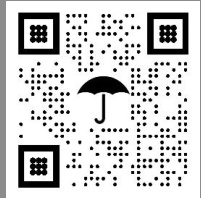

GOOSEHEAD INSURANCE   
1500 SOLANA BLVD BLDG 4   
STE 4500   
WESTLAKE, TX 76262   
0000 0DHD93  

ANNE CHAMPAGNE 1908 W 25TH ST HOUSTON, TX 77008-1583  

  

June 2, 2024  

# Your Policy  

ANNE CHAMPAGNE 1908 W 25TH ST HOUSTON, TX 77008-1583  

615843239-633-1   
1908 W 25TH ST   
06/04/2024 to 06/04/2025  

# Welcome to Travelers!  

As a Travelers insurance customer, you have more than 150 years of experience, financial stability and superior claim service behind you, so you can feel protected – especially when you need us most.  

# Review your policy documents  

No one understands your needs better than you. So please take a moment to review and confirm your new insurance policy details, including:  

Your Declarations page, listing the coverage you   
purchased, your coverage limits and deductibles   
Insurance policy and endorsements   
Other important documents, including our privacy notice,   
billing options and more  

If you decide to rent, sell, vacate or remodel this property, please notify your agent or Travelers representative immediately to maintain the coverage you need.  

# Superior Service  

At Travelers, we provide fast, efficient claim service and  24/7 claim reporting. We’re proud to put our talent, expertise and resolution excellence to work for you.  

On behalf of GOOSEHEAD INSURANCE, thank you for choosing Travelers to help you protect what matters. It’s Better Under the Umbrella®.  

# A faster, easier way to manage your account  

Visit MyTravelers.com or open the camera on your smartphone and scan the QR code below to download our mobile app, where you can: Manage your policy and bills  

Submit and monitor a claim  

  

# Contact Information  

Policy questions or changes:1.800.474.1377   
24-hour claim service:1.800.252.4633  

# Additional Benefits  

As a valued customer, you may be eligible for certain programs for which you may receive goods, services, or other types of benefits. Visit travelers.com/additionalbenefits to learn more!  

Sincerely,  

Mehel Kleni  

Michael Klein   
President   
Travelers Personal Insurance   
YOUR AGENCY   
GOOSEHEAD INSURANCE   
1500 SOLANA BLVD BLDG 4   
WESTLAKE, TX 76262   
PHONE: 1.800.474.1377 | FAX: (888) 682-8559  

  

# You’re insured!  

This document is intended to help you better understand your homeowners insurance. Your policy is effective from June 4, 2024 to June 4, 2025. For a complete description of your coverage, please refer to your policy.  

  

You’re receiving four discounts for a total savings of $\pmb{5}\tau$ ,408.00  

Multi-Policy   
Good Payer   
Water Protective Device   
Early Quote   
Fire Protective Device   
Green Home  

Loss Free Theft Protective Device Windstorm Mitigation  

12-month total premium \$2,700.00  

Go to MyTravelers.com/discounts and use product code QH2 to learn about all the discounts available to you.  

\* Your Coverage B, C, and D limits are maintained as a percentage of your Coverage A limit. If your Coverage A limit changes, your Coverage B, C, and D limits will be adjusted accordingly.  

# What does your policy typically cover?  

Your policy helps protect you from a number of things that can go wrong. Here are some of the most common:  

# Weather  

Hail, lightning, and other weather events can damage your roof, windows, siding, and more – so can falling branches and other debris.  

  

# Fire  

Whether it’s smoke damage from a small kitchen fire or extensive damage from a large, accidental fire, your policy can help you repair or rebuild your property.  

  

# Theft or vandalism  

Your policy typically covers theft or vandalism of your property. See your policy for special limits on things such as collectibles, jewelry, and money.  

# Take steps to protect your property and call us as soon as damage occurs. For more tips, go to MyTravelers.com/prepare-prevent.  

# What isn’t covered?  

Your policy covers you for many types of loss or damage, but it can’t protect you from everything. Some examples:  

  

# Floods are not covered  

Your policy does not cover flood damage. Please review the Important Information About Flood Damage page for more details and resources.  

  

# Earthquake coverage is optional  

Damage from earthquakes is not covered, unless you specifically purchase coverage for it. Check under the Optional Coverages and Packages section of your Policy Declarations. If you do not see this coverage listed and think you need it, please contact your agent or Travelers representative.  

  

# It’s not for home maintenance  

Repairs due to wear and tear or lack of upkeep are not typically covered under your policy.  

# When circumstances change, we need to know  

Review your Policy Declarations to be sure the information we have is accurate. If your property, circumstances, or needs change, let us know immediately to maintain the coverage you need. Not informing us may result in a denied claim.  

Contact your agent or Travelers representative if:  

• Your mailing address changes Someone named on the policy moves out Someone named on the policy passes away Someone moved onto your property  

• You rent, sell, temporarily relocate, vacate or buy a new home Business is conducted on your property You renovate or build an addition You replace your roof  

# YOUR HOMEOWNERS POLICY QUICK REFERENCE  

Beginning on Page  

HOMEOWNERS POLICY DECLARATIONS D-1 NAMED INSURED AND MAILING ADDRESS LOCATION OF YOUR RESIDENCE PREMISES YOUR AGENCY’S NAME AND ADDRESS MORTGAGEE NAME AND ADDRESS POLICY INFORMATION DISCOUNTS COVERAGES AND LIMITS OF LIABILITY DEDUCTIBLES  

AGREEMENT..... .A-1   
DUTY TO REPORT CHANGES IN EXPOSURE .A-1   
DEFINITIONS...... .A-1   
POLICY CONDITIONS A-4  

PROPERTY COVERAGE SECTION PROPERTY COVERAGE A – DWELLING... P-1 PROPERTY COVERAGE B  – OTHER STRUCTURES.. P-1 PERILS INSURED AGAINST PROPERTY COVERAGE A – DWELLING PROPERTY COVERAGE B – OTHER STRUCTURES P-1 PROPERTY COVERAGE C – PERSONAL PROPERTY........ P-3 PERILS INSURED AGAINST PROPERTY COVERAGE C – PERSONAL PROPERTY. .P-5 PROPERTY COVERAG E D – LOSS OF USE .P-6 PROPERTY – ADDITIONAL COVERAGES.. ..P-7 PROPERTY – EXCLUSIONS.... .P-11 PROPERTY – CONDITIONS.... .P-14  

LIABILITY COVERAGE SECTION   
LIABILITY COVERAGE E – PERSONAL LIABILITY..... L-1   
LIABILITY COVERAGE F –  MEDICAL PAYMENTS TO OTHERS L-1   
LIABILITY – ADDITIONAL COVERAGES. L-1   
LIABILITY – EXCLUSIONS... L-3   
LIABILITY – CONDITIONS.. L-8  

# Homeowners Policy Declarations  

# Named Insured and Mailing Address  

Your Agency’s Name and Address  

ANNE CHAMPAGNE 1908 W 25TH ST HOUSTON, TX 77008-1583 ANNECHAMPAGNE@ATT.NET  

GOOSEHEAD INSURANCE 1500 SOLANA BLVD BLDG 4 WESTLAKE, TX 76262  

Residence Premises  

1908 W 25TH ST HOUSTON, TX 77008-1583  

# Mortgagee Name and Address  

1. JP MORGAN CHASE BANK NA ISAOA/ATIMA PO BOX 4465 SPRINGFIELD, OH 45501-4465 LOAN NUMBER: 1318780360  

# Policy Information  

Your Policy Number 615843239 633 1 For Policy Service 1.800.474.1377   
Your Account Number For Claim Service 1.800.252.4633   
Your Insurer: TRAVELERS PERSONAL INSURANCE COMPANY a subsidiary or affiliate of The Travelers Indemnity Company One Tower Square, Hartford, CT 06183 The policy period is from June 4, 2024 at 12:01 A.M. STANDARD TIME to June 4, 2025 at 12:01 A.M.   
STANDARD TIME at the residence premises.  

Total Premium for this Policy: \$2,700.00 This is not a bill. The mortgagee will be billed separately for this policy.  

# Discounts  

The following discounts reduced your premium: Multi-Policy Early Quote Good Payer  

Savings Reflected in Your Total Premium:  

\$1,408.00  

# Coverages and Limits of Liability Property Coverage Section  

# Limit  

Coverage A – Dwelling Coverage B – Other Structures Coverage C – Personal Property Coverage D – Loss of Use  

\$471,000 \$47,100 \$235,500 $^{\Phi94,200}$  

# Liability Coverage Section  

# Limit  

Coverage E – Personal Liability - Bodily Injury and Property Damage (each occurrence) \$500,000   
Coverage F – Medical Payments to Others (each person) \$5,000  

# Deductibles  

# Peril Deductible  

# Deductible  

Property Coverage Deductible (All Other Perils) $1\%$ of Coverage A - Dwelling Limit $^{\mathbb{S}4,710}$   
Windstorm or Hail Deductible $2\%$ of Coverage A - Dwelling Limit $\mathbb{S}9{,}420$ In case of loss under the Property Coverage Section, only that part of the loss over the applicable deductible will be paid (up to the coverage limit that applies).  

# Special Limits and Additional Coverages Coverage Level: Travelers Protect  

The limit shown for each of the Special Limits of Liability and Additional Coverages is the total limit for each loss in that category.  

# Personal Property – Special Limits of Liability  

# Limit  

a. Money, bank notes, coins, stored value cards $\mathtt{5250}$ b. Securities, accounts, passports, tickets, stamps $\mathbb{S}1,500$ c. Comic books and trading cards $\mathbb{S}1\small{,}000$ d. Collectibles, figurines, glassware, marble, porcelains, statuary $\mathbb{S}1\small{,}000$ e. Theft of jewelry, watches, precious stones $\mathbb{S}1,500$ f. Theft of furs \$1,500 g. Theft of silverware, goldware, pewterware \$1,500 h. Theft of firearms and related equipment \$1,500 i. Theft of tools and their accessories \$1,500 j. Theft of rugs, tapestries and wall hangings \$1,500 k. Business property on the residence premises \$3,000 l. Business property away from the residence premises \$1,500 m. Trailers or semitrailers not used with watercraft $\mathbb{S}1,500$ n. Motor vehicle parts or equipment not attached to motor vehicle $\mathfrak{S}500$ o. Electronic apparatus while in or upon a motor vehicle or watercraft $\mathbb{S}1,500$ The Special Limits of Liability do not increase your Coverage C – Personal Property Limit.  

# Property – Additional Coverages  

Limit  

Debris Removal (Additional $\%$ of damaged covered property limit) $5\%$ Tree Removal Per Tree $\mathfrak{S}500$ Per Loss $\mathbb{S}1\small{,}000$ Trees, Shrubs and Other Plants Per Tree $\mathfrak{S}500$ Per Loss $\mathbb{S}23{,}550$ $(5\%$ of Coverage A - Dwelling Limit) Fire Department Service Charge $\mathfrak{S}500$ Credit Card, Fund Transfer, Forgery and Counterfeit Money $\mathbb{S}1\small{,}000$ Loss Assessment $\mathbb{S}1\small{,}000$ Landlord Furnishings $\mathbb{S}2{,}500$ Ordinance or Law ( $10\%$ of Coverage A - Dwelling Limit) $^{\Phi47,100}$  

Property – Additional Coverages (continued) Personal Records and Data Replacement Limited Fungi or Other Microbes Remediation  

Limit $\mathbb{S}1,500$ \$5,000  

The applicable policy deductible applies unless otherwise noted.  

Liability – Additional Coverages Limit Damage to Property of Others $\mathbb{S}1\small{,}000$ Loss Assessment $\mathbb{S}1\small{,}000$  

Please review your policy for other Personal Property Special Limits of Liability and Additional Coverages that may apply.  

# Optional Coverages and Packages  

Optional Coverages Personal Property Replacement Cost Loss Settlement Windstorm or Hail Percentage Deductible Additional Replacement Cost Protection Coverage $25\%$ of Coverage A - Dwelling Limit  

Endorsement Limit Premium HQ-290 CW (02-21) Included\* HQ-312 CW (05-17) Included\* HQ-420 CW (11-18) $\Phi1\,17,750$ Included\*  

Foundation Coverage  

HQ-468 TX (05-17) Included\*  

Endorsement Limit Premium  

Enhanced Water Package   
Water Back Up and Sump Discharge or Overflow Coverage   
Limited Hidden Water or Steam Seepage or Leakage   
Coverage  

Included\*  

HQ-208 CW (08-20) $\boldsymbol{\Phi}10{,}000$ HQ-209 CW (08-18) $\boldsymbol{\Phi}10{,}000$  

\*Note: The additional cost or premium reduction for any optional coverage or package shown as “Included” is contained in the Total Policy Premium Amount.  

# Required Forms and Endorsements Included in Your Policy:  

Form: 633  

Policy Quick Reference   
Agreement, Definitions & Policy Conditions   
Property Coverage Section   
Liability Coverage Section   
Signature Page   
Special Provisions - Texas   
Additional Benefits  

HQ-T77 CW H2 (05-17) HQ-D77 CW (05-17) HQ-P03 CW (05-17) HQ-L77 CW (05-17) HQ-S99 CW (05-17) HQ-300 TX (07-23) HQ-860 CW (08-18)  

The Declarations along with the Optional Coverages, Optional Packages and Required Forms and Endorsements listed above form your Homeowners Insurance Policy. Please keep these documents for reference.  

# Information About Your Property  

There are many factors that determine the premium on your policy, some of which are displayed below. If you would like a policy review, please contact your agent or Travelers Representative.  

Year Built:2018 Garage Type:Attached Pool:No   
# of Families: 1 Family Square Footage: 3043 Age of Roof:6   
# of Stories:3 Construction Type: Frame Roof Square Footage:1709   
# of Bathrooms:4 Siding Type:Stucco Tree Overhang: $0\%$   
# of Employees:00 Foundation Type:Slab Roof Material Type:Asphalt-Fiberglass   
Garage - Number of Cars:2 Finished Basement:00  

Issued on 06-02-2024 Countersignature (Agent Use Only):  

# For Your Information  

For  information  about  how  Travelers  compensates  independent  agents  and  brokers,  please  visit www.Travelers.com or call our toll free telephone number 1-866-904-8348. You may also request a written copy from Marketing at One Tower Square, 2GSA, Hartford, Connecticut 06183.  

We want to make sure we are using accurate information to rate your policy.  Because you are the most familiar with your home we need your help to make sure that the information on your Declarations is accurate and complete.  If any of the information on your Declarations has changed, appears incorrect or is missing, please advise  your  agent  or  Travelers  representative.   We  also  need  you  to  check  our  website  at www.mytravelers.com/discounts to ensure that you are receiving all of the discounts for which you are eligible. Once at the website, type in your policy number 6158432396331 and product code QH2 to view all available discounts.  Should you have any questions about the information on your Declarations or your discounts, please call your agent or Travelers representative.  

If you have recently replaced your roof it is important that you inform your Travelers Representative.  

SPECIAL WINDSTORM DEDUCTIBLE APPLIES: SEE ENDORSEMENT HQ-312.  

This policy contains pollution exclusions under the Property Coverage Section and the Liability Coverage Section.  

This policy may contain a percentage deductible. Please refer to the Deductible Section of the Declarations which identifies all deductibles applicable to your policy. If your coverage limit changes, the percentage deductible amount will also change.  

# TRAVELERS INSURANCE POLICY  

Travelers Personal Insurance Company One Tower Square, Hartford, Connecticut 06183 (A Stock Insurance Company)  

# AGREEMENT  

We will provide the insurance described in this policy in return for the premium and compliance with all applicable provisions of this policy.  

# DUTY TO REPORT CHANGES IN EXPOSURE  

You or an “insured” must notify us when:  

1. There is a change to the mailing or “residence premises” address shown in the Declarations;   
2. A named “insured” no longer resides on the “residence premises” or a person or persons begin to reside on the “residence premises”;   
3. A named “insured” dies;   
4. Title to or ownership of the “residence premises” changes;   
5. There is a change to the use of the “residence premises” with respect to “business” conducted or rental activity;   
6. An addition, alteration or renovation is made to a dwelling  or  other  building  on  the  “residence premises”; or   
7. A named “insured” acquires a replacement or additional residential property.  

If you fail to report a change relating to the insured property within 60 days, it may result in denial of coverage under this policy.  

# DEFINITIONS  

In this policy, you and your refer to:  

a. The  named  “insured”  shown  in  the Declarations; and   
b. The  spouse  if  a  resident  of  the  same household. The term spouse includes, if a resident of the same household: (1) The civil partner of the named “insured”, provided such civil union was obtained in a state  where  a  civil  union is  legally recognized; or (2) The  domestic  partner  of  the  named “insured”,  provided  such  domestic partner was in a continuing spouse-like relationship with the named “insured” for the  purpose  of  a  domestic  life.  Both persons must be 18 years of age or older and may not be related to each other by blood. Neither may be married to another person,  or  be  a  domestic  partner  or partner by civil union of any other person.  

In this policy, we, us and our refer to the member company of Travelers providing this insurance and shown as Your Insurer in the Declarations.  

In  this policy, certain words and phrases are  in quotes. Those words and phrases are defined as follows:  

1. “Aircraft” means any device used or designed for flight, including any: a. Unmanned  flying  device,  self-propelled missile or spacecraft; and b. Accessory,  equipment  or  part  for  such device, whether or not attached to the device.  

Under Property Coverage C – Personal Property, Liability Coverage E – Personal Liability, Liability Coverage F – Medical Payments to Others and Liability – Additional Coverages, “aircraft” does not include any unmanned flying device that:  

a. Is used or operated for recreational purposes only; and   
b. Weighs less than 10 pounds with or without any accessory, equipment or part attached.  

2. “Aircraft  Liability”,  “Hovercraft  Liability”,  “Motor Vehicle Liability” and “Watercraft Liability” mean liability for “bodily injury” or “property damage” arising out of the:  

a. Ownership of such vehicle or craft by an “insured”;  

b. Maintenance,  occupancy,  operation,  use, loading or unloading of such vehicle or craft by any person;   
c. Entrustment of such vehicle or craft by an “insured” to any person;   
d. Failure to supervise or negligent supervision of any person involving such vehicle or craft by an “insured”; or   
e. Vicarious liability, whether or not imposed by law,  for  the  actions  of  a  child  or  minor involving such vehicle or craft.  

For the purpose of this definition:  

a. Aircraft means an  “aircraft” as defined  in Definitions 1.;   
b. Hovercraft means a self-propelled motorized ground effect vehicle and includes flarecraft and air cushion vehicles;   
c. Motor vehicle means a “motor vehicle” as defined in Definitions 11.; and   
d. Watercraft means a craft principally designed to be propelled on or in water by wind, engine power or electric motor.  

3. “Apartment” means a single room or set of rooms, rented or held for rental, that is part of a covered building and is intended as a place to stay or reside, regardless of the length of the habitation.  

4. “Bodily injury” means bodily harm, sickness or disease, including required care, loss of services and death that results.  

5. “Business” means:  

a. A trade, profession or occupation engaged in on a full-time, part-time or occasional basis; or   
b. Any other activity engaged in for money or other compensation, except the following: (1) Volunteer activities for which no money is received  other  than  payment  for expenses incurred to perform the activity; (2) Providing home day care services for which no compensation is received, other than  the  mutual  exchange  of  such services; or (3) Providing home day care services to a relative of an “insured”.  

6. “Employee” means an employee of an “insured”, or an employee leased to an “insured” by a labor leasing firm under an agreement between an “insured” and the labor leasing firm, whose duties are other than those performed by a “residence employee”.  

7. “Fuel system” means:  

a. One or more containers, tanks or vessels which have a total combined fuel storage capacity of 100 or more U.S. gallons; and (1) Are, or were, used to hold fuel; and (2) Are, or were, located on any one location;   
b. Any pumping apparatus, which includes the motor, gauge, nozzle, hose or pipes that are, or  were,  connected  to  one  or  more containers,  tanks  or  vessels  described  in 7.a.;   
c. Filler pipes and flues connected to one or more containers, tanks or vessels described in 7.a.;   
d. A boiler, furnace or a water heater, the fuel for which is stored in a container, tank or vessel described in 7.a.;   
e. Fittings  and  pipes  connecting  the  boiler, furnace  or  water heater  to one  or  more containers,  tanks  or  vessels  described  in 7.a.; or   
f. A structure that is specifically designed and built to hold escaped or released fuel from one or more containers, tanks or vessels described in 7.a.   
A “fuel system” does not include any fuel tanks   
that are permanently affixed to a “motor vehicle”  

or watercraft owned by an “insured”, used for powering the “motor vehicle” or watercraft and not used at any time or in any manner for “business”.  

8. “Fungi”  means  any  type  or  form  of  fungus, including mold or mildew, and any mycotoxins, spores,  scents  or  by-products  produced  or released by “fungi”. Under the Liability Coverage Section, this does not include any “fungi” that are, are on, or are contained in, products  or goods intended  for consumption.  

9. “Insured” means:  

a. You and residents of your household who are: (1) Your relatives; or (2) Other persons under the age of 21 and in the care of any person named above;   
b. A  student  enrolled  in  school  full-time,  as defined by the school, who was a resident of your household before moving out to attend school, provided the student is under the age of: (1) 24 and your relative; or  

(2) 21 and in your care or the care of a person described in 9.a.(1); or  

c. Any  Additional  Insured  named  in  the Declarations,  but  only  with  respect  to Coverages A, B, E and F if applicable to your policy and only for the “residence premises”.   
d. Under the Liability Coverage Section: (1) With respect to animals or watercraft to which this policy applies, any person or organization legally responsible for these animals or watercraft which are owned by you or any person included in 9.a. or b. “Insured” does not mean a person or organization using or having custody of these animals or watercraft in the course of any “business” or without consent of the owner; or (2) With respect to any vehicle to which this policy applies: (a) Persons  while  engaged  in  your employ  or  that  of  any  person included in 9.a. or b.; or (b) Other persons using the vehicle on an  “insured  location”  with  your consent.  

Under both the Property and Liability Coverage Sections  of  this  policy,  when  the  word  an immediately precedes the word “insured”, the words an “insured” together mean one or more “insureds”.  

10. “Insured location” means:  

a. The “residence premises”;   
b. The part of other premises, other structures and grounds used by you as a residence and: (1) Which is shown in the Declarations; or (2) Which is acquired  by  you  during the policy period for your use as a residence;   
c. Any premises used by you in connection with a premises described in 10.a. and b.;   
d. Any part of a premises: (1) Not owned by an “insured”; and (2) Where  an  “insured”  is  temporarily residing;   
e. Vacant land, other than farm land, owned by or rented to an “insured”;   
f. Land owned by or rented to an “insured” on which a one or two family dwelling is being built as a residence for an “insured”;   
g. Individual or family cemetery plots or burial vaults of an “insured”;   
h. Any part of a premises occasionally rented to an “insured” for other than “business” use;   
i. Any premises owned by you and rented to others for use as a residence by not more than  four  families,  if  shown  in  the Declarations  as  an  Additional  Residence Rented to Others; or   
j. Any  other  structure  on  the  “residence premises”  rented  to  others  as  a  private residence if a limit of liability is shown in the Declarations as Structures Rented to Others.  

# 11. “Motor vehicle” means:  

a. A self-propelled land or amphibious vehicle; or   
b. Any  trailer  or  semi-trailer  which  is  being carried on, towed by or hitched for towing by a vehicle described in 11.a.   
“Motor vehicle” does not include model, hobby or   
children’s toy vehicles.  

12. “Occurrence”  means  an  accident,  including continuous or repeated exposure to substantially the  same  general  harmful  conditions,  which results during the policy period, in:  

a. “Bodily injury”; or b. “Property damage”.  

13. “Pollutants” means any solid, liquid, gaseous or thermal irritant or contaminant, including smoke, vapor,  soot,  fumes,  acids,  alkalis,  chemicals, waste and any unhealthful or hazardous building materials.  Waste  includes  materials  to  be recycled, reconditioned or reclaimed.  

14. “Property  damage”  means  physical  injury  to, destruction of, or loss of use of tangible property.  

# 15. “Residence employee” means:  

a. An employee of an “insured”, or an employee leased to an “insured” by a labor leasing firm under an agreement between an “insured” and the labor leasing firm, if the employee’s duties are related to the maintenance or use of  the  “residence  premises”,  including household or domestic services; or   
b. One who performs similar duties elsewhere not related to the “business” of an “insured.”  

A  “residence  employee”  does  not  include  a temporary  employee  who  is  furnished  to  an “insured” to substitute for a permanent “residence employee” on leave or to meet seasonal or shortterm workload conditions.  

16. “Residence premises” means:  

a. The one family dwelling or unit where you reside; or   
b. The two, three or four family dwelling where you reside in at least one of the family units;   
and which is shown as the “residence premises”   
in the Declarations.  

“Residence  premises”  also  includes  other structures and grounds at that location.  

17. “Vacant” means the dwelling or unit lacks the necessary amenities, adequate  furnishings or utilities and services required to sustain normal occupancy. A dwelling or unit being constructed is not considered “vacant”.  

# POLICY CONDITIONS  

1. Liberalization Clause. If we make a change which broadens coverage under this edition of our policy without additional premium charge, that change will automatically apply to your insurance as of the date we implement the change in your state, provided that this implementation date falls within 60 days prior to or during the policy period stated in the Declarations. This  Liberalization  Clause  does  not  apply  to changes implemented with a general program revision  that  includes  both  broadenings  and restrictions of coverage, whether that general program  revision  is  implemented  through introduction of: a. A subsequent edition of this policy form; or b. An amendatory endorsement.  

2. Waiver or Change of Policy Provisions. A waiver or change of a provision of this policy must be in writing by us to be valid. Our request for an appraisal or examination will not waive any of our rights.  

3. Duty  to Cooperate and Inform. The coverage provided by this policy and the premium charged for this policy are based on information you have given us. You agree:  

a. To cooperate with us in determining if this information is correct and complete;   
b. To inform us of any change in title, use or occupancy of the “residence premises”.   
c. That if within 90 days of the policy effective date this information changes, is incorrect or incomplete, we may adjust your coverage and  premium  accordingly  by  giving  you notice. This notice may be delivered to you, electronically  transmitted  to  you,  if permissible by law, or mailed to you at your mailing address shown in the Declarations. The notice will contain the changed, incorrect or  incomplete  information  along  with  the resulting premium change.  

4. Cancellation.  This  policy  may  be  cancelled during the policy period as follows:  

a. A named “insured” shown in the Declarations may cancel this policy by: (1) Returning this policy to us; or (2) Giving us advance written notice of the date cancellation is to take effect. We may accept another form of notice from a named  “insured”.  The  cancellation  by  a named “insured” will be binding on any other named “insured”.   
b. We  may  cancel  this  policy  only  for  the reasons stated below by letting you know in writing of the date cancellation takes effect. This cancellation notice may be delivered to you,  electronically  transmitted  to  you,  if permissible by law, or mailed to you at your mailing address shown in the Declarations. Proof of mailing or electronic transmission will be sufficient proof of notice. We will also deliver or mail a copy of the notice to any Additional  Insured  named  in  the Declarations. (1) When you have not paid the premium, we may cancel at any time by letting you know at least 10 days before the date cancellation takes effect; (2) When this policy has been in effect for less than 60 days and is not a renewal with us, we may cancel for any reason by letting you know at least 10 days before the date cancellation takes effect; or (3) When this policy has been in effect for 60 days or more, or at any time if it is a renewal with us, we may cancel: (a) If  there  has  been  a  material misrepresentation  of  fact  which  if known to us would have caused us not to issue the policy; or (b) If the risk has changed substantially since the policy was issued. This can be done by letting you know at least  30  days  before  the  date cancellation takes effect. If specific Cancellation provisions apply in your state, they will appear in the Special Provisions Endorsement that is part of this policy.   
c. When this policy is cancelled, the premium for the period from the date of cancellation to the expiration date will be refunded pro rata.   
d. If the return premium is not refunded with the notice of cancellation or when this policy is returned to us, we will refund it within a reasonable time after the date cancellation takes effect.  

5. Nonrenewal. We may elect not to renew this policy. We may do so by delivering to  you, electronically transmitting to you, if permissible by law, or mailing to you at the mailing address shown in the Declarations, written notice at least 30 days before the expiration date of this policy. Proof of mailing or electronic transmission will be sufficient proof of notice. We will also deliver or mail a copy of the notice to any Additional Insured named in the Declarations. If  we  offer  to  renew  and you  or  your representative  do  not  accept,  this  policy  will automatically  terminate  without  notice  of termination at the end of the current policy period. Failure to pay the required renewal premium when due shall mean that you have not accepted our offer. If specific Nonrenewal provisions apply in your state, they will appear in the Special Provisions Endorsement that is part of this policy.  

6. Assignment. Assignment of this policy is void unless we give our written consent. We, as the non-assigning  party,  will  not  recognize  any assignment  of  this  policy  unless  our  written consent is provided.  

7. Subrogation. An “insured” may waive in writing before a loss all rights of recovery against any person.  If  not  waived,  we  may  require  an assignment of rights of recovery for a loss to the extent that payment is made by us. If an assignment is sought, an “insured” must sign and deliver all related papers and cooperate with us. Subrogation does not apply under the Liability Coverage Section to Medical Payments to Others or Damage to Property of Others.  

8. Death. If any person named in the Declarations or  the  spouse,  if  a  resident  of  the  same household, dies: a. We insure the legal representative of the deceased  but  only  with  respect  to  the premises  and  property  of  the  deceased covered under the policy at the time of death; and b. “Insured” will then also include: (1) An “insured” who is a member of your household at the time of your death, but only while a resident of the “residence premises”; and (2) With respect to your property, the person having proper temporary custody of the property until appointment and qualification of a legal representative.  

# TRAVELERS HOMEOWNERS INSURANCE POLICY  

PROPERTY COVERAGE SECTION  

# PROPERTY COVERAGE A - DWELLING  

# 1. We cover:  

a. The dwelling on the “residence premises” shown  in  the  Declarations,  including structures attached to the dwelling; and  

b. Materials and supplies located on or next to the “residence premises” used to construct,  

alter or repair the dwelling or other structures on the “residence premises”.  

2. We do not cover land, including land on which the dwelling is located.  

# PROPERTY COVERAGE B – OTHER STRUCTURES  

1. We cover other structures on the “residence premises” set apart from the dwelling by clear space. This includes structures connected to the dwelling by only a fence, utility line or similar connection. It also includes other structures that are not buildings, including driveways, walkways and patios.  

# 2. We do not cover:  

a. Land,  including  land  on  which  the  other structures are located;  

b. Other structures rented or held for rental to any person not a tenant of the dwelling, unless used solely as a private garage. We do cover other structures rented to others as a private residence for which a limit of liability is shown in the Declarations for Structures Rented to Others;  

c. Other structures from which any “business” is conducted; or   
d. Other structures used to store “business” property.  We  do  cover  a  structure  that contains “business” property solely owned by an  “insured”  or  a  tenant  of  the  dwelling provided that “business” property does not include gaseous or liquid fuel, other than fuel in a permanently installed fuel tank of a vehicle  or  craft  parked  or  stored  in  the structure.  

# PERILS INSURED AGAINST PROPERTY COVERAGE A – DWELLING PROPERTY COVERAGE B – OTHER STRUCTURES  

1. We insure against direct physical loss to property described in Property Coverages A and B.  

2. We do not insure for loss:  

a. Excluded under Property - Exclusions;   
b. Involving  collapse  or  danger  of  collapse, except as provided in Property - Additional Coverage 9. Collapse; or   
c. Caused by: (1) Freezing  of  a  plumbing,  heating,  air conditioning or automatic fire protective sprinkler  system  or  of  a  household appliance, or by discharge, leakage or overflow  from  within  the  system  or appliance  caused  by  freezing.  This exclusion does not apply if you have used reasonable care to: (a) Maintain heat in the building; or  

(b) Shut off the water supply and drain all systems and appliances of water.  

If  the  building  is  protected  by  an automatic  fire protective sprinkler system, you must use reasonable care to continue the water supply and maintain heat in the building for coverage to apply. For  purposes  of  this  provision,  a plumbing system or household appliance does not include a sump, sump pump or related equipment or any other system designed to remove surface or subsurface  water,  roof  drain,  gutter, downspout or  similar fixtures or equipment; (2) Freezing, thawing, pressure or weight of water, ice or snow, whether driven by wind or not, to a:  

(a) Fence, pavement or patio; (b) Outdoor  spa  or  hot  tub,  outdoor sauna or outdoor swimming pool and any related equipment; (c) Footing, foundation, bulkhead, wall, or any other structure or device that supports all or part of a building or other structure; (d) Retaining wall or bulkhead that does not support all or part of a building or other structure; or (e) Pier, wharf or dock. This exclusion applies whether any item identified in  (2)(a) through  (e) of  this exclusion is wholly or partially above or below ground;   
(3) Theft  in  or  to  a  dwelling  under construction, or of materials and supplies for  use  in  the  construction  until  the dwelling is finished and occupied;   
(4) Vandalism and malicious mischief, and any  ensuing  loss  caused  by  any intentional and wrongful act committed in the course of the vandalism or malicious mischief,  if  the  dwelling  has  been “vacant” for more than 60 consecutive days  immediately  before  the  loss regardless of the policy’s inception or renewal date;   
(5) Theft  or  vandalism  and  malicious mischief in or to a dwelling while rented to others by an “insured” for a rental term of less than 30 consecutive days; or   
(6) Any of the following: (a) Wear and tear, marring, scratching or deterioration; (b) Mechanical breakdown, latent defect, inherent vice or any quality in property that causes it to damage or destroy itself; (c) Smog, rot, rust or other corrosion; (d) Smoke from agricultural smudging or industrial operations; (e) Discharge, dispersal, seepage, migration,  release  or  escape  of “pollutants” unless  the discharge, dispersal, seepage, migration, release or escape is itself caused by a Peril Insured Against  under Property Coverage C; (f) Settling, shrinking, bulging or expansion, including resultant cracking, of bulkheads, pavements, patios, footings, foundations, walls, floors,  roofs  or  ceilings.  This exclusion applies whether any item is wholly or partially above or below ground;   
(g) Birds, bats, vermin, rodents, raccoons,  skunks,  arachnids or insects;   
(h) Nesting or infestation, or discharge or  release  of  waste  products  or secretions, by any animals;   
(i) Animals  owned  or  kept  by  an “insured” or “residence employee”; or   
(j) Presence, pressure or intrusion of any root system.  

# Exception to c.(6)  

Unless the loss is otherwise excluded, we cover  loss  to  property  covered  under Property Coverages A and B resulting from an accidental discharge or overflow of water or steam from within a plumbing, heating, air conditioning  or  automatic  fire  protective sprinkler system or household appliance, that causes  damage  to  a  building  on  the “residence  premises”,  if  the  accidental discharge or overflow of water or steam originates from within a system or appliance:  

a.  On the “residence premises”; or   
b. Off the “residence premises”, if located on a premises adjacent to the “residence premises”.  

This includes the cost to tear out and replace any part of a building, or other structure, on the  “residence  premises”,  but  only  when necessary to repair the system or appliance from which this water or steam escaped.  

# We do not cover loss:  

a. To the system or appliance from which this water or steam escaped;   
b. Caused  by  accidental  discharge  or overflow of water or steam from within a storm drain whether located on or off the “residence premises”; or   
c Caused  by  accidental  discharge  or overflow of water or steam from within a steam  or sewer  pipe located  off  the “residence premises”. For  purposes  of  this  provision,  a plumbing system or household appliance does not include a sump, sump pump or related equipment or any other system designed  to remove surface or  

subsurface  water,  roof  drain,  gutter, down  spout  or  similar  fixtures  or equipment.  

Under Perils Insured Against 2.b. and c., any ensuing loss to property described in Property Coverages A and B not excluded by any other provision in this policy is covered.  

# PROPERTY COVERAGE C – PERSONAL PROPERTY  

1. Covered Property. We cover personal property owned  or  used  by  an  “insured”  while  it  is anywhere in the world. At your request, we will cover personal property owned by:  

a. Others while the property is on the part of the “residence  premises”  occupied  by  an “insured”; or   
b. A guest or a “residence employee”, while the property is in any residence occupied by an “insured”.  

This request may be made after a loss.  

# 2. Limit for Property at Other Locations.  

# a. Other Residences.  

Our  limit  of  liability  for  personal  property usually located at an “insured’s” residence, other than the “residence premises”, is $10\%$ of the limit of liability for Property Coverage C,  or $\mathbb{S}1\,,000$ ,  whichever  is  greater.  This limitation does not apply to personal property:  

(1) Moved from the “residence premises” because the “residence premises” is: (a) Being repaired, renovated or rebuilt; and (b) Not fit to live in or store property in;   
(2) Removed, for a period of 60 days or less, from the “residence premises” endangered by a Peril Insured Against; or   
(3) In a newly acquired principal residence for 60 days from the time you begin to move the property there.  

# b. Storage Facilities.  

Our  limit  of  liability  for  personal  property owned or used by an “insured” and located in a storage facility is $10\%$ of the limit of liability for  Property  Coverage  C,  or $\Phi1{,}000$ , whichever is greater. This limitation does not apply to personal property:  

(1) Moved from the “residence premises” because the “residence premises” is: (a) Being repaired, renovated or rebuilt; and (b) Not fit to live in or store property in;  

(2) Removed, for a period of 60 days or less, from the “residence premises” endangered by a Peril Insured Against; or   
(3) Usually  located  in an “insured’s” residence,  other  than  the  “residence premises”.  

3. Special  Limits  of  Liability.  The  following categories of personal property are covered only up to the Special Limits of Liability indicated below or shown in the Declarations. The special limit for each category described below is the total limit for each loss for all property in that category. These special limits do not increase the Property Coverage C limit of liability.  

a. Money, bank notes, bullion, gold other than goldware,  silver  other  than  silverware, platinum  other  than  platinumware,  coins, medals,  scrip,  stored  value  cards,  smart cards, gift certificates, digital currency and any  related  currencies  used  in  place  of money.   
b. Securities,  accounts,  deeds,  evidence  of debt, letters of credit, notes other than bank notes, manuscripts, passports, tickets and stamps.This  limit  includes  the  cost  to research, replace or restore information from the lost or damaged material.   
c. Comic books and trading cards, including sport  cards,  game  cards  and  non-sports cards.   
d. Collectibles,  including  figurines,  glassware, marble,  porcelains,  statuary  and  similar articles.   
e. Loss by theft of jewelry, watches, precious and semiprecious stones.   
f. Loss by theft of furs.   
g. Loss  by  theft  of  silverware,  silver-plated ware,  goldware,  gold-plated  ware, platinumware,  platinum-plated  ware  and pewterware.  This  includes  flatware, hollowware,  tea  sets,  trays  and  trophies made of or including silver, gold, platinum or pewter.   
h. Loss  by  theft  of  firearms  and  related equipment.   
i. Loss by theft of tools and their accessories.   
j. Loss by theft of any rugs, carpets, tapestries, wall hangings or other similar articles. This limit does not apply to wall-to-wall carpet.   
k. Covered  property,  on  the  “residence premises”,  used  primarily  for  “business” purposes.   
l. Covered property, away from the “residence premises”,  used  primarily  for  “business” purposes. This limit does not apply to loss to electronic apparatus and accessories while in or upon a “motor vehicle”.   
m. Trailers  or  semitrailers  not  used  with watercraft.   
n. “Motor vehicle” accessories, equipment  or parts while not attached to, located in or upon or while removed from any “motor vehicle”.   
o. Electronic apparatus and accessories, while in or upon a “motor vehicle” or watercraft, but only  if  the  apparatus  is  equipped  to  be operated by power from the “motor vehicle’s” or watercraft’s  electrical  system  while  still capable of being operated by other power sources.   
p. $\mathfrak{S}500$ for  tapes,  records,  discs,  antennas, wires, electronic music and movies or other media that can be used with any electronic apparatus and accessories while in or upon a “motor vehicle” or watercraft.   
q. $\mathbb{S}1\,,500$ for watercraft, including their trailers, furnishings,  accessories,  equipment,  parts and outboard engines or motors. This limit does not apply to non-motorized personal craft under 20 feet in length, such as  kayaks,  surf  boards,  canoes,  paddle boards,  row  boats,  wind  surfers  or  kite boards.   
r. $\mathtt{5250}$ for  legally  obtained  or  prescribed marijuana.   
s. $\mathbb{S}1\,,000$ for  fine  arts,  including  paintings, etchings, drawings, lithographs, photographs, sculptures and other bonafide works of art of rarity, historical value or artistic merit.  

# 4. Property Not Covered.  

We do not cover:  

a. Articles separately described and specifically insured, regardless of the limit for which they are insured, in this or other insurance;  

b. Animals, birds or fish; c. “Motor vehicles”. (1) This includes:  

(a) Accessories, equipment and parts; or (b) Electronic apparatus and accessories designed to be operated solely by power from the electrical system of the “motor vehicle”. The exclusion of property described in 4.c.(1)(a) and (b) applies only while such property is attached to or located in or upon the “motor vehicle”; (2) We  do  cover  “motor  vehicles”  not required  to  be  registered  for  use  on public roads or property, which are: (a) Used  to  service  an  “insured’s” residence; or (b) Designed to assist the handicapped;   
d. “Aircraft”;   
e. Hovercraft, including accessories, equipment and parts, whether or not attached to the hovercraft. Hovercraft means a self-propelled motorized ground effect vehicle and includes flarecraft and air cushion vehicles;   
f. Property of roomers, boarders, tenants and other occupants who provide compensation to an “insured” for use of all or part of the “residence premises”. This includes property of guests of any such roomer, boarder, tenant or other occupant. We do cover property of roomers, boarders, tenants, other occupants and guests of any such  roomer,  boarder,  tenant  and  other occupants related to an “insured”;   
g. Property in an “apartment” rented or held for rental to others by an “insured”, except as provided  under  Property  -  Additional Coverage 11. Landlord’s Furnishings;   
h.  Property rented or held for rental to others off the “residence premises”; “Business”  or  personal  records  or  data, including such data stored in: (1) Books  of  account,  drawings  or  other paper records; (2) Computers  and related or similar equipment; or (3) Digital, electronic or virtual form; except as provided in Property – Additional Coverage 14. Personal Records and Data Replacement. We do cover the cost of blank recording or storage media and of prerecorded computer programs  available  on  the  retail  market;  

j. Credit cards, electronic fund transfer cards or access  devices  used  solely  for  deposit, withdrawal or transfer of funds except as provided in Property - Additional Coverage 7. Credit Card, Electronic Fund Transfer Card or Access Device, Forgery and Counterfeit Money;  

k. Grave  markers,  except  as  provided  in Property - Additional Coverage 13. Grave Markers; or   
l. Water or steam.  

# PERILS INSURED AGAINSTPROPERTY COVERAGE C – PERSONAL PROPERTY  

We insure for direct physical loss to the property described in Property Coverage C caused by any of the following perils, unless the loss is excluded in Property - Exclusions.  

# 1. Fire or Lightning.  

# 2. Windstorm or Hail.  

This peril includes loss to watercraft and their trailers,  furnishings,  accessories,  equipment, parts and outboard engines or motors, only while inside a fully enclosed building.  

This  peril  does  not  include  loss  to  property contained in a building caused by rain, snow, sleet, sand or dust unless the direct force of wind or hail damages the building, causing an opening in a roof or wall and the rain, snow, sleet, sand or dust enters through this opening.  

# 3. Explosion.  

# 4. Riot or Civil Commotion.  

# 5. Aircraft.  

This peril includes remotely operated, unmanned flying device, self-propelled missile or spacecraft.  

# 6. Vehicles.  

# 7. Smoke.  

This peril means sudden and accidental damage from smoke, including the emission or puffback of smoke, soot, fumes or vapors from a boiler, furnace or related equipment.  

This peril does not include loss caused by smoke from the manufacture of controlled substances, agricultural smudging or industrial operations.  

# 8. Vandalism or Malicious Mischief.  

This  peril  does  not  include  loss  to  property caused by vandalism and malicious mischief, and any ensuing loss caused by any intentional and wrongful act committed in the course of the vandalism or malicious mischief, if the dwelling has been “vacant” for more than 60 consecutive days immediately before the loss regardless of the policy’s inception or renewal date.  

# 9. Theft.  

a. This peril includes attempted theft and loss of property from a known place when it is likely that the property has been stolen.   
b. This peril does not include loss caused by theft: (1) Committed by an “insured”; (2) In or to a dwelling under construction, or of materials and supplies for use in the construction until the dwelling is finished and occupied; (3) From that part of a “residence premises” rented by an “insured” to someone other than another “insured”; (4) Anywhere on the “residence premises” when  any  portion  is  rented  by  an “insured” to someone other than another “insured” for a continuous period of less than 30 days; or (5) That occurs off the “residence premises” of: (a) Trailers, semitrailers and campers; (b) Watercraft, including their furnishings, accessories, equipment, parts  and  outboard  engines  or motors; or (c) Property while at any other residence owned by, rented to or occupied by an  “insured”,  except  while  an “insured” is temporarily living there. Property of an “insured”, who is a student,  is  covered  while  at  the residence the  student  occupies  to attend school as long as the student has been there at any time during the 90 days immediately before the loss.  

# 10. Falling Objects.  

This  peril  does  not  include  loss  to  property contained in a building unless the roof or an  

outside wall of the building is first damaged by a falling object. Damage to the falling object itself is not included.  

# 11. Weight of Ice, Snow or Sleet.  

This peril means weight of ice, snow or sleet which causes damage to property contained in a building.  

# 12. Accidental Discharge or Overflow of Water or Steam.  

a. This  peril  means  accidental  discharge  or overflow of water or steam from within a plumbing,  heating,  air  conditioning  or automatic fire protective sprinkler system or from within a household appliance, if the accidental discharge or overflow of water or steam originates from within a system or appliance: (1) On the “residence premises”; or (2) Off the “residence premises”, if located on a premises adjacent to the “residence premises”.   
b. This peril does not include loss: (1) To the system or appliance from which the water or steam escaped; (2) Caused  by  or  resulting  from  freezing except  as  provided  in  Peril  Insured Against 14. Freezing; (3) Caused  by  accidental  discharge  or overflow of water or steam from within a storm drain whether located on or off the “residence premises”; or (4) Caused  by  accidental  discharge  or overflow of water or steam from within a steam  or  sewer  pipe  located  off  the “residence premises”.   
c. In this peril, a plumbing system or household appliance does not include a sump, sump pump or related equipment or any other system  designed  to  remove  surface  or  

subsurface  water,  roof  drain,  gutter, downspout or similar fixtures or equipment. d. Property – Exclusion 3. Water, paragraphs a. and c. that apply to surface water and water below the surface of the ground do not apply to loss by water covered under this peril.  

# 13. Sudden  and  Accidental  Tearing  Apart, Cracking, Burning or Bulging.  

This peril means sudden and accidental tearing apart, cracking, burning or bulging of a steam or hot water heating system, an air conditioning or automatic fire protective sprinkler system or an appliance for heating water.  

This peril does not include loss caused by or resulting from freezing except as provided in Peril Insured Against 14. Freezing.  

# 14. Freezing.  

a. This  peril  means  freezing  of  a  plumbing, heating,  air  conditioning  or  automatic  fire protective sprinkler system or of a household appliance  but  only  if  you  have  used reasonable care to: (1) Maintain heat in the building; or (2) Shut off the water supply and drain all systems and appliances of water. If the building is protected by an automatic fire protective sprinkler system, you must use reasonable care to continue the water supply and maintain heat in the building for coverage to apply.   
b. In this peril, a plumbing system or household appliance does not include a sump, sump pump  or  related  equipment  or  any  other system  designed  to  remove  surface  or subsurface  water,  roof  drain,  gutter, downspout or similar fixtures or equipment.  

15. Sudden  and  Accidental  Damage from Artificially Generated Electrical Current.  

# PROPERTY COVERAGE D – LOSS OF USE  

The limit of liability for Property Coverage D is the total limit for the coverages in 1. Additional Living Expense, 2. Fair Rental Value and 3. Civil Authority Prohibits Use.  

1. Additional Living Expense. If a loss covered under the Property Coverage Section makes that part of the “residence premises” where you reside not fit to live in, we cover any necessary increase in living expenses incurred by you so that your household can maintain its normal standard of living.  

Payment will be for the lesser of:  

a.  The shortest time required to: (1) Repair or replace the damage; or (2) Settle your household elsewhere, if you permanently relocate; or   
b. 24 months.  

2. Fair Rental Value. If a loss covered under the Property Coverage Section makes that part of the “residence premises” rented to others or held for rental by you not fit to live in, we cover the amount of fair rental value of such premises lost, less any expenses that do not continue while it is not fit to live in.  

Coverage under Fair Rental Value will only apply when that part of the “residence premises” is held for rental or rented to others for a term of 6 consecutive months or more by the same roomer, boarder, tenant or other occupant who provides compensation to an “insured”.  

Payment will be for the shortest time required to repair or replace such premises, but for no more than 24 months.  

Written proof that part of the “residence premises” is rented, was held for rental at the time of loss or has been rented within the 12 months prior to the date of loss is required.  

3. Civil Authority Prohibits Use. If a civil authority prohibits  you  from  use  of  the  “residence premises” as a result of direct physical damage to  neighboring  premises  caused  by  a  Peril Insured  Against  under  this  policy,  we  cover resulting 1. Additional Living Expense and 2. Fair Rental Value as provided above for no more than 30  days.  Neighboring  premises  means  a premises in sufficient proximity to the “residence premises” that there exists a reasonable risk that the damage affecting the neighboring premises could endanger either the “residence premises” or  the  safety  of  its  occupants  while  in  the “residence premises”.  

The  periods  of  time  under  1.  Additional  Living Expense, 2. Fair Rental Value and 3. Civil Authority Prohibits Use above are not limited by expiration of this policy.  

4. Loss or Expense Not Covered. We do not cover loss or expense due to cancellation of a lease or agreement.  

# PROPERTY - ADDITIONAL COVERAGES  

Unless otherwise stated, the following coverages are additional insurance and are subject to the applicable deductible.  

1. Debris Removal. We will pay your reasonable expense for the removal of debris of covered property if a Peril Insured Against that applies to the damaged property causes the loss.  

This expense is included in the limit of liability that applies to the damaged property. If the amount to be paid for the actual damage to the property plus the debris removal expense is more than the limit of liability for the damaged property, an additional percentage, as shown in the Declarations for this Property – Additional Coverage, of that limit is available for such expense.  

We do not pay for the removal of trees except as provided under Property – Additional Coverage 2. Tree Removal. We also do not pay for:  

a. Extraction of “pollutants” from land or water; or   
b. Removal,  restoration  or  replacement  of polluted land or water.  

2. Tree Removal. We  will pay  your reasonable expense, up to the limit shown in the Declarations for this Property - Additional Coverage, for the removal  of  trees  fallen  on  the  “residence premises” as a result of a Peril Insured Against, provided the tree(s):  

a. Damage(s) a covered structure; or b. Do(es) not damage a covered structure, but: (1) Block(s) a driveway on the “residence premises”  which  prevent(s)  a  “motor vehicle”, that is registered  for use on public roads or property, from entering or leaving the “residence premises”; or (2) Block(s) a ramp or other fixture designed to assist a person to enter or leave the dwelling building.  

The Per Loss Limit shown in the Declarations for this Property – Additional Coverage is the most we will pay in any one loss regardless of the number of fallen trees. No more than the Per Tree Limit shown in the Declarations for this Property - Additional Coverage will be paid for the removal of any one tree.  

# 3. Reasonable Repairs.  

a. We will pay the reasonable cost incurred by you for the necessary measures taken solely to protect covered property that is damaged by  a  Peril  Insured  Against  from  further damage.   
b. If the measures taken involve repair to other damaged property, we will pay only if that  

property is covered under this policy and the damage is caused by a Peril Insured Against.  

This coverage does not increase the limit of liability that applies to the covered property or relieve you of your duties described in Property – Conditions 2.d. Duties After Loss.  

4. Trees, Shrubs and Other Plants. We cover trees, shrubs, plants or lawns, on the “residence premises”, for loss caused by the following Perils Insured Against:  

a. Fire or Lightning;   
b. Explosion;   
c. Riot or Civil Commotion;   
d. Aircraft;   
e. Vehicles not owned or operated by a resident of the “residence premises”;   
f. Vandalism or Malicious Mischief; or   
g. Theft.  

We will pay up to the percentage of Property Coverage A shown in the Declarations for this Property – Additional Coverage for all damaged trees, shrubs, plants or lawns. No more than the Per Tree Limit shown in the Declarations for this Property – Additional Coverage will be paid for any one tree, shrub or plant. We do not cover property illegally grown or grown for “business” purposes.  

5. Fire Department Service Charge. We will pay up to the limit shown in the Declarations for this Property - Additional Coverage for reasonable and necessary fire department charges incurred by you when the fire department is called to save or protect covered property from a Peril Insured Against.  

No deductible applies to this coverage.  

6. Property Removed. We insure covered property against direct loss from any cause while being removed  from  or  returned  to  a  premises endangered by a Peril Insured Against and for no more than 60 days while removed. This coverage does not change the limit of liability that applies to the removed property.  

7. Credit Card, Electronic Fund Transfer Card or Access  Device,  Forgery  and  Counterfeit Money.  

a. We will pay up to the limit shown in the Declarations for this Property -  Additional Coverage for:  

(1) The legal obligation of an “insured” to pay because of the theft or unauthorized use of credit cards issued to or registered in an “insured’s” name;   
(2) Loss resulting from theft or unauthorized use of an electronic fund transfer card or access  device  used  for  deposit, withdrawal or transfer of funds, issued to or registered in an “insured’s” name;   
(3) Loss to an “insured” caused by forgery or alteration  of  any  check  or  negotiable instrument; and   
(4) Loss to an “insured” through acceptance in good faith of counterfeit United States or Canadian paper currency.  

No deductible applies to this coverage.  

All loss resulting from a series of acts:   
(1) Committed by any one person or group of persons acting in concert; or   
(2) In which any one person or group of persons acting in concert is concerned or implicated;   
is considered to be one loss.  

c. We do not cover: (1) Use  of  a  credit  card,  electronic  fund transfer card or access device: (a) By a resident of your household; (b) By a person who has been entrusted with either type of card or access device; or (c) If an “insured” has not complied with all terms and conditions under which the cards are issued or the devices accessed; or (2) Loss arising out of “business” use or dishonesty of an “insured”.  

d. If the coverage in 7.a. applies, the following defense provisions also apply:  

(1) We may investigate and settle any claim or suit that we decide is appropriate. Our duty to defend a claim or suit ends when the amount we pay for the loss equals our limit of liability.   
(2) If a suit is brought against an “insured” for liability  under  7.a.(1)  or  (2),  we  will provide a defense at our expense by counsel of our choice.   
(3) We have the option to defend, at our expense, an “insured” or an “insured’s” bank against any suit for the enforcement of payment under 7.a.(3).  

a. We will pay up to the limit shown in the Declarations  for  this  Property -  Additional Coverage for your share of loss assessment charged during the policy period against you, as  owner  or  tenant  of  the  “residence premises”, by a corporation or association of property owners. The assessment must be made as a result of direct loss to property, owned by all members collectively, of the type that would be covered by this policy if owned by you, caused by a Peril Insured Against under Property Coverage A.  

This coverage does not apply to assessments made as a result of damage caused by earthquake and other earthquake shocks,  including  land  shock  waves  or tremors  before,  during  or  after  volcanic activity.  

We do cover loss caused directly by fire, explosion or theft resulting from earthquake and other earthquake shocks.  

The limit shown in the Declarations is the most we will pay with respect to any one loss, regardless of the number of assessments. We will apply only one deductible, per unit, to the total amount of any one loss to the property described above, regardless of the number of assessments.  

b. We  do  not  cover  assessments  charged against you or a corporation or association of property owners by any governmental body.  

c. Property - Condition 16. Policy Period does not apply to this coverage.  

9. Collapse.  

a. With respect to this Property - Additional Coverage:  

(1) Collapse means an abrupt falling down or caving in of a building or any part of a building with the result that the building or part of the building cannot be occupied for its current intended purpose.   
(2) A building or any part of a building that is in danger of falling down or caving in is not  considered  to  be  in  a  state  of collapse.   
(3) A part of a building that is standing is not considered to be in a state of collapse even if it has separated from another part of the building.   
(4) A building or any part of a building that is standing is not considered to be in a state  

of collapse even if it shows evidence of cracking,  bulging,  sagging,  bending,  

leaning, settling, shrinkage or expansion.   
b. We insure for direct physical loss to covered property  involving  abrupt  collapse  of  a building  or  any  part  of  a  building  if  the collapse was caused by one or more of the following: (1) A Peril Insured Against under Property Coverage C; (2) Decay that is hidden from view, unless the presence of such decay is known to an “insured” prior to collapse or there are visible signs of damage and the “insured” has not taken prompt action to prevent further damage; (3) Insect or vermin damage that is hidden from view, unless the presence of such damage is known to an “insured” prior to collapse; (4) Weight of contents, equipment, animals or people; (5) Weight of rain which collects on a roof; or (6) Use of defective material, methods or faulty,  inadequate  workmanship in construction, remodeling or renovation if the collapse occurs during the course of the  construction,  remodeling  or renovation.   
c. Loss  to  an  awning,  fence,  patio,  deck, pavement,  swimming  pool,  underground pipe,  flue,  drain,  cesspool,  septic  tank, footing, foundation, wall, floor, retaining wall, bulkhead, pier, wharf or dock, whether any item is wholly or partially above or below ground, is not included under 9.b.(2) through (6), unless the loss is a direct result of the collapse of a building or any part of a building.   
d. This coverage does not increase the limit of liability that applies to the damaged covered property.  

# 10. Glass or Safety Glazing Material.  

a. We cover: (1) The breakage of glass or safety glazing material  which  is  part  of  a  covered building, storm door or storm window; and (2) The  direct  physical  loss  to  covered property caused solely by the pieces, fragments or splinters of broken glass or safety glazing material which is part of a building, storm door or storm window.   
b. This coverage does not include loss:  

(1) To  covered property  which  results because  the glass  or  safety  glazing material has  been  broken,  except as provided in 10.a.(2); or   
(2) On  the  “residence  premises”  if  the dwelling has been “vacant” for more than 60 consecutive days immediately before the loss.   
This coverage does not increase the limit of   
liability that applies to the damaged property.  

11. Landlord’s Furnishings. We will pay up to the limit shown in the Declarations for this Property - Additional  Coverage  for  your  appliances, carpeting and other household furnishings, in each “apartment” on the “residence premises” rented or held for rental to others by an “insured”, for loss caused by a Peril Insured Against in Property Coverage C, other than Theft. This limit is the most we will pay in any one loss regardless of the number of appliances, carpeting or other household furnishings involved in the loss. This coverage does not increase the limit of liability  that applies to  the  damaged  covered property.  

# 12. Ordinance or Law.  

a. You  may  use  up  to  the  percentage  of Property  Coverage  A  shown  in  the Declarations for this Property -  Additional Coverage for the increased costs you incur due to the enforcement of any ordinance or law which requires or regulates: (1) The construction, demolition, remodeling, renovation or repair of that part  of  a  covered  building  or  other structure damaged by a Peril Insured Against; (2) The demolition and reconstruction of the undamaged part of a covered building or other  structure,  when  that  building  or other  structure  must  be totally demolished because of damage by a Peril Insured Against to another part of that covered building or other structure; or (3) The remodeling, removal or replacement of the portion of the undamaged part of a covered  building  or  other  structure necessary to complete the remodeling, repair or replacement of that part of the covered  building  or  other  structure damaged by a Peril Insured Against.  

b. You may use all or part of this ordinance or law coverage to pay for the increased costs you incur to remove debris resulting from the construction, demolition, remodeling, renovation, repair or replacement of property as stated in 12.a.   
c. We do not cover: (1) Stigma  damage  or  any  actual or perceived  reduction  or  diminution  in value to any covered building or other structure due to the requirements of any ordinance or law; or (2) The costs to comply with any ordinance or law which requires an “insured” or others  to  test  for,  monitor,  clean  up, remove,  contain,  treat,  detoxify  or neutralize, or in any way respond to, or assess the effects of, “pollutants” in or on any covered building or other structure.   
d. The most we will pay for any increased costs to comply with any ordinance or law that becomes effective after the date of loss is $\mathbb{S}5{,}000$ .  

13. Grave Markers. We will pay up to $\mathbb{S}5{,}000$ for grave  markers,  including  mausoleums,  on  or away from the “residence premises” for loss caused by a Peril Insured Against under Property Coverage C.  

This coverage does not increase the limits of liability  that  apply  to  the  damaged  covered property.  

14. Personal Records and Data Replacement. We will pay up to the limit shown in the Declarations for  this  Property  –  Additional  Coverage  to research, replace or restore personal records or data lost as a result of a Peril Insured Against. This  limit  includes  replacing  or  restoring information from the lost or damaged material, including blank  recording, storage  media and prerecorded computer programs available on the retail market.  

We will pay only when the records or data are replaced or recreated.  

15. Inflation Coverage. We may adjust the limits of liability for Property Coverage A at the beginning of  each  successive  policy  term  to  reflect estimated increases in rebuilding costs for your dwelling. We may also adjust the limits of liability for Property Coverages B, C and D. The rules then in use by us will determine the new amounts for these coverages.  

Payment of the required premium when due for the successive policy term will be sufficient to indicate  your  acceptance  of  the  adjusted increased limits.  

We will also adjust the limits of liability at the time of a loss by the same percentage pro-rated from the effective date of the policy period or the effective date of change if you have requested a change  to  the  limit  of  liability  for  Property Coverage A during the policy period.  

# 16. Limited “Fungi” or Other Microbes Remediation.  

If  a  loss  covered  under  the  Property Coverage Section results in “fungi” or other microbes, we will pay up to the limit shown in the Declarations for this Property - Additional Coverage for: (1) Remediation  of  the  “fungi”  or  other microbes. This includes payment for the reasonable and necessary cost to: (a) Remove  the  “fungi”  or  other microbes from covered property or to repair,  restore  or replace  that property; and (b) Tear out and replace any part of the building as needed to gain access to the “fungi” or other microbes; (2) Any reasonable and necessary: (a) Increase in living expense you incur; or (b) Loss of fair rental value; as covered under Property Coverage D – Loss  of  Use,  if  the  “fungi”  or  other microbes  makes  the “residence premises” not fit to live in; and (3) Any reasonable and necessary testing or monitoring of air or property to confirm the absence, presence or level of the “fungi”  or  other  microbes,  whether performed  prior  to,  during  or  after removal, repair, restoration or replacement.  

b. We will pay under this Property - Additional Coverage only if: (1) The covered loss occurs during the policy period; (2) All reasonable means were used to save and preserve the property at the time of and after the covered loss; and (3) We receive prompt notice of the covered cause of loss that is alleged to have resulted in “fungi” or other microbes.   
c. The most we will pay under this Property - Additional Coverage is the limit of liability shown in the Declarations for Limited “Fungi” or Other Microbes Remediation. This is the most we will pay for the total of all loss or costs during the policy period regardless of the: (1) Number of locations or items of property insured under this policy; or (2) Number of losses or claims made. Any  amount  payable  under  Property Coverage D as described in 16.a.(2) of this Property – Additional Coverage is included within  the  limit  of  liability  shown  in  the Declarations  for  Limited  “Fungi”  or  Other Microbes Remediation.   
d. If there is covered loss or damage to covered property, not caused, in whole or in part, by “fungi” or other microbes, loss payment will not be limited by the terms of this Property – Additional Coverage, except to the extent that  “fungi”  or  other  microbes  cause  an increase in the loss. Any such increase in the loss  will  be  subject  to  the  terms  of  this Property – Additional Coverage.   
e. This coverage does not increase the limit of liability that applies to: (1) The damaged property; or (2) Property Coverage D – Loss of Use.  

All other provisions of this policy apply to Property – Additional Coverages.  

# PROPERTY – EXCLUSIONS  

A. We do not insure for any direct or indirect loss or damage caused by, resulting from, contributing to or aggravated by any of the following. Such loss is excluded regardless of any other cause or event  contributing  concurrently  or  in  any sequence to the loss.  

These exclusions apply whether or not the loss event:  

(1) Results in widespread damage; (2) Affects a substantial area; or (3) Occurs gradually or suddenly.  

These exclusions also apply whether or not the loss event arises from:  

(1) Any acts of nature; (2) Any human action or inaction; (3) The forces of animals, plants or other living or dead organisms; or (4) Any other natural or artificial process.  

1. Ordinance or Law, meaning any ordinance or law:  

a. Requiring or regulating the construction, demolition,  remodeling,  renovation  or repair of property, including removal of any  resulting  debris.  This  exclusion, A.1.a., does not apply to the amount of coverage that may be provided for under Property  -  Additional  Coverage  12. Ordinance or Law;   
b. The  requirements  of  which  result  in stigma  damage  or  any  actual or perceived  reduction  or  diminution  in value to property; or Requiring an “insured” or others to test for, monitor, clean up, remove, contain, treat, detoxify or neutralize, or in any way respond to, or assess the effects of, “pollutants”.   
This exclusion applies whether or not the   
property has been physically damaged.  

# 2. Earth Movement, meaning:  

a. Earthquake  and  other  earthquake shocks, including land shock waves or tremors before, during or after volcanic activity;   
b. Volcano activity, including: (1) Volcanic eruption; (2) Volcanic explosion; (3) Effusion of volcanic material; or (4) Lava flow;   
c. Mudslide, including mudflow, debris flow, landslide, avalanche or sediment;   
d. Sinkhole;   
e. Subsidence;   
f. Excavation;   
g. Erosion; or   
h. Any expansion, shifting, rising, sinking, contracting or settling of the earth, soil or land.  

This exclusion applies whether or not the earth, soil or land is combined or mixed with water  or  any  other  liquid  or  natural  or man-made material.  

We do cover loss caused directly by fire, explosion or theft resulting from any earth movement.  

Water, meaning any:   
a. Flood,  surface  water,  ground  water, subsurface water, storm surge, waves, wave wash, tidal water, tsunami, seiche, overflow of a body of water or spray from any  of  these,  whether  a  result  of precipitation or driven by wind;   
b. Water or water borne material that enters through or backs up from a sewer or drain, or which discharges or overflows from  a  sump,  sump  pump,  related equipment or any other system designed to remove surface or subsurface water which  is  drained  from  the  foundation area;   
c. Water or water borne material located below the surface of the ground including water or water borne material: (1) Which exerts pressure on, seeps, leaks or flows into: (a) Any part of the dwelling or other structures; (b) The foundation of the dwelling or other structures; (c) Any paved surface located on the “residence premises”; or (d) Any spa, hot tub or swimming pool; or (2) Which causes earth movement; or   
d. Overflow, release, migration or discharge of water in any manner from a dam, levee,  dike,  hurricane  barrier  or  any water or flood control device.   
We do cover loss caused directly by fire,  

explosion or theft resulting from water.  

4. Power Failure, meaning the failure of power or other utility service if the failure takes place off the “residence premises”.  

If the failure results in a loss from a Peril Insured  Against,  on  the  “residence premises”, we will pay for the loss caused by that peril.  