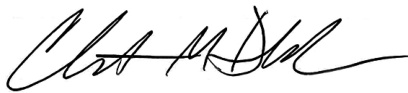
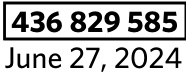

# To Whom it May Concern:  

I am a duly authorized representative of _A_ll_st_at_e_ V_e_h_ic_le_ _an_d_ _Pr_o_p_er_ty_ I_n_su_r_a_nc_e_ _C_o_m_pa_n_y_ . I certify that I have reviewed the records kept in the regular course of business and enclosed a copy of the policy and or declaration pages for the above claim and policy number.  

This information, and supporting documents, were either sent via electronic mail (email) or printed and mailed through Allstate’s Output Processing.  

TDDTTADAFDADAAAADAAFTFDTADFADTDDTDDAATFAAADDADTDTAAAATAAFATAAFADT   
TERRY CONNELLY   
PHYLLIS CONNELLY   
410 PRESSWOOD DR   
SPRING TX 77386-1207   
Your Allstate agency is   
Willie Bradley Ins   
(972) 248-0111   
WILLIEBRADLEY@ALLSTATE.COM  

# Thanks for Choosing Allstate—We’re Happy to Have You with Us!  

# Here’s your insurance policy  

We're happy you're extending your relationship with us. We truly value and appreciate your business. Along with your new House & Home policy, I've included a guide to what’s in this package and answers to some common questions.  

# You qualify for a Multiple Policy Discount!  

I'm happy to pass along the great news that you now qualify for our Multiple Policy Discount. Keep in mind that each time you purchase an additional Allstate policy, your discount could get even bigger! Besides the savings, you’re also enjoying the convenience of working with the same, experienced team on all of your Allstate policies.  

# How to contact us  

Please give me a call at (972) 248-0111 if you have any questions. It’s my job to make sure you’re in good hands.  

Sincerely,  

# Your Insurance Coverage Checklist  

We’re happy to have you as an Allstate customer! This checklist outlines what’s in this package and provides answers to some basic questions, as well as any “next steps” you may need to take.  

# £ What’s in this package?  

See the guide below for the documents that are included. Next steps: review your Policy Declarations to confirm you have the coverages, coverage limits, premiums and savings that you requested and expected. Read any Endorsements or Important Notices to learn about new policy changes, topics of special interest, as well as required communications. Keep all of these documents with your other important insurance papers.  

# £ Am I getting all the discounts I should?  

Confirm with your Allstate Agent that you’re benefiting from all the discounts you’re eligible to receive.  

# £ What about my bill?  

Unless you’ve already paid your premium in full, we’ll send your bill separately. Next steps: please pay the minimum amount by the due date listed on it.  

You can also pay your bill online at Allstate.com/support or through the Allstate mobile app. If you’re enrolled in the Allstate® Easy Pay Plan, we’ll send you a statement detailing your payment withdrawal schedule. Para español, Ilamar al 1-800-979-4285.  

# £ What if I have questions?  

Visit Allstate.com/support to browse our list of frequently asked questions and find information regarding billing or policy documents. You can also create an online account to access and manage your policies. Para español, Ilamar al 1-800-979-4285.  

# A guide to your welcome package  

  

# IMPORTANT NOTICE  

# AVISO IMPORTANTE  

# Have a complaint or need help?  

If you have a problem with a claim or your premium, call your insurance company first. If you can't work out the issue, the Texas Department of Insurance may be able to help.  

Even if you file a complaint with the Texas Department of Insurance, you should also file a complaint or appeal through your insurance company. If you don't, you may lose your right to appeal.  

# ¿Tiene una queja o necesita ayuda?  

Si tiene un problema con una reclamación o con su prima de seguro, llame primero a su compañía de seguros. Si no puede resolver el problema, es posible que el Departamento de Seguros de Texas (Texas Department of Insurance, por su nombre en inglés) pueda ayudar.  

Aun si usted presenta una queja ante el Departamento de Seguros de Texas, también debe presentar una queja a través del proceso de quejas o de apelaciones de su compañía de seguros. Si no lo hace, podría perder su derecho para apelar.  

# Allstate Insurance Company  

To get information or file a complaint with your insurance company:  

# Call: Toll Free at 1-800 Allstate® (1-800-255-7828)  

Email:   
allstatecustomerservicesupport@allstate.com   
Mail:   
P. O. Box 660598, Dallas, TX 75266-0598  

# Allstate Insurance Company  

Para obtener información o para presentar una queja ante su compañía de seguros:  

# Llame a: Teléfono gratuito al 1-800-255-7828  

Correo electrónico:   
allstatecustomerservicesupport@allstate.com   
Dirección postal:   
P. O. Box 660598, Dallas, TX 75266-0598  

# The Texas Department of Insurance  

To get help with an insurance question or file a complaint   
with the state: Call with a question: 1-800-252-3439 File a complaint: www.tdi.texas.gov Email: ConsumerProtection@tdi.texas.gov Mail: P.O. Box 12030, Austin, TX 78711-2030  

# El Departamento de Seguros de Texas  

Para obtener ayuda con una pregunta relacionada con los   
seguros o para presentar una queja ante el estado: Llame con sus preguntas al: 1-800-252-3439 Presente una queja en: www.tdi.texas.gov Correo electrónico: ConsumerProtection@tdi.texas.gov Dirección postal: P.O. Box 12030, Austin, TX 78711-2030  

# INSURANCE WEBSITE NOTICE  

# To compare policies and prices:  

Visit HelpInsure.com to compare prices and coverages on home and auto insurance policies. The website is a service of the Texas Department of Insurance and the Office of Public Insurance Counsel.  

# AVISO DEL SITIO WEB DE SEGURA  

# Para comparar pólizas y precios:  

Visite HelpInsure.com para comparar precios y coberturas en pólizas de seguro para el hogar y automóvil. El sitio web es un servicio del Departamento de Seguros de Texas y de la Oficina del Asesor Público de Seguros (Office of Public Insurance Counsel, por su nombre en inglés).  

# House & Home Policy Declarations  

Your policy effective date is June 27, 2024  

Total Premium for the Policy Period   

<html><body><table><tr><td colspan="2">Premium for property insured</td></tr><tr><td>RecoupmentFeeVolunteerRural FireDepartmentAssistance Program</td><td>$2,872.16 1.54</td></tr><tr><td>Total</td><td>$2,873.70</td></tr></table></body></html>  

Discounts (included in your total premium)   

<html><body><table><tr><td>ProtectiveDevice Claim Free</td><td>$46.74 $386.37</td><td>MultiplePolicy HomeBuyer</td><td>$569.63 $49.61</td></tr><tr><td>EarlySigning</td><td>$22.47</td><td>Responsible Payment</td><td>$696.38</td></tr><tr><td>Welcome</td><td>$274.54</td><td></td><td></td></tr><tr><td colspan="2">Total discount savings</td><td></td><td>$2,045.74</td></tr></table></body></html>  

# Insured property details\*  

Please review and verify the information regarding your insured property. Please refer to the Important Notice (X73182-1) for additional coverage information. Contact us if you have any changes.  

Location of property insured: 410 Presswood Dr, Spring, TX 77386-1207  

Location zone: N3012653W09542024   
Your location zone is based on the location of the insured property and is one of many factors used in determining your rate.  

Dwelling Style: Built in 1980; 1 family; 2406 sq. ft.; colonial - 1 story  

Foundation: Slab at grade, $100\%$  

Attached structure: Open porch, 20 sq. ft.  

Detached structure: One 2-car detached garage  

Interior details: One builders grade kitchen Three builders grade full baths  

One zero clearance pre-fab fireplace  

$50\%$ brick on frame  

Information as of June 20, 2024  

# Summary  

Named Insured(s)   
Terry  Connelly, Phyllis  Connelly   
Mailing address   
410 Presswood Dr   
Spring TX 77386-1207  

# 436 829 585  

Your policy provided by   
Allstate Vehicle and Property   
Insurance Company   
Policy period   
Beginning June 27, 2024 through June   
27, 2025 at 12:01 a.m. standard time   
Your Allstate agency is   
Willie Bradley Ins   
17430 Campbell #206   
Dallas TX 75252-5213   
(972) 248-0111   
WILLIEBRADLEY@ALLSTATE.COM  

Some or all of the information on your Policy Declarations is used in the rating of your policy or it could affect your eligibility for certain coverages. Please notify us immediately if you believe that any information on your Policy Declarations is incorrect. We will make corrections once you have notified us, and any resulting rate adjustments, will be made only for the current policy period or for future policy periods. Please also notify us immediately if you believe any coverages are not listed or are inaccurately listed.  

Exterior wall types: $50\%$ vinyl siding Interior wall partition: $100\%$ drywall Heating and cooling:  

# Insured property details\* (continued)  

<html><body><table><tr><td colspan="2">Average cost heat & central air conditioning, 100%</td></tr><tr><td>Additional details:</td><td></td></tr><tr><td>Standard wood sash with glass, 100% Two exteriorwooddoors</td><td>Interiorwall height -8 ft, 100%</td></tr><tr><td></td><td></td></tr><tr><td>Fire protection details:</td><td>2 miles to fire department</td></tr><tr><td>Fire department subscription-no</td><td></td></tr><tr><td>Roof surface material type:</td><td></td></tr><tr><td>Composition</td><td></td></tr><tr><td colspan="2">·10o% architectural shingles</td></tr><tr><td>Roof details:</td><td></td></tr><tr><td>Predominantroof type:Composition</td><td>Ageof roof-2years</td></tr><tr><td>Roofgeometry-Gable</td><td></td></tr><tr><td></td><td></td></tr><tr><td></td><td></td></tr></table></body></html>  

Mortgagee   
HOMELOANSERV ISAOA ATIMA   
P O Box 818007, Cleveland, OH 44181-8007   
Loan number: 4850126311  

Additional Interested Party - None \*This is a partial list of property details. If the interior of your property includes custom construction, finishes, buildup, specialties or systems, please contact your Allstate representative for a complete description of additional property details.  

Coverage detail for the property insured   

<html><body><table><tr><td>Coverage</td><td>Limits of Liability</td><td>ApplicableDeductible(s)</td></tr><tr><td>Dwelling Protection</td><td>$320,266</td><td>· $6,405 Tropical Cyclone · $6,405 Windstorm and Hail · $6,405 All other perils</td></tr><tr><td>Other Structures Protection</td><td>$32,027</td><td>· $6,405 Tropical Cyclone · $6,405 Windstorm and Hail · $6,405 All other perils</td></tr><tr><td>Personal Property Protection</td><td>$96,080</td><td>· $6,405 Tropical Cyclone · $6,405 Windstorm and Hail ·$6,405 All other perils</td></tr><tr><td>Additional Living Expense</td><td>Up to 24 months not to exceed $128,107</td><td></td></tr><tr><td>Family Liability Protection</td><td>$100,oo0 each occurrence</td><td></td></tr><tr><td>Guest Medical Protection</td><td>$5,000 each person</td><td></td></tr><tr><td>Foundation Water Damage</td><td>$5,000</td><td></td></tr><tr><td>Building Codes</td><td>Not purchased*</td><td></td></tr><tr><td>Building Structure Reimbursement Extended Limits</td><td>Not purchased*</td><td></td></tr><tr><td>Roof Surfaces Extended Coverage</td><td>Included</td><td></td></tr><tr><td>Water Back-Up</td><td>$5,000</td><td>· $500 Water Back-Up</td></tr></table></body></html>  

# Residence Glass  

# Not purchased\*  

# Other Coverages Not Purchased:  

• Additional Fire Department Charges\*   
• Building Materials Theft\*   
• Country Endorsement\*   
• Dwelling in the Course of Construction\*   
• Electronic Data Recovery\*   
• Extended Coverage on Cameras\*   
• Extended Coverage on Jewelry, Watches and Furs\*   
• Extended Coverage on Musical Instruments\*   
• Extended Coverage on Sports Equipment\*   
• Fair Rental Income\*   
• Golf Cart\*   
• Green Improvement\*   
• Home Day Care\*   
• Identity Theft Expenses\*   
• Increased Coverage on Business Property\*   
• Increased Coverage on Theft of Silverware\*   
• Loss Assessments\*   
• Residence Glass\*   
• Secondary Residence\*   
• Yard and Garden\*  

\* This coverage can provide you with valuable protection. To help you stay current with your insurance needs, contact your agent to discuss available coverage options and other products and services that can help protect you.  

# Scheduled Personal Property Coverage  

Your policy does not include Scheduled Personal Property Coverage. This coverage can provide you with valuable protection. To help you stay current with your insurance needs, contact your agent to discuss available coverage options and other products and services that can help protect you.  

# Your policy documents  

Your House & Home policy consists of the Policy Declarations, any Policy Declarations Addendum, and the following documents. Please keep them together.  

• AVPIC House & Home Policy  – AVP91   
• Windstorm and Hail Deductible Endorsement – AVP82   
• Water Back–Up Endorsement – AVP98-1   
• Roof Surfaces Extended Coverage Endorsement – AVP144-1   
• Depreciation Amendatory Endorsement – AP4970   
• Tropical Cyclone Deductible Endorsement – APC548-1   
• Texas Amendatory Endorsement – AVP348   
• Texas Amendatory Endorsement – AVP345  

Please note: The Policy Contract listed as the first item in this section is not mailed and can be found at allstate.com/forms. You can view your complete Policy Package, including the Policy Contract, on myaccount.allstate.com or request a mailed copy at 1-800 Allstate® (1-800-255-7828). Endorsements to your Policy Contract are only enclosed the first time they apply to your policy and not in subsequent renewal or endorsement packages.  

# Important payment and other information  

Here is some additional, helpful information related to your coverage and paying your bill: „ The Property Insurance Adjustment condition applies using the Marshall Swift Boeckh Publications building cost index.  

„ Do not pay.  Mortgagee has been billed.  

  
Allstate Vehicle and Property Insurance Company's Secretary and President have signed this policy with legal authority at Northbrook, Illinois.  

William Hill President  

Christine DeBiase Secretary  

# ALLSTATE VEHICLE AND PROPERTY INSURANCE COMPANY  

# House & Home Policy  

TEXAS  

Policy number 436 829 585  

Policy effective June 27, 2024  

Policyholders   
Terry  Connelly, Phyllis  Connelly   
410 Presswood Dr   
Spring TX 77386-1207  

Your Allstate agency is Willie Bradley Ins 17430 Campbell #206 Dallas TX 75252-5213  

  

# Table of Contents  

Agreements We Make With You ..... .. 3   
General ... 3   
Definitions Used In This Policy ......... . 3   
Insuring Agreement .. 4   
Conformity To State Statutes ........ .. 4   
Coverage Changes ... .. 4   
Policy Transfer .... .. 4   
Continued Coverage After Your Death .. .. 4   
Dividend Provision .... ... 4   
Cancellation .... .. 4   
Refusal To Renew .. .. 5   
Charge For Insufficient Funds ... ... 5   
Misrepresentation, Fraud Or Concealment .... ... 5   
What Law Will Apply .. .. 5   
Where Lawsuits May Be Brought .. .. 5   
Action Against Us ..... .. 5   
Arbitration ........ ... 5   
Residential Community Property Clause .. .. 6   
Loss Reduction And Other Items .. ... 6   
Section I—Your Property ....... .. 6   
Dwelling Protection–Coverage A .. ... 6   
Property We Cover Under Coverage A .. ... 6   
Property We Do Not Cover Under Coverage A .. .. 6   
Other Structures Protection–Coverage B .. .. 6   
Property We Cover Under Coverage B ... ... 6   
Property We Do Not Cover Under Coverage B .. .. 6   
Personal Property Protection–Coverage C .. .. 6   
Property We Cover Under Coverage C ... .. 6   
Limitations On Certain Personal Property ....... ... 6   
Property We Do Not Cover Under Coverage C .. . 7   
Losses We Cover Under Coverages A, B and C .. . 7   
Losses We Do Not Cover Under Coverages A, B and C. ... ... 8   
Section I Additional Protection ... . 10   
Additional Living Expense ...... ... 10   
Civil, Governmental And Military Authorities .. .. 10   
Debris Removal .... .. 11   
Emergency Removal Of Property .. .. 11   
Fire Department Charges ..... .. 11   
Temporary Repairs After A Loss .. .. 11   
Trees, Shrubs, Plants And Lawns .. .. 11   
Power Interruption ... .. 11   
Arson Reward . .. 11   
Collapse ....... .. 11   
Lock Replacement .. .... 12   
Foundation Water Damage .......... ... 12   
Section I Conditions .. .. 12   
Deductible ... .. 12   
Insurable Interest And Our Liability .. .. 12   
What You Must Do After A Loss .. ... 12   
Our Duties After Loss ..... .. 13   
Our Settlement Options .. .. 13   
How We Pay For A Loss .. ... 13   
Our Settlement Of Loss ... .... 14   
Appraisal .... ..... 14   
Abandoned Property .... ...... 14   
Permission Granted To You ... .. 15   
Our Rights To Recover Payment .. ..... 15   
Our Rights To Obtain Salvage .. .... 15   
Action Against Us ... ... 15   
Loss To A Pair Or Set .. ..... 15   
Glass Replacement ... ..... 15   
No Benefit To Bailee ....... ...... 15   
Other Insurance ....... ... 15   
Property Insurance Adjustment .. ...... 15   
Mortgagee ... ..... 15   
Catastrophe Claims .. .... 16   
Mold, Fungus, Wet Rot And Dry Rot Or Other Microbes Remediation   
As A Direct Result Of A Covered Water Loss ..... .... 16   
Section II—Family Liability And Guest Medical Protection .. .... 16   
Family Liability Protection–Coverage X . .. 16   
Losses We Cover Under Coverage X.... .... 16   
Losses We Do Not Cover Under Coverage X ... ..... 16   
Guest Medical Protection–Coverage Y .. .... 18   
Losses We Cover Under Coverage Y ... ... 18   
Losses We Do Not Cover Under Coverage Y ... ..... 18   
Section II Additional Protection .. ... 19   
Claim Expenses .... ... 19   
Emergency First Aid ... ..... 19   
Damage To Property Of Others ... ..... 19   
Section II Conditions .. ...... 19   
What You Must Do After A Loss . .. 19   
What An Injured Person Must Do—Guest Medical Protection–Coverage Y .... 20   
Our Payment Of Loss—Guest Medical Protection–Coverage Y. .. .. 20   
Our Limits Of Liability .... .. 20   
Bankruptcy ...... ..... 20   
Our Rights To Recover Payment—Family Liability Protection–Coverage X ..... 20   
Action Against Us ... ...... 20   
Other Insurance—Family Liability Protection–Coverage X .. .. 20   
Notice Of Settlement Of Liability Claim ... ........... 20   
Section III—Optional Protection .. ... 20   
Optional Coverages ... ... 20   
Building Codes–Coverage BC ... ... 20   
Increased Coverage On Business Property–Coverage BP ... ....... 21   
Fire Department Charges–Coverage F .. .. 21   
Loss Assessments–Coverage G ... .. 21   
Extended Coverage On Jewelry, Watches And Furs–Coverage J .. .. 21   
Increased Coverage On Theft Of Silverware–Coverage ST .. .. 21  

<html><body><table><tr><td>436829585</td></tr><tr><td>June27,2 2024</td></tr></table></body></html>  

# Agreements We Make With You  

We make the following agreements with you:  

# General  

# Definitions Used In This Policy  

Throughout this policy, when the following words appear in bold type, they are defined as follows:  

1. Bodily injury—means physical harm to the body, including sickness or disease, and resulting death, except that bodily injury does not include diseases transmitted through sexual contact including:  

a) any venereal disease;   
b) herpes;   
c) Acquired Immune Deficiency Syndrome (AIDS);   
d) AIDS Related Complex (ARC);   
e) Human Immunodeficiency Virus (HIV);  

or any resulting symptom, effect, condition, disease or illness related to a) through e) listed above.  

In addition, bodily injury does not include any symptom, effect, condition, disease or illness resulting in any manner from:  

a) lead in any form;   
b) asbestos in any form;   
c) radon in any form; or   
d) oil, fuel oil, kerosene, liquid propane or gasoline intended for, or from, a storage tank located at the residence premises;   
unless such symptom, effect, condition, disease or illness results from:   
a)  heat, smoke or fumes from a fire which becomes uncontrollable or escapes from its intended location; or   
b) the sudden and accidental discharge, dispersal, release or escape of carbon monoxide from a heating system, an appliance for heating water, or a household appliance located at the residence premises.  

2.  Building structure—means a structure with walls and a roof.  

# 3. Business—means:  

) any full- or part-time activity of any kind engaged in for economic gain including the use of any part of any premises for such purposes. The providing of home day care services to other than an insured person or relative of an insured person for economic gain is also a business.  

However, the mutual exchange of home day care services is not considered a business;  

b)  the rental or holding for rental of property by an insured person. Rental of your residence premises is not considered a business when: 1)  it is rented occasionally for residential purposes; 2)  a portion is rented to roomers or boarders, provided not more than two roomers or boarders reside on the residence premises at any one time; or 3)  a portion is rented as a private garage.  

4. Business day—means a day other than a Saturday, Sunday or holiday recognized by the state of Texas.   
5. Dwelling—means the single-family building structure, identified as the insured property on the Policy Declarations, where you reside and which is principally used as a private residence.   
6. Insured person(s)—means you and, if a resident of your household: a)  any relative; and b)  any person under the age of 21 in your care.  

# Under Family Liability Protection–Coverage X and Guest Medical Protection–Coverage Y, “insured person” also means:  

a) any person or organization legally responsible for loss caused by animals or watercraft covered by this policy which are owned by an insured person. We do not cover any person or organization using or having custody of animals or watercraft in any business, or without permission of the owner.   
b) with respect to the use of any vehicle covered by this policy, any person while engaged in the employment of an insured person.  

# 7. Insured premises—means:  

# a) the residence premises; and  

) under Section II only: 1) the part of any other premises, other structures and grounds used by you as a residence. This includes premises, structures and grounds you acquire for your use as a private residence while this policy is in effect; 2) any part of a premises not owned by an insured person but where an insured person is temporarily living; 3) cemetery plots or burial vaults owned by an insured person; 4) land owned by or rented to an insured person where a single-family dwelling is being built as that person's residence; 5) any premises used by an insured person in connection with the residence premises; and 6) any part of a premises occasionally rented to an insured person for other than business purposes.  

8.  Occurrence—means an accident, including continuous or repeated exposure to substantially the same general harmful conditions during the policy period, resulting in bodily injury or property damage.   
9. Property damage—means physical injury to or destruction of tangible property, including loss of its use resulting from such physical injury or destruction.   
10.  Residence employee—means an employee of an insured person while performing duties arising out of and in the course of employment in connection with the maintenance or use of your residence premises. This includes similar duties performed elsewhere for an insured person, not in connection with the business of an insured person.   
11. Residence premises—means the dwelling, other structures and land located at the address stated on the Policy Declarations.  

12.  Roof surface—means the roof surface material type (slate, composition, wood, tile, metal, all other roof surface material types) of a building structure or other structure covered under Dwelling Protection– Coverage A or Other Structures Protection–Coverage B and all other roofing components, including, but not limited to:  

a) flashing, caps, vents, drip edges, and ice shields;   
b) sheeting, felt and membranes;   
c) modified bitumen, bitumen, rubber, built-up and sprayed polyurethane foam roofing;   
d) foam inserts and elastomeric coating;   
e) finials, eave and gable trim and snow guards;   
f) battens, counter battens, bird stops, gravel stops; and   
g) coatings, adhesives, adherents and other finishing materials for roof surface materials and all other roofing components.   
13.  Sudden and accidental—means damage which occurs abruptly and is unexpected and/or unintended from the standpoint of you.   
14. We, us, or our—means the company named on the Policy Declarations   
15. Windstorm—means wind with or without precipitation.   
16. You or your—means the person listed under Named Insured(s) on the Policy Declarations as the insured and that person's resident spouse.  

# Insuring Agreement  

In reliance on the information you have given us, we agree to provide the coverages indicated on the Policy Declarations. In return, you must pay the premium when due and comply with the policy terms and conditions, and inform us of any change in title, use or occupancy of the residence premises.  

Subject to the terms of this policy, the Policy Declarations shows the location of the residence premises, applicable coverages, limits of liability and premiums. The policy applies only to losses or occurrences that take place during the policy period. The Policy Period is shown on the Policy Declarations. This policy is not complete without the Policy Declarations.  

This policy imposes joint obligations on the Named Insured(s) listed on the Policy Declarations and on that person's resident spouse. These persons are defined as you or your. This means that the responsibilities, acts and omissions of a person defined as you or your will be binding upon any other person defined as you or your.  

# Conformity To State Statutes  

When the policy provisions conflict with the statutes of the state in which the residence premises is located, the provisions are amended to conform to such statutes.  

# Coverage Changes  

When we broaden coverage during the policy period without charge, you have the new features if you have the coverage to which they apply. Otherwise, the policy can be changed only by endorsement.  

The coverage provided and the premium for the policy are based on information you have given us. You agree to cooperate with us in determining if this information is correct and complete. You agree that if this information changes, or if this information is incorrect or incomplete, we may adjust your coverage and premium accordingly during the policy period.  

Any calculation of your premium or changes in your coverage will be made using the rules, rates and forms on file, if required, for our use in your state. The rates in effect at the beginning of your current policy period will be used to calculate any change in your premium.  

# Policy Transfer  

You may not transfer this policy to another person without our written consent.  

# Continued Coverage After Your Death  

If you die, coverage will continue until the end of the current policy period for:   
1. your legal representative while acting as such, but only with respect to the residence premises and property covered under this policy on the date of your death.   
2. an insured person, and any person having proper temporary custody of your property until a legal representative is appointed and qualified.  

# Dividend Provision  

To the extent and upon the conditions fixed and determined from time to time by our Board of Directors in accordance with the provisions of the Texas Insurance Code of 1951, as amended, you shall be entitled to participate in a distribution of our surplus.  

# Cancellation  

1.  You may cancel this policy at any time by notifying us of the date cancellation is to take effect. We will send you any refund due when the policy is returned to us.   
2.  If this policy has been in effect for less than 60 days and is not a renewal we may cancel this policy if: a)  we identify a condition that: 1)  creates an increased risk of hazard; 2)  was not disclosed in the application for insurance coverage; and 3)  is not the subject of a prior claim; or b)  before the effective date of the policy, we have not accepted a copy of a required inspection report that: 1) was completed by an inspector licensed by the Texas Real Estate Commission or who is otherwise authorized to perform inspections; and 2) is dated not earlier than the $90^{\mathrm{th}}$ day before the effective date of the policy. An inspection report is deemed accepted, unless we reject it before the 11th day after the date the inspection report is received by us.   
3.  We may cancel this policy at any time for the following reasons: you do not pay the premium or any portion of the premium when due. b) the Department of Insurance determines that continuation of the policy would violate the Texas Insurance Code or any other laws governing the business of insurance in this state.  

# 436 829 585 June 27, 2024  

c) you submit a fraudulent claim. d) there is an increase in the hazard covered by this policy that is within your control and that would produce an increase in the premium rate of this policy.   
4. The effective date of cancellation cannot be before the $10^{\mathrm{th}}$ day after we mail the notice if we cancel for any of the reasons in item 3 above or the $30^{\mathrm{th}}$ day after we mail the notice if we cancel for any other reason. Our notice of cancellation must state the reason for cancellation.   
5. If we cancel, our notice to you will state that if the refund is not included with the notice, it will be provided on demand.   
6. We may not cancel this policy solely because you are an elected official  

# Refusal To Renew  

1. We may not refuse to renew this policy because of claims for losses resulting from natural causes.  

2.  We may not refuse to renew this policy solely because you are an elected officer.  

3. We may refuse to renew this policy if you have filed three or more claims under the policy in any three year period that do not result from natural causes.  

If you have filed two claims in a period of less than three years, we may notify you in writing, that if you file a third claim during the three year period, we may refuse to renew this policy by providing you proper notice of our refusal to renew as provided in 4 below. If we do not notify you after the second claim, we may not refuse to renew this policy because of losses.  

A claim does not include a claim that is filed but is not paid or payable under this policy.  

4. If we refuse to renew this policy, we must deliver to you, or mail to you at your mailing address shown on the Policy Declarations and any mortgagee named on the Policy Declarations, written notice of our refusal to renew not later than the $30^{\mathrm{th}}$ day before the date on which this policy expires. Proof of mailing will be sufficient proof of notice. If we fail to give you proper notice of our decision not to renew, you may require us to renew the policy.  

# Charge For Insufficient Funds  

If at any time, your payment of any premium amount due is made by check, electronic transaction or other remittance which is not honored because of insufficient funds or closed account, you will be charged a fee.  

# Misrepresentation, Fraud Or Concealment  

We may void this policy if it was obtained by misrepresentation, fraud or concealment of material facts. If we determine that this policy is void, all premiums paid will be returned to you since there has been no coverage under this policy.  

We do not cover any loss or occurrence in which any insured person has concealed or misrepresented any material fact or circumstance.  

# What Law Will Apply  

This policy is issued in accordance with the laws of the state in which the residence premises is located and covers property or risks principally located in that state. Subject to the following paragraph, the laws of the state in which the residence premises is located shall govern any and all claims or disputes in any way related to this policy.  

If a covered loss to property, or any other occurrence for which coverage applies under this policy, happens outside the state in which the residence premises is located, claims or disputes regarding that covered loss to property, or other covered occurrence, may be governed by the laws of the jurisdiction in which that covered loss to property or other covered occurrence happened, only if the laws of that jurisdiction would apply in the absence of a contractual choice of law provision such as this.  

# Where Lawsuits May Be Brought  

Subject to the following two paragraphs, any and all lawsuits in any way related to this policy, shall be brought, heard and decided only in a state or federal court located in the state in which the residence premises is located. Any and all lawsuits against persons not parties to this policy but involved in the sale, administration, performance, or alleged breach of this policy, or otherwise related to this policy, shall be brought, heard and decided only in a state or federal court located in the state in which the residence premises is located, provided that such persons are subject to or consent to suit in the courts specified in this paragraph.  

If a covered loss to property, or any other occurrence for which coverage applies under this policy, happens outside the state in which the residence premises is located, lawsuits regarding that covered loss to property, or other covered occurrence, may also be brought in the judicial district where that covered loss to property or other covered occurrence happened.  

Nothing in this provision, Where Lawsuits May Be Brought, shall impair any party’s right to remove a state court lawsuit to a federal court.  

# Action Against Us  

No one may bring an action against us unless there has been full compliance with all policy terms.  

Any action against us to which neither the Action Against Us provision located in Section I Conditions nor the Action Against Us provision located in Section II Conditions applies must be commenced within two years and one day of the date the cause of action first accrues.  

If an action is brought asserting claims relating to the existence or amount of coverage, or the amount of loss for which coverage is sought, under different coverages of this policy, the claims relating to each coverage shall be treated as if they were separate actions for the purpose of the time limit to commence action.  

# Arbitration  

After a loss or occurrence, any coverage claim or dispute in any way related to this policy, by an insured person against us or us against an insured person, may be resolved by arbitration only upon mutual consent of the parties. Arbitration pursuant to this provision shall be subject to the following:  

1. no arbitrator shall have the authority to award punitive damages or attorney’s fees;   
2. neither of the parties shall be entitled to arbitrate any claims or disputes in a representative capacity or as a member of a class; and   
3. no arbitrator shall have the authority, without the mutual consent of the parties, to consolidate claims or disputes in arbitration.  

# Residential Community Property Clause  

This policy, subject to all other terms and conditions, when covering residential community property, as defined by state law, shall remain in full force and effect as to the interest of each spouse covered, irrespective of divorce or change of ownership between the spouses unless excluded by endorsement attached to this policy, until the expiration of the policy or until cancelled in accordance with the terms and conditions of this policy.  

# Loss Reduction And Other Items  

From time to time and in our sole discretion, we may provide you, or allow others to provide you, with:  

1. items, memberships, special offers, merchandise, points, services, classes, seminars or other things of value designed to help you or other persons insured under this policy manage the risks you or they face, including, but not limited to, loss reduction or safety-related items; or   
2. items, memberships, special offers, merchandise, points, services, classes, seminars or things of any other type that we think may be of value to you or someone else insured under this policy. These items, memberships, special offers, merchandise, points, services, classes, seminars or other things of value may be provided in any form, including, but not limited to, redemption codes, coupons, vouchers and gift cards.  

# Section I—Your Property  

# Dwelling Protection–Coverage A  

# Property We Cover Under Coverage A:  

1.  Your dwelling, including attached structures. Structures connected to your dwelling by only a fence, utility line, or similar connection are not considered attached structures.   
2. Construction materials and supplies at the residence premises for use in connection with your dwelling.   
3.  Wall-to-wall carpeting fastened to your dwelling.  

# Property We Do Not Cover Under Coverage A:  

Any structure, including fences, or other property covered under Other Structures Protection–Coverage B.  

2. Land.   
3. Satellite dish antennas and their systems, whether or not attached to your dwelling.  

# Other Structures Protection–Coverage B  

# Property We Cover Under Coverage B:  

1. Structures at the address shown on the Policy Declarations separated from your dwelling by clear space.   
2. Structures at the address shown on the Policy Declarations connected to your dwelling by only a fence, utility line, or similar connection.   
3. Construction materials and supplies at the residence premises for use in connection with structures other than your dwelling.   
4. Wall-to-wall carpeting fastened to building structures, other than your dwelling, at the address shown on the Policy Declarations.  

# Property We Do Not Cover Under Coverage B:  

1. Structures used in whole or in part for business purposes.   
2. Any structure or other property covered under Dwelling Protection– Coverage A.   
3. Land.   
4. Construction materials and supplies at the residence premises for use in connection with the dwelling.   
5. Satellite dish antennas and their systems, whether or not attached to building structures.  

# Personal Property Protection–Coverage C  

# Property We Cover Under Coverage C:  

1. Personal property owned or used by an insured person anywhere in the world. When personal property is located away from the residence premises, coverage is limited to $10\%$ of Personal Property Protection–Coverage C.   
2. At your option, personal property owned by a guest or residence employee while the property is in a residence you are occupying.  

# Limitations On Certain Personal Property:  

Limitations apply to the following groups of personal property. If personal property can reasonably be considered a part of two or more of the groups listed below, the lowest limit will apply. These limitations do not increase the amount of insurance under Personal Property Protection–Coverage C. The total amount of coverage for each group in any one loss is as follows:  

1. $\mathfrak{S}$ 200 —  Property used or intended for use in a business while the property is away from the residence premises. This does not include electronic data processing equipment or the recording or storage media used with that equipment.   
2.  \$  500 —  Theft of any recording or storage media while such property is away from the residence premises, whether or not it is used with electronic data processing equipment or in a business. Recording or storage media includes, but is not limited to:  

House & Home Policy Policy number: Policy effective date:  

<html><body><table><tr><td>436829585</td></tr><tr><td>June27,2 2024</td></tr></table></body></html>  

# Page 7 of 21  

a) tapes;   
b) CDs, DVDs and other discs;   
c) records;   
d) disks;   
e) reels;   
f) cassettes;   
g) cartridges; or h)  programs.   
3.  \$  1,000 —  Property used or intended for use in a business, including property held as samples or for sale or delivery after sale, while the property is on the residence premises. This does not include electronic data processing equipment or the recording or storage media used with that equipment.   
4.  \$  1,000 —  Trading cards, subject to a maximum amount of $\mathtt{5250}$ per card.   
5. $\mathfrak{S}$ 1,000 —  Watercraft, including their attached or unattached trailers, furnishings, equipment, parts, and motors.   
6. $\mathfrak{S}$ 1,000 —  Trailers not used with watercraft.   
7. $\mathfrak{S}$ 1,500 —  Motorized land vehicle parts, equipment or accessories not attached to or located in or upon any motorized land vehicle.   
8. $\mathfrak{S}$ 2,000 —  Theft of firearms, their related equipment, and accessories.   
9. $\mathfrak{S}$ 2,500 —  Theft of goldware, silverware, pewterware and platinumware.   
10. $\mathfrak{S}$ 5,000 —  Theft of jewelry, watches, precious and semi-precious stones, gold other than goldware, silver other than silverware, pewter other than pewterware, platinum other than platinumware, and furs, including any item containing fur which represents its principal value, subject to a maximum amount of $\mathtt{51},\mathtt{000}$ per item.   
11. $\mathfrak{S}$ 10,000 —  Theft of tools and their accessories.   
12. $\mathfrak{S}$ 10,000 —  Motorized land vehicles used solely for the service of the insured premises and not licensed for use on public roads. This does not include motorized land vehicles designed for assisting the disabled and not licensed for use on public roads.  

# Property We Do Not Cover Under Coverage C:  

1.  Personal property specifically described and insured by this or any other insurance.  

3. Motorized land vehicles, including, but not limited to, any land vehicle powered or assisted by a motor or engine. We do not cover any motorized land vehicle parts, equipment or accessories attached to or located in or upon any motorized land vehicle. We do cover motorized land vehicles designed for assisting the disabled, or used solely for the service of the insured premises, and not licensed for use on public roads.  

4.  Aircraft and aircraft parts. This does not include model or hobby craft not designed to carry people or cargo.   
5. Property of roomers, boarders or tenants not related to you.   
6. Property located away from the residence premises and rented or held for rental to others.   
7. Satellite dish antennas and their systems.   
8. Money, bullion, bank notes, coins and other numismatic property, scrip, stored value cards, and smart cards.   
9.  Accounts, bills, deeds, evidences of debt, letters of credit, notes other than bank notes, checks, cashier’s checks, traveler’s checks, passports, securities, tickets, and stamps, including philatelic property.   
10.  Manuscripts, including documents stored on electronic media.  

Losses We Cover Under Coverages A, B and C: We will cover sudden and accidental direct physical loss to the property described in Dwelling Protection–Coverage A, Other Structures Protection–Coverage B or Personal Property Protection–Coverage C caused by the following, except as limited or excluded in this policy:  

1. Fire or lightning.   
2. Windstorm or hail. We do not cover: a)  loss to covered property inside a building structure, caused by rain, snow, sleet, sand or dust unless the wind or hail first damages the roof or walls and the wind forces rain, snow, sleet, sand or dust through the damaged roof or wall; b)  loss to watercraft and their trailers, furnishings, equipment and motors unless inside a fully enclosed building structure. However, we do cover canoes and rowboats on the residence premises.   
3. Explosion.   
4. Riot or civil commotion, including pillage and looting during, and at the site of, the riot or civil commotion.   
5. Aircraft, including self-propelled missiles and spacecraft.   
6. Vehicles.   
7. Smoke.   
8. Vandalism and malicious mischief.  

We do not cover vandalism or malicious mischief if your dwelling has been vacant or unoccupied for more than 30 consecutive days immediately prior to the vandalism or malicious mischief. A dwelling under construction is not considered vacant or unoccupied.  

<html><body><table><tr><td>436829585</td></tr><tr><td>June27,2 2024</td></tr></table></body></html>  

# 9. Falling objects.  

We do not cover loss to personal property inside a building structure unless the falling object first damages the exterior walls or roof of the building structure.  

10.  Weight of ice, snow or sleet which causes damage to:  

a)  a building structure or other structure covered under Dwelling Protection–Coverage A or Other Structures Protection– Coverage B; or   
b) property covered under Personal Property Protection–Coverage C in a building structure, but only if the building structure is damaged due to the weight of ice, snow or sleet.  

11. Artificially generated electrical current to electronics, electrical appliances, fixtures and wiring.  

12.  Bulging, burning, cracking or rupture of a steam or hot water heating system, an air conditioning system, an automatic fire protective sprinkler system or an appliance for heating water.  

13.  Water or steam that escapes from a plumbing, heating or air conditioning system, an automatic fire protective sprinkler system, or from a household appliance due to accidental discharge or overflow. However, we do not cover loss, including ensuing loss or the cost of tearing out and replacing any part of your dwelling, caused by the discharge or overflow of water or steam from within a plumbing, heating or air conditioning system, household appliance or fire protective sprinkler system where the source of the discharge or overflow is either below the surface of the ground or within or below the slab or foundation of the dwelling except as specifically provided in Section I, Additional Protection, under item 12, Foundation Water Damage.  

We do not cover loss to the system or appliance from which the water or steam escapes, or loss from water which backs up through sewers or drains or overflows from a sump pump, sump pump well or other system designed for the removal of subsurface water which is drained from a foundation area of a structure.  

14.  Freezing of a plumbing, heating or air conditioning system, an automatic fire protective sprinkler system or a household appliance.  

We do not cover loss at the residence premises under items 12, 13, and 14, immediately above, which is caused by freezing while the building structure is vacant, unoccupied or under construction, or when freezing results from a lack of utility services at the residence premises to which item A.10 in Losses We Do Not Cover Under Coverages A, B and C applies, unless you have used reasonable care to maintain heat in the building structure. If the building structure is not equipped with an automatic fire protective sprinkler system, you may elect to shut off the water supply and drain the water from the systems and appliances instead of maintaining heat in the building structure.  

15.  Theft, or attempted theft, including disappearance of property from a known place when it is likely that a theft has occurred. Any theft must be promptly reported to the police.  

We do not cover:   
a)  theft or attempted theft committed by an insured person;   
b) theft in or from the residence premises while under construction or of materials and supplies for use in construction, until the dwelling is completed and occupied;   
c) theft of any property while at any other residence owned, rented to or occupied by an insured person unless the insured person is temporarily residing there;   
d) theft of trailers, campers, watercraft, including furnishings, equipment and outboard motors, away from the residence premises; or   
e) theft from that part of the residence premises rented by you to other than an insured person.  

16.  Breakage of glass, meaning damage to covered personal property caused by breakage of glass constituting a part of any building structure on the residence premises. This does not include damage to the glass.  

Losses We Do Not Cover Under Coverages A, B and C:   
A.  Under Dwelling Protection–Coverage A, Other Structures Protection–Coverage B or Personal Property Protection–Coverage C of this policy, we do not cover any loss which consists of, is caused by, or would not have occurred but for, one or more of the following excluded events, perils or conditions. Such loss is excluded regardless of: a) the cause or source of the excluded event, peril or condition; b) any other causes contributing concurrently or in any sequence with the excluded event, peril or condition to produce the loss; or c) whether the excluded event, peril or condition involves isolated or widespread damage, arises from natural, man-made or other forces, or arises as a result of any combination of these forces.   
1. Flood, including, but not limited to, surface water, waves, tidal water or overflow of any body of water, or spray from any of these, whether or not driven by wind.   
2. Water or any other substance that backs up through sewers or drains.   
3. Water or any other substance that overflows from a sump pump, sump pump well or other system designed for the removal of subsurface water which is drained from a foundation area of a structure.   
4. Water or any other substance on or below the surface of the ground. This includes water or any other substance which exerts pressure on, or flows, seeps or leaks through any part of the residence premises.  

We do cover sudden and accidental direct physical loss caused by fire or explosion resulting from items 1 through 4 listed above.  

5. Earth movement of any type, including, but not limited to, earthquake, volcanic eruption, lava flow, landslide, subsidence, mudflow, pressure, sinkhole, erosion, or the sinking, rising, shifting, creeping, expanding, bulging, cracking, settling or contracting of the earth. This exclusion applies whether or not the earth movement is combined with water.  

# House & Home Policy Policy number: Policy effective date:  

<html><body><table><tr><td></td></tr><tr><td>436829585</td></tr><tr><td>June 27,2 2024</td></tr></table></body></html>  

We do cover sudden and accidental direct physical loss caused by fire or explosion resulting from earth movement.  

6. Actions taken by civil, governmental or military authorities: a)  to enforce any building codes, ordinances or laws regulating or requiring the construction, reconstruction, maintenance, replacement, repair, placement or demolition of any building structure, other structure or land at the residence premises; or b) requesting, demanding or ordering that an insured person test for, monitor, clean up, remove, contain, treat, detoxify, decontaminate, or neutralize, or in any way respond to or assess the effects of, any loss or potential loss at the residence premises.  

However, we will cover sudden and accidental direct physical loss caused by actions of civil, governmental or military authority to prevent the spread of fire.  

7. Nuclear hazard, meaning nuclear reaction, discharge, radiation or radioactive contamination, or any consequence of any of these. Loss which consists of, is caused by, or would not have occurred but for, the nuclear hazard is not considered loss by fire, explosion or smoke.  

8.  a)  War, whether declared or undeclared;  

b) warlike acts;   
c) invasion;   
d) insurrection;   
e) rebellion;   
f) revolution;   
g) civil war;   
h) usurped power;   
i) destruction for a military purpose; or j) action taken by civil, governmental or military authority to hinder or defend against an actual or impending enemy act.  

9. Vapors, fumes, smoke, smog, soot, alkalis, acids, toxic chemicals, toxic gasses, toxic liquids, toxic solids, waste materials, or other irritants, contaminants or pollutants.  

However, we will not apply this exclusion to sudden and accidental direct physical loss which consists of, is caused by, or would not have occurred but for:  

a) a fire or an explosion at your residence premises;   
b) smoke or soot resulting from food preparation at your residence premises;   
c) the malfunction of a heating or air conditioning system or a household appliance at your residence premises;   
d) smoke, soot or fumes originating away from your residence premises, provided the smoke, soot or fumes: 1) were not from industrial, governmental or military operations, agricultural smudging, or the manufacturing of any controlled substance; and 2)  did not result from nuclear hazard, meaning nuclear reaction, discharge, radiation or radioactive contamination, or any consequence of any of these;   
e) spray, overspray, spatter, or spillage, by a person located on the ground at the residence premises or in or upon a structure we cover at the residence premises, of lawfully possessed, commercially available supplies manufactured or produced for use in food preparation, personal hygiene, or for cleaning or maintaining a residential property or personal property;   
f) spillage or release at your residence premises of gas or oil, in any form, used to prepare foods at your residence premises, or to heat the dwelling or other building structures at your residence premises, when such spillage or release results in a fire or an explosion at your residence premises; or   
g) fuel, oil or other fluids necessary to operate a motorized land vehicle if, at the time of the loss, such fuel, oil or other fluids are being used solely for the purpose of operating a motorized land vehicle and the loss results from a collision, at the residence premises, of the motorized land vehicle with property we cover under Dwelling Protection–Coverage A or Other Structures Protection–Coverage B.  

10.  Lack of utility services at the residence premises, meaning loss or interruption of, lack or loss of access to, or unavailability of, one or more utility services for the residence premises, including, but not limited to, electric, natural gas or other fuels, water, sanitation, sewer, cable or communication services, unless the lack of utility services results solely from a sudden and accidental direct physical loss to property located at the residence premises caused by an event, peril or condition not excluded by this policy.  

When the lack of utility services results in freezing of:   
a) plumbing, automatic fire protective sprinkler system, heating or air conditioning systems; or   
b) household appliances;  

or when the lack of utility services results in discharge, leakage or overflow from within a) or b) above caused by freezing, we do cover sudden and accidental direct physical loss caused by the freezing if you used reasonable care to maintain heat in the building structure. If the building structure is not equipped with an automatic fire protective sprinkler system, you may elect to shut off the water supply and drain the water from the systems and appliances instead of maintaining heat in the building structure.  

11. Inability of an insured person to use, access or retain personal property we cover under Personal Property Protection– Coverage C due to an actual, impending or expected lack, impassability or unavailability of any reasonable means of ingress to or egress from the residence premises or any other location where the property is located, including, but not limited to, roads, highways, causeways, sidewalks, paths, rails, bridges, tunnels or waterways.  

  

For purposes of this exclusion, a particular means of ingress or egress will be considered impassable or unavailable if: a)  it cannot be safely traveled due to physical damage or destruction of that means of ingress or egress; or b)  it cannot be traveled due to actions by others, including, but not limited to, civil, governmental or military authorities which prohibit or restrict travel using that means of ingress or egress. 12.  Weather Conditions that contribute in any way with an event, peril or condition excluded under Losses We Do Not Cover Under Coverages A, B and C to produce a loss.  

B. Under Dwelling Protection–Coverage A, Other Structures Protection–Coverage B or Personal Property Protection–Coverage C of this policy, we do not cover any loss consisting of or caused by mold, fungus, wet rot, dry rot or other microbes. This includes any loss which, in whole or in part, arises out of, is aggravated by or results from mold, fungus, wet rot, dry rot or other microbes.  

This exclusion applies regardless of whether mold, fungus, wet rot, dry rot or other microbes arises from any other cause of loss, including, but not limited to, a loss involving water, water damage or discharge, which may otherwise be covered by this policy, except as specifically provided in Section I Conditions, Mold, Fungus, Wet Rot And Dry Rot Or Other Microbes Remediation As A Direct Result Of A Covered Water Loss.  

C. When loss is not excluded under paragraph A or paragraph B of Losses We Do Not Cover Under Coverages A, B and C, and there are two or more causes of loss to the covered property, we do not cover the loss if the predominant cause(s) of loss is (are) excluded under paragraph D, immediately below.  

D. Under Dwelling Protection–Coverage A, Other Structures Protection–Coverage B or Personal Property Protection–Coverage C of this policy, we do not cover any loss consisting of or caused by one or more of the following excluded events, perils or conditions. Such loss is excluded regardless of whether the excluded event, peril or condition involves isolated or widespread damage, arises from natural, man-made or other forces, or arises as a result of any combination of these forces.  

1. The failure by any insured person to take all reasonable steps to save and preserve property when the property is endangered by a cause of loss we cover.   
2. Intentional or criminal acts of or at the direction of any insured person, if the loss that occurs: a)  may be reasonably expected to result from such acts; or b)  is the intended result of such acts. This exclusion will not apply to an innocent spouse or insured person who did not contribute to such loss or to the interest of an innocent spouse or insured person in the damaged property.  

This exclusion applies regardless of whether the insured person is actually charged with, or convicted of, a crime. 3.  Planning, Construction or Maintenance, meaning faulty, inadequate or defective: a)  planning, zoning, development, surveying, siting; b) design, specifications, workmanship, repair, construction, renovation, remodeling, grading, compaction; c) materials used in repair, construction, renovation or remodeling; or d)  maintenance; of property whether on or off the residence premises by any person or organization.  

# Section I Additional Protection  

# 1. Additional Living Expense  

We will pay the reasonable increase in living expenses necessary to maintain your normal standard of living when a direct physical loss we cover under Dwelling Protection–Coverage A, Other Structures Protection–Coverage B or Personal Property Protection–Coverage C makes your residence premises uninhabitable. However, additional living expense due to remediation of mold, fungus, wet rot or dry rot will not be paid in addition to any amounts paid or payable under Section I Conditions, Mold, Fungus, Wet Rot And Dry Rot Or Other Microbes Remediation As A Direct Result Of A Covered Water Loss.  

Payment for additional living expense as a result of a covered loss under Dwelling Protection–Coverage A, Other Structures Protection– Coverage B or Personal Property Protection–Coverage C will be limited to the least of the following:  

a) the time period required to repair or replace the property we cover, using due diligence and dispatch;   
b) if you permanently relocate, the shortest time for your household to settle elsewhere; or   
c) 12 months.  

These periods of time are not limited by the termination of this policy.  

In no event shall our payment for additional living expenses exceed the Limit Of Liability shown on your Policy Declarations for Additional Living Expense.  

We do not cover any lost income or expense due to the cancellation of a lease or agreement.  

No deductible applies to this protection.  

# 2.  Civil, Governmental And Military Authorities  

We will pay the reasonable and necessary increase in living expenses up to $\mathtt{5750}$ per day, for up to two weeks should civil, governmental or military authorities prohibit the use of the residence premises due to a loss at a neighboring premises caused by an event, peril or condition we insure against under Dwelling Protection–Coverage A, Other Structures Protection–Coverage B or Personal Property Protection– Coverage C. However, payments for increase in living expenses due to  

# 436 829 585 June 27, 2024  

remediation of mold, fungus, wet rot or dry rot will not be paid in addition to any amounts paid or payable under Section I Conditions, Mold, Fungus, Wet Rot And Dry Rot Or Other Microbes Remediation As A Direct Result Of A Covered Water Loss.  

The two-week period of time referenced above is not limited by the termination of this policy.  

No deductible applies to this protection.  

# 3. Debris Removal  

We will pay reasonable expenses you incur to remove debris of covered property damaged by a loss we cover. If the loss to the covered property and the cost of debris removal are more than the Limit Of Liability shown on the Policy Declarations for the covered property, we will pay up to an additional $5\%$ of that limit for debris removal.  

# 4.  Emergency Removal Of Property  

We will pay for sudden and accidental direct physical loss to covered property from any cause while removed from a premises because of danger from a loss we cover. Protection is limited to a 30-day period from date of removal. This protection does not increase the limit of liability that applies to the covered property.  

# 5.  Fire Department Charges  

We will pay up to $\S500$ for service charges made by fire departments called to protect your property from a loss we cover at the residence premises.  

No deductible applies to this protection.  

# 6.  Temporary Repairs After A Loss  

We will reimburse you up to $^\mathrm{\S}_{},\!000$ for the reasonable and necessary cost you incur for temporary repairs to protect covered property from further imminent covered loss following a loss we cover. This coverage does not increase the limit of liability applying to the property being repaired.  

# 7.  Trees, Shrubs, Plants And Lawns  

We will pay up to $5\%$ of the Limit Of Liability shown on the Policy Declarations under Dwelling Protection–Coverage A for loss to trees, shrubs, plants and lawns at the address of the residence premises. We will not pay more than $\S500$ for any one tree, shrub, or plant, including expenses incurred for removing debris. This coverage applies only to sudden and accidental direct physical loss caused by fire or lightning, explosion, riot or civil commotion, aircraft, vehicles not owned by an occupant of the residence premises, vandalism or malicious mischief, theft, or collapse of a building structure or any part of a building structure.  

We will pay up to $\S500$ for reasonable expenses you incur for the removal of debris of trees at the address of the residence premises for sudden and accidental direct physical loss caused by windstorm, hail, or weight of ice, snow or sleet. The fallen tree must have caused damage to property covered under Dwelling Protection–Coverage A or Other Structures Protection–Coverage B.  

We do not cover trees, shrubs, plants, or lawns grown for business purposes.  

This coverage does not increase the Dwelling Protection–Coverage A limit of liability.  

# 8. Power Interruption  

We will pay up to $\S500$ for loss to the contents of freezers and refrigerated units on the residence premises caused by the interruption of power which occurs off the residence premises. If a power interruption is known to an insured person, all reasonable means must be used to protect the contents of freezers and refrigerated units.  

This coverage does not increase the limit of liability applying to the damaged property.  

# 9. Arson Reward  

We will pay up to $\mathfrak{S}\mathrm{,}000$ for information leading to an arson conviction in connection with a fire loss to property covered under Section I of this policy. The $^\mathrm{\S}_{},000$ limit applies regardless of the number of persons providing information.  

# 10.  Collapse  

We will cover at the residence premises:  

a) the entire collapse of a covered building structure; b) the entire collapse of part of a covered building structure; and c) direct physical loss to covered property caused by a) or b) above.  

For coverage to apply, the collapse of a building structure specified in a) or b) above must be a sudden and accidental direct physical loss caused by one or more of the following:  

a loss we cover under Section I, Losses We Cover Under Coverages A, B and C;  

b) weight of persons, animals, equipment or contents;   
c) weight of rain, snow or ice which collects on a roof;   
d) defective methods or materials used in construction, repair, remodeling or renovation, but only if the collapse occurs in the course of such construction, repair, remodeling or renovation.  

Collapse, as referenced herein, means the covered building structure or part of the covered building structure has actually fallen down or fallen into pieces unexpectedly and instantaneously. It does not include settling, cracking, shrinking, bulging, expansion, sagging, or bowing. Furthermore, collapse does not include or mean substantial structural impairment or imminent collapse.  

Loss to an awning, fence, patio, deck, pavement, swimming pool, underground pipe, flue, drain, cesspool, fuel oil tank, septic tank, cistern or similar system, foundation, retaining wall, bulkhead, pier, wharf or dock is not included, unless the loss is a direct result of the collapse of a building structure or part of a building structure that is a sudden and accidental direct physical loss caused by one or more of the following: a)  a loss we cover under Section I, Losses We Cover Under  

# Coverages A, B and C;  

b)  weight of persons, animals, equipment or contents;  

c) weight of rain, snow or ice which collects on a roof; or   
d) defective methods or materials used in construction, repair, remodeling or renovation, but only if the collapse occurs in the course of such construction, repair, remodeling or renovation.  

This coverage does not increase the limit of liability applying to the covered property.  

# 11. Lock Replacement  

When a key to a lock is stolen as part of a covered theft loss, we will pay, under Dwelling Protection–Coverage A or Other Structures Protection–Coverage B, as applicable, up to $\S500$ for the reasonable expenses you incur to replace or re-key exterior door locks at the residence premises with locks or cylinders of like kind and quality.  

This coverage does not increase the limit of liability that applies to the covered property.  

# 12.  Foundation Water Damage  

In the event of the sudden and accidental discharge or overflow of   
water or steam from within a plumbing, heating or air conditioning   
system, household appliance, fire protection or sprinkler system where   
the source of the discharge or overflow is located within or below the   
slab or foundation of the dwelling, we will pay up to the amount shown   
on the Policy Declarations for:   
a) tearing out and replacing any part of the dwelling necessary to access, repair or replace that part of such system, and   
b) loss to property covered under Dwelling Protection–Coverage A and Personal Property Protection–Coverage C that results from the sudden and accidental escape of water or steam from within a plumbing, heating or air conditioning system, household appliance, fire protection or sprinkler system located within the slab or foundation of the dwelling.  

This coverage does not include damage to the system from which the water or steam escaped.  

# Section I Conditions  

# 1. Deductible  

We will pay when a covered loss exceeds the applicable deductible shown on the Policy Declarations. We will then pay only the excess amount, unless we have indicated otherwise in this policy.  

# 2.  Insurable Interest And Our Liability  

In the event of a covered loss, we will not pay for more than an insured person's insurable interest in the property covered, nor more than the amount of coverage afforded by this policy.  

Section 862.053 Policy A Liquidated Demand. A fire insurance policy, in case of a total loss by fire of property insured, shall be held and considered to be a liquidated demand against the company for the full amount of such policy. The provisions of this article shall not apply to personal property.  

# 3. What You Must Do After A Loss  

In the event of a loss to any property that may be covered by this policy, you must:  

a) promptly give us or our agent notice. Report any theft to the police as soon as possible.   
b)  protect the property from further loss. Make any reasonable repairs necessary to protect it. Keep an accurate record of any repair expenses.   
c) separate damaged from undamaged personal property. Give us a detailed list of the damaged, destroyed or stolen property, showing the quantity, cost, actual cash value and the amount of loss claimed.   
d) give us all accounting records, bills, invoices and other vouchers, or certified copies, which we may reasonably request to examine and permit us to make copies.   
e) produce receipts for any increased costs to maintain your standard of living while you reside elsewhere, and records supporting any claim for loss of rental income.   
f) as often as we reasonably require: 1)  show us the damaged property. We have a right to reasonable and safe opportunities to view and inspect the loss as often as necessary, unimpeded by actions of you or others, including, but not limited to, civil, governmental or military authorities, that prevent us from viewing and inspecting the loss. We may require you to accompany us when we conduct these activities. 2)  at our request, submit to examinations under oath, separately and apart from any other person defined as you or insured person and sign a transcript of the same. 3) produce representatives, employees, members of the insured person's household or others to the extent it is within the insured person's power to do so; and   
g)  within 91 days after the loss, give us a signed, sworn proof of the loss. This statement must include the following information: 1)  the date, time, location and cause of loss; 2)  the interest insured persons and others have in the property, including any encumbrances; 3) the actual cash value and amount of loss for each item damaged, destroyed or stolen; 4) any other insurance that may cover the loss; 5) any changes in title, use, occupancy or possession of the property that have occurred during the policy period; and 6) at our request, the specifications of any damaged building structure or other structure.  

We have no duty to provide coverage under this section if you, an insured person, or a representative of either fail to comply with items a) through g) above, and this failure to comply is prejudicial to us.  

<html><body><table><tr><td></td></tr><tr><td>436829585</td></tr><tr><td>June 27,2024</td></tr></table></body></html>  

# 4. Our Duties After Loss  

a) Within 15 days after we receive your written notice of claim, we must:  

1) acknowledge receipt of the claim. If our acknowledgement of the claim is not in writing, we will keep a record of the date, method and content of our acknowledgment;   
2) begin any investigation of the claim; and   
3) specify the information you must provide in accordance with Section I, Conditions item 3 “What You Must Do After A Loss.” We may request more information, if during the investigation of the claim such additional information is necessary.  

b)  After we receive the information we request, we must notify you in writing whether the claim will be paid or has been denied or whether more information is needed:  

1) within 15 business days; or   
2) within 30 days if we have reason to believe the loss resulted from arson.  

c)  If we do not approve payment of your claim or require more time  

for processing your claim, we must:   
1) give the reasons for denying your claim; or   
2) give the reasons we require more time to process your claim. But, we must either approve or deny your claim within 45 days after requesting more time.  

# 5. Our Settlement Options  

In the event of a covered loss, we have the option to:   
a) repair, rebuild or replace all or any part of the damaged, destroyed or stolen property with property of like kind and quality within a reasonable time; or   
b) pay for all or any part of the damaged, destroyed or stolen property as described in Condition 5, “How We Pay For A Loss.”  

Within 30 days after we receive your signed, sworn proof of loss, we will notify you of the option or options we intend to exercise.  

6. How We Pay For A Loss Under Dwelling Protection–Coverage A, Other Structures Protection–Coverage B and Personal Property Protection–Coverage C, payment for covered loss will be by one or more of the following methods:  

a)  Special Payment. At our option, we may make payment for a covered loss before you repair, rebuild or replace the damaged, destroyed or stolen property if: 1)  the whole amount of loss for property covered under Dwelling Protection–Coverage A and Other Structures Protection–Coverage B, without deduction for depreciation, is less than $\mathfrak{S}2.500$ and if the property is not excluded from the Building Structure Reimbursement provision; or 2) the whole amount of loss for property covered under Personal Property Protection–Coverage C, without  

deduction for depreciation, is less than \$2,500, your Policy Declarations shows that the Personal Property Reimbursement provision applies, and the property is not excluded from the Personal Property Reimbursement provision.  

b) Actual Cash Value. If you do not repair or replace the damaged, destroyed or stolen property, payment will be on an actual cash value basis. This means there may be a deduction for depreciation. Payment will not exceed the Limit Of Liability shown on the Policy Declarations for the coverage that applies to the damaged, destroyed or stolen property, regardless of the number of items involved in the loss.  

You may make claim for additional payment as described in paragraph c) and paragraph d) below if applicable, if you repair or replace the damaged, destroyed or stolen covered property within 365 days after the loss unless you request in writing that this time limit be extended for an additional 180 days.  

c) Building Structure Reimbursement. Under Dwelling Protection– Coverage A and Other Structures Protection–Coverage B, we will make additional payment to reimburse you for cost in excess of actual cash value if you repair, rebuild or replace damaged, destroyed or stolen covered property within 365 days after the loss unless you request in writing that this time limit be extended for an additional 180 days.  

This additional payment includes the reasonable and necessary expense for treatment or removal and disposal of contaminants, toxins or pollutants as required to complete repair or replacement of that part of a building structure damaged by a covered loss. This additional payment shall not include any amounts which may be paid or payable under Section I Conditions, Mold, Fungus, Wet Rot And Dry Rot Or Other Microbes Remediation As A Direct Result Of A Covered Water Loss, and shall not be payable for any losses excluded in Section I—Your Property, under Losses We Do Not Cover Under Coverages A, B, And C, paragraph B.  

Building Structure Reimbursement will not exceed the smallest of   
the following amounts:   
1)  the replacement cost of the part(s) of the building structure(s) for equivalent construction for similar use on the same residence premises;   
2) the amount actually and necessarily spent to repair or replace the damaged building structure(s) with equivalent construction for similar use on the same residence premises; or   
3) the Limit Of Liability applicable to the building structure(s) as shown on the Policy Declarations for Dwelling Protection–Coverage A or Other Structures Protection– Coverage B, regardless of the number of building  

  

# structures and structures other than building structures involved in the loss.  

If you replace the damaged building structure(s) at an address other than shown on the Policy Declarations through construction of a new structure or purchase of an existing structure, such replacement will not increase the amount payable under Building Structure Reimbursement described above. The amount payable under Building Structure Reimbursement described above does not include the value of any land associated with the replacement structure(s).  

Building Structure Reimbursement payment will be limited to the difference between any actual cash value payment made for the covered loss to building structures and the smallest of 1), 2) or 3) above.  

Building Structure Reimbursement will not apply to:  

1) property covered under Personal Property Protection– Coverage C;   
2) property covered under Other Structures Protection– Coverage B that is not a building structure;   
3) wall-to-wall carpeting, fences, awnings and outdoor antennas, whether or not fastened to a building structure;   
4) roof surface(s) when the loss is caused by windstorm or hail; or   
5) land.  

Payment under a), b) or c) above will not include any increased cost due to the enforcement of building codes, ordinances or laws regulating or requiring the construction, reconstruction, maintenance, replacement, repair, relocation or demolition of building structures or other structures.  

d)  Personal Property Reimbursement. Under Personal Property Protection–Coverage C, we will make additional payment to reimburse you for cost in excess of actual cash value if you repair, rebuild or replace damaged, destroyed or stolen covered personal property or wall-to-wall carpeting within 365 days of the loss.  

Personal Property Reimbursement payment will not exceed the smallest of the following amounts:  

1) the amount actually and necessarily spent to repair or replace the property with similar property of like kind and quality;   
2) the cost of repair or restoration; or   
3) the Limit Of Liability shown on the Policy Declarations for Personal Property Protection–Coverage C, or any special limit of liability described in the policy, regardless of the number of items of personal property involved in the loss.  

Personal Property Reimbursement will be limited to the difference between any actual cash value payment made for the covered loss to personal property and the smallest of 1), 2) or 3) above.  

Personal Property Reimbursement will not apply to:   
1) property insured under Dwelling Protection–Coverage A and Other Structures Protection–Coverage B, except wall-to-wall carpeting;   
2) antiques, fine arts, paintings, statuary and similar articles which, by their inherent nature, cannot be replaced;   
3) articles whose age or history contribute substantially to their value. This includes, but is not limited to, memorabilia, souvenirs and collector's items;   
4) property that was obsolete or unusable for the originally intended purpose because of age or condition prior to the loss; or   
5) motorized land vehicles used solely for the service of the insured premises and not licensed for use on public roads. This does not include motorized land vehicles designed for assisting the disabled and not licensed for use on public roads.  

# 7. Our Settlement Of Loss  

We will settle any covered loss with you unless some other person or entity is named in the policy. We will settle within 5 business days after the amount of loss is finally determined. This amount may be determined by an agreement between you and us, an appraisal award or a court judgment.  

If we notify you that we will pay your claim, or part of your claim, we must pay within 5 business days after we notify you. If payment of your claim or part of your claim requires the performance of an act by you, we must pay within 5 business days after the date you perform the act.  

# 8. Appraisal  

If you and we fail to agree on the amount of loss, either party may make written demand for an appraisal. Upon such demand, each party must select a competent and impartial appraiser and notify the other of the appraiser's identity within 20 days after the demand is received. The appraisers will select a competent and impartial umpire. If the appraisers are unable to agree upon an umpire within 15 days, you or we can ask a judge of a court of record in the state where the residence premises is located to select an umpire.  

The appraisers shall then determine the amount of loss, stating separately the actual cash value and the amount of loss to each item. If the appraisers submit a written report of an agreement to you and to us, the amount agreed upon shall be the amount of loss. If they cannot agree, they will submit their differences to the umpire. A written award agreed upon by any two will determine the amount of loss.  

Each party will pay the appraiser it chooses, and equally bear expenses for the umpire and all other appraisal expenses.  

# 9. Abandoned Property  

We are not obligated to accept any property or responsibility for any property abandoned by an insured person.  

<html><body><table><tr><td>436829585</td></tr><tr><td>June 27,2024</td></tr></table></body></html>  

# 10.  Permission Granted To You  

a) The residence premises may be vacant or unoccupied for any length of time, except where a time limit is indicated in this policy. A building structure under construction is not considered vacant.   
b) You may make alterations, additions or repairs, and you may complete structures under construction.  

# 11.  Our Rights To Recover Payment  

When we pay for any loss, an insured person's right to recover from anyone else becomes ours up to the amount we have paid. An insured person must protect these rights and help us enforce them. You may waive your rights to recover against another person for loss involving the property covered by this policy. This waiver must be in writing prior to the date of loss.  

# 12.  Our Rights To Obtain Salvage  

We have the option to take all or any part of the damaged or destroyed covered property upon replacement by us or payment of the agreed or appraised value.  

We will notify you of our intent to exercise this option within 30 days after we receive your signed, sworn proof of loss. If no signed, sworn proof of loss is requested by us, we will notify you of our intent to exercise this option within 60 days after the date you report the loss to us.  

When we settle any loss caused by theft or disappearance, we have the right to obtain all or part of any property which may be recovered. An insured person must protect this right and inform us of any property recovered. We will inform you of our intent to exercise this right within 10 days of your notice of recovery to us.  

# 13.  Action Against Us  

No one may bring an action against us in any way related to the existence or amount of coverage, or the amount of loss for which coverage is sought, under a coverage to which Section I Conditions applies, unless:   
a)  there has been full compliance with all policy terms; and   
b)  the action is commenced within two years and one day from the date the cause of action first accrues.  

# 14.  Loss To A Pair Or Set  

If there is a covered loss to a pair or set, we may:   
a) repair or replace any part of the pair or set to restore it to its actual cash value before the loss; or   
b) pay the difference between the actual cash value of the pair or set before and after the loss.  

# 15.  Glass Replacement  

Payment for loss to covered glass includes the cost of using safety glazing materials when required by law.  

# 16.  No Benefit To Bailee  

This insurance will not benefit any person or organization that may be caring for or handling your property for a fee.  

# 17.  Other Insurance  

If both this insurance and other insurance apply to a loss, we will pay the proportionate amount that this insurance bears to the total amount of all applicable insurance. However, in the event of a loss by theft, this insurance shall be excess over any other insurance that covers loss by theft.  

# 18.  Property Insurance Adjustment  

At each policy renewal, we may increase the Limit Of Liability shown on the Policy Declarations for Dwelling Protection–Coverage A to reflect the minimum amount of insurance coverage we are willing to issue for the succeeding policy period under Dwelling Protection–Coverage A for your dwelling and other property we cover under Dwelling Protection–Coverage A.  

Any adjustment in the limit of liability for Dwelling Protection– Coverage A will result in an adjustment in the limit of liability for Other Structures Protection–Coverage B and Personal Property Protection–Coverage C in accordance with our manual of Rules and Rates.  

Any adjustment in premium resulting from the application of this condition will be made based on premium rates in use by us at the time a change in limits is made.  

We will not reduce the Limit Of Liability shown on the Policy Declarations without your consent. You agree that it is your responsibility to ensure that each of the Limits Of Liability shown on the Policy Declarations are appropriate for your insurance needs. If you want to increase or decrease any of the Limits Of Liability shown on the Policy Declarations, you must contact us to request such a change.  

# 19.  Mortgagee  

A covered loss will be payable to the mortgagee(s) named on the Policy Declarations, to the extent of their interest and in the order of precedence. All provisions of Section I of this policy apply to these mortgagees.  

# We will:  

a) protect the mortgagee's interest in a covered building structure in the event of an increase in hazard, intentional or criminal acts of, or directed by, an insured person, failure by any insured person to take all reasonable steps to save and preserve property after a loss, a change in ownership, or foreclosure if the mortgagee has no knowledge of these conditions; and   
b)  give the mortgagee at least 10 days notice if we cancel this policy.   
The mortgagee will:   
a) furnish proof of loss within 91 days after notice of the loss if an insured person fails to do so;   
b) pay upon demand any premium due if an insured person fails to do so;   
c) notify us in writing of any change of ownership or occupancy or any increase in hazard of which the mortgagee has knowledge;   
d) give us the mortgagee's right of recovery against any party liable for loss; and   
e) after a loss, and at our option, permit us to satisfy the mortgage requirements and receive full transfer of the mortgage.   
If property covered under Dwelling Protection-Coverage A is   
foreclosed upon under a deed of trust, the mortgagee of that property   
may cancel this policy at any time by notifying us of the date   
cancellation is to take effect. We will send the refund, if any, to the   
mortgagee.  

The mortgagee must credit the refund against any deficiency owed by you and return any amount not so credited to you.  

This mortgagee interest provision shall apply to any trustee or loss payee or other secured party.  

# 20.  Catastrophe Claims  

If a claim results from a weather related catastrophe or a major natural disaster, each claim handling deadline shown under the What You Must Do After A Loss, Our Duties After Loss and Our Settlement Of Loss conditions is extended for an additional 15 days.  

Catastrophe or Major Natural Disaster means a weather related event which:  

a) is declared a disaster under the Texas Disaster Act of 1975; or b) is determined to be a catastrophe by the Texas Department of Insurance.  

21.  Mold, Fungus, Wet Rot And Dry Rot Or Other Microbes Remediation As A Direct Result Of A Covered Water Loss In the event of a covered water loss under Dwelling Protection– Coverage A, Other Structures Protection–Coverage B or Personal Property Protection–Coverage C, we will pay up to \$5,000 for mold, fungus, wet rot or dry rot or other microbes remediation.  

Remediation means the reasonable and necessary treatment, removal or disposal of mold, fungus, wet rot or dry rot as required to complete repair or replacement of property we cover under Dwelling Protection– Coverage A, Other Structures Protection–Coverage B or Personal Property Protection–Coverage C damaged by a covered water loss, including payment for any reasonable increase in living expenses necessary to maintain your normal standard of living if mold, fungus, wet rot or dry rot makes your residence premises uninhabitable. Remediation also includes any investigation or testing to detect, measure or evaluate mold, fungus, wet rot or dry rot.  

This Condition does not increase the limits of liability under Dwelling Protection–Coverage A, Other Structures Protection–Coverage B or Personal Property Protection–Coverage C.  

# Section II—Family Liability And Guest Medical Protection  

# Family Liability Protection–Coverage X  

# Losses We Cover Under Coverage X:  

Subject to the terms, conditions and limitations of this policy, we will pay damages which an insured person becomes legally obligated to pay because of bodily injury or property damage arising from an occurrence to which this policy applies, and is covered by this part of the policy.  

We may investigate or settle any claim or suit for covered damages against an insured person. If an insured person is sued for these damages, we will provide a defense with counsel of our choice, even if the allegations are groundless, false or fraudulent. We are not obligated to pay any claim or judgment after we have exhausted our limit of liability.  

# Losses We Do Not Cover Under Coverage X:  

1. We do not cover bodily injury or property damage which is caused intentionally by or at the direction of an insured person. We will not apply this exclusion to an innocent spouse or insured person who did not cooperate in, or contribute to, such bodily injury or property damage.   
2. We do not cover bodily injury to an insured person or property damage to property owned by an insured person whenever any benefit of this coverage would accrue directly or indirectly to an insured person.   
3. We do not cover bodily injury to any person eligible to receive any benefits required to be provided, or voluntarily provided, by an insured person under any workers' compensation, non-occupational disability or occupational disease law.   
4.  We do not cover bodily injury or property damage arising out of the ownership, maintenance, use, occupancy, renting, loaning, entrusting, loading or unloading of aircraft. We will not apply this exclusion to bodily injury to a residence employee.   
5. We do not cover bodily injury or property damage arising out of the ownership, maintenance, use, occupancy, renting, loaning, entrusting, loading or unloading of any motor vehicle or trailer. We will not apply this exclusion to: a)  a motor vehicle in dead storage or used exclusively on an insured premises; b) any motor vehicle designed principally for recreational use off public roads, unless that vehicle is owned by an insured person and is being used away from an insured premises;  

# House & Home Policy Policy number: Policy effective date:  

# 436 829 585 June 27, 2024  

c) a motorized wheelchair;   
d) a vehicle used to service an insured premises which is not designed for use on public roads and not subject to motor vehicle registration;   
e) a golf cart owned by an insured person when used for golfing purposes;   
f) a trailer of the boat, camper, home or utility type unless it is being towed or carried by a motorized land vehicle;   
g) lawn or garden implements under 40 horsepower; or   
h) bodily injury to a residence employee.  

6. We do not cover bodily injury or property damage arising out of the ownership, maintenance, use, occupancy, renting, loaning, entrusting, loading or unloading of watercraft away from an insured premises if the watercraft:  

a) has inboard or inboard-outboard motor power of more than 50 horsepower;   
b) is a sailing vessel 26 feet or more in length;   
c) is powered by one or more outboard motors with more than 25 total horsepower;   
d) is designated as an airboat, air cushion, or similar type of watercraft; or   
e) is a personal watercraft, meaning a craft propelled by a water jet pump engine and designed to be operated by a person or persons sitting, standing or kneeling on the craft.  

We will not apply this exclusion to bodily injury to a residence employee.  

7.  We do not cover bodily injury or property damage arising out of: a)  the negligent supervision by any insured person of any person; or b)  any liability statutorily imposed on any insured person;  

arising from the ownership, maintenance, use, occupancy, renting, loaning, entrusting, loading or unloading of any aircraft, watercraft, hovercraft, motorized land vehicle or trailer which is not covered under Section II of this policy.  

8. We do not cover any bodily injury which results in any manner from the discharge, dispersal, release or escape of vapors, fumes, smoke, smog, soot, alkalis, acids, toxic chemicals, toxic gasses, toxic liquids, toxic solids, waste materials, or other irritants, contaminants or pollutants.  

We will not apply this exclusion to bodily injury which results from such discharge, dispersal, release or escape, if the discharge, dispersal, release or escape is sudden and accidental.  

9. We do not cover any property damage which results in any manner from vapors, fumes, smoke, smog, soot, alkalis, acids, toxic chemicals, toxic gasses, toxic liquids, toxic solids, waste materials, or other irritants, contaminants or pollutants.  

10.  We do not cover any liability imposed upon any insured person by any civil, governmental or military authority for bodily injury or property damage which results in any manner from vapors, fumes, smoke, smog, soot, alkalis, acids, toxic chemicals, toxic gasses, toxic liquids, toxic solids, waste materials, or other irritants, contaminants or pollutants.  

11.  We do not cover bodily injury or property damage arising out of the rendering of, or failure to render, professional services by an insured person.  

12.  We do not cover bodily injury or property damage arising out of the past or present business activities of an insured person.  

We will not apply this exclusion to bodily injury or property damage arising from the occasional or part-time business activities of an insured person who is a student under 21 years of age who is selfemployed and has no employees.  

13.  We do not cover bodily injury or property damage arising out of any premises, other than an insured premises, owned, rented or controlled by an insured person. We will not apply this exclusion to bodily injury to a residence employee.  

14.  We do not cover property damage to property rented to, occupied or used by, or in the care of, an insured person. We will not apply this exclusion if the property damage is caused by fire, explosion or smoke.  

15.  We do not cover any liability an insured person assumes arising out of any contract or agreement.  

16.  We do not cover bodily injury or property damage caused by:  

a) war, whether declared or undeclared;   
b) warlike acts;   
c) invasion;   
d) insurrection;   
e) rebellion;   
f) revolution;   
g) civil war;   
h) usurped power;   
i) destruction for a military purpose; or j) action taken by civil, governmental or military authority to hinder or defend against an actual or impending enemy act.  

17.  We do not cover bodily injury or property damage which, in whole or in part, arises out of, is aggravated by or results from mold, fungus, wet rot, dry rot or other microbes.  

18.  We do not cover any liability imposed upon any insured person by any civil, governmental or military authority for bodily injury or property damage which, in whole or in part, arises out of, is aggravated by or results from mold, fungus, wet rot, dry rot or other microbes.  

19.  We do not cover any loss, cost or expense arising out of any request, demand, or order that any insured person test for, monitor, clean up, remove, contain, treat, detoxify, decontaminate, or neutralize, or in any way respond to or assess the effects of any type of vapors, fumes, smoke, smog, soot, alkalis, acids, toxic chemicals, toxic gasses, toxic liquids, toxic solids, waste materials, or other irritants, contaminants or pollutants.  

20.  We do not cover bodily injury or property damage arising out of nuclear hazard, meaning nuclear reaction, discharge, radiation or radioactive contamination, or any consequence of any of these. Bodily injury or property damage arising out of a nuclear hazard is not considered as arising from fire, explosion or smoke.  

21.  We do not cover bodily injury or property damage arising out of the ownership, maintenance, use, occupancy, renting, loaning, entrusting, loading or unloading of hovercrafts. We will not apply this exclusion to bodily injury to a residence employee.  

# Guest Medical Protection–Coverage Y  

# Losses We Cover Under Coverage Y:  

We will pay the reasonable expenses incurred for necessary medical, surgical, X-ray and dental services, ambulance, hospital, licensed nursing and funeral services, and prosthetic devices, eye glasses, hearing aids, and pharmaceuticals. These expenses must be incurred and the services performed within three years from the date of an occurrence causing bodily injury to which this policy applies, and is covered by this part of the policy.  

Each person who sustains bodily injury is entitled to this protection when that person is:  

1.  on the insured premises with the permission of an insured person; or  

2.  off the insured premises, if the bodily injury: a)  arises out of a condition on the insured premises or immediately adjoining ways; b) is caused by the activities of an insured person or a residence employee; c) is caused by an animal owned by or in the care of an insured person; or d) is sustained by a residence employee.  

# Losses We Do Not Cover Under Coverage Y:  

1. We do not cover bodily injury which is caused intentionally by or at the direction of an insured person. We will not apply this exclusion to an innocent spouse or insured person who did not cooperate in, or contribute to, such bodily injury.   
2. We do not cover bodily injury to any insured person or regular resident of the insured premises. We will not apply this exclusion to a residence employee.   
3. We do not cover bodily injury to any person eligible to receive any benefits required to be provided, or voluntarily provided, under any workers' compensation, non-occupational disability or occupational disease law.   
4. We do not cover bodily injury arising out of the ownership, maintenance, use, occupancy, renting, loaning, entrusting, loading or unloading of aircraft. We will not apply this exclusion to bodily injury to a residence employee.  

5.  We do not cover bodily injury arising out of the ownership, maintenance, use, occupancy, renting, loaning, entrusting, loading or unloading of any motor vehicle or trailer. We will not apply this exclusion to: a)  a motor vehicle in dead storage or used exclusively on an insured premises; b) any motor vehicle designed principally for recreational use off public roads, unless that vehicle is owned by an insured person and is being used away from an insured premises; c) a motorized wheelchair; d)  a vehicle used to service an insured premises which is not designed for use on public roads and not subject to motor vehicle registration; e) a golf cart owned by an insured person when used for golfing purposes; f) a trailer of the boat, camper, home or utility type unless it is being towed or carried by a motorized land vehicle; g) lawn or garden implements under 40 horsepower; or h) bodily injury to a residence employee.  

6. We do not cover bodily injury arising out of the ownership, maintenance, use, occupancy, renting, loaning, entrusting, loading or unloading of watercraft away from an insured premises if the watercraft:  

a) has inboard or inboard-outboard motor power of more than 50 horsepower;   
b) is a sailing vessel 26 feet or more in length;   
c) is powered by one or more outboard motors with more than 25 total horsepower;   
d) is designated as an airboat, air cushion, or similar type of watercraft; or   
e) is a personal watercraft, meaning a craft propelled by a water jet pump engine and designed to be operated by a person or persons sitting, standing or kneeling on the craft.  

We will not apply this exclusion to bodily injury to a residence employee.  

7.  We do not cover bodily injury arising out of: a)  the negligent supervision by any insured person of any person; or b)  any liability statutorily imposed on any insured person; arising from the ownership, maintenance, use, occupancy, renting, loaning, entrusting, loading or unloading of any aircraft, watercraft, hovercraft, motorized land vehicle or trailer which is not covered under Section II of this policy.  

8. We do not cover any bodily injury which results in any manner from the discharge, dispersal, release or escape of vapors, fumes, smoke, smog, soot, alkalis, acids, toxic chemicals, toxic gasses, toxic liquids, toxic solids, waste materials, or other irritants, contaminants or pollutants.  

# 436 829 585 June 27, 2024  

We will not apply this exclusion to bodily injury which results from such discharge, dispersal, release or escape, if the discharge, dispersal, release or escape is sudden and accidental.  

9.  We do not cover bodily injury arising out of the rendering of, or failure to render, professional services by an insured person.  

10.  We do not cover bodily injury arising out of the past or present business activities of an insured person.  

We will not apply this exclusion to bodily injury arising from the occasional or part-time business activities of an insured person who is a student under 21 years of age who is self-employed and has no employees.  

11.  We do not cover bodily injury to any person on the insured premises because of a business activity or professional service conducted there.  

12.  We do not cover bodily injury arising out of any premises, other than an insured premises, owned, rented or controlled by an insured person. We will not apply this exclusion to bodily injury to a residence employee.  

13.  We do not cover bodily injury caused by:  

a) war, whether declared or undeclared;   
b) warlike acts;   
c) invasion;   
d) insurrection;   
e) rebellion;   
f) revolution;   
g) civil war;   
h) usurped power;   
i) destruction for a military purpose; or j) action taken by civil, governmental or military authority to hinder or defend against an actual or impending enemy act.  

14.  We do not cover bodily injury which, in whole or in part, arises out of, is aggravated by or results from mold, fungus, wet rot, dry rot or other microbes.  

15.  We do not cover bodily injury arising out of nuclear hazard, meaning nuclear reaction, discharge, radiation or radioactive contamination, or any consequence of any of these. Bodily injury arising out of a nuclear hazard is not considered as arising from fire, explosion or smoke  

16.  We do not cover bodily injury arising out of the ownership, maintenance, use, occupancy, renting, loaning, entrusting, loading or unloading of hovercrafts. We will not apply this exclusion to bodily injury to a residence employee.  

# Section II Additional Protection  

We will pay, in addition to the limits of liability:  

# 1. Claim Expenses  

We will pay:   
a)  all costs we incur in the settlement of any claim or the defense of any suit against an insured person;   
b)  interest accruing on damages awarded until such time as we have paid, formally offered, or deposited in court the amount for which we are liable under this policy; interest will be paid only on damages which do not exceed our limits of liability;   
c) premiums on bonds required in any suit we defend; we will not pay bond premiums in an amount that is more than our limit of liability; we have no obligation to apply for or furnish bonds;   
d) up to $\mathtt{5750}$ per day for loss of wages and salary, when we ask you to attend trials and hearings;   
e) any other reasonable expenses incurred by an insured person at our request.  

2. Emergency First Aid We will pay reasonable expenses incurred by an insured person for first aid to other persons at the time of an accident involving bodily injury covered under this policy.  

# 3.  Damage To Property Of Others  

At your request, we will pay up to $\mathtt{51},\mathtt{000}$ each time an insured person causes property damage to someone else's property. At our option, we will pay the cost to either repair or replace the property damaged by an insured person, without deduction for depreciation.  

# We will not pay for property damage:  

a) to property covered under Section I of this policy;   
b) to property intentionally damaged by an insured person who has attained the age of 13;   
c) to property owned by or rented to an insured person, any tenant of an insured person, or any resident in your household; or   
d) arising out of: 1) past or present business activities; 2) any act or omission in connection with a premises, other than an insured premises, owned, rented or controlled by an insured person; or 3) the ownership or use of a motorized land vehicle, trailer, aircraft, hovercraft or watercraft.  

# Section II Conditions  

# 1. What You Must Do After A Loss  

In the event of bodily injury or property damage, you must do the following:  

) Promptly notify us or our agent stating: 1) your name and policy number; 2) the date, the place and the circumstances of the loss; 3) the name and address of anyone who might have a claim against an insured person; 4)  the names and addresses of any witnesses.   
b) Promptly send us any legal papers relating to the accident.   
c) At our request, an insured person will: 1)  cooperate with us and assist us in any matter concerning a claim or suit; 2) help us enforce any right of recovery against any person or organization who may be liable to an insured person;  

3)  attend any hearing or trial. d) Under the Damage To Property Of Others protection, give us a sworn statement of the loss. This must be made within 91 days after the date of loss. Also, an insured person must be prepared to show us any damaged property under that person's control.  

Any insured person will not voluntarily pay any money, assume any obligations or incur any expense, other than for first aid to others at the time of the loss as provided for in this policy.  

# 2. What An Injured Person Must Do—Guest Medical Protection– Coverage Y  

If someone is injured, that person, or someone acting for that person,   
must do the following:   
a)  Promptly give us written proof of the loss. If we request, this must be done under oath.   
b) Give us written authorization to obtain copies of all medical records and reports.   
c) Permit doctors we select to examine the injured person as often as we may reasonably require.  

3. Our Payment Of Loss—Guest Medical Protection–Coverage Y We may pay the injured person or the provider of the medical services. Payment under this coverage is not an admission of liability by us or an insured person.  

# 4. Our Limits Of Liability  

Regardless of the number of insured persons, injured persons, claims, claimants or policies involved, our total liability under Family Liability Protection–Coverage X for damages resulting from one occurrence will not exceed the Limit Of Liability shown on the Policy Declarations. All bodily injury and property damage resulting from continuous or repeated exposure to the same general conditions is considered the result of one occurrence.  

Our total liability under Guest Medical Protection–Coverage Y for all medical expenses payable for bodily injury, to any one person, shall not exceed the “each person” Limit Of Liability shown on the Policy Declarations.  

# 5. Bankruptcy  

We are not relieved of any obligation under this policy because of the bankruptcy or insolvency of an insured person.  

6. Our Rights To Recover Payment—Family Liability Protection– Coverage X When we pay any loss, an insured person's right to recover from anyone else becomes ours up to the amount we have paid. An insured person must protect these rights and help us enforce them.  

# 7. Action Against Us  

a)  No one may bring an action against us in any way related to the existence or amount of coverage, or the amount of loss for which coverage is sought, unless there has been full compliance with all policy terms.  

b) No one may bring an action against us in any way related to the existence or amount of coverage, or the amount of loss for which coverage is sought, under Family Liability Protection–Coverage $\pmb{\ X},$ unless the obligation of an insured person to pay has been finally determined either by judgment against the insured person after actual trial, or by written agreement of the insured person, injured person and us, and the action against us is commenced within two years and one day from the date the cause of action first accrues.   
c) No one may bring an action against us in any way related to the existence or amount of coverage, or the amount of loss for which coverage is sought, under Guest Medical Protection–Coverage Y, unless such action is commenced within two years and one day from the date the cause of action first accrues.   
d) No one may bring an action against us in any way related to the existence or amount of coverage, or the amount of loss for which coverage is sought, under Section II Additional Protection, unless such action is commenced within two years and one day from the date the cause of action first accrues .   
e) No one shall have any right to make us a party to an action to determine the liability of an insured person.  

8. Other Insurance—Family Liability Protection–Coverage X This insurance is excess over any other valid and collectible insurance except insurance that is written specifically as excess over the limits of liability that apply to this policy.  

# 9. Notice Of Settlement Of Liability Claim  

a) We will notify the insured person in writing of any initial offer to compromise or settle a claim against the insured person under the liability section of this policy. We will give the insured person notice within 10 days after the date the offer is made.   
b) We will notify the insured person in writing of any settlement of a claim against the insured person under the liability section of this policy. We will give the insured person notice within 30 days after the date of the settlement.  

# Section III—Optional Protection  

# Optional Coverages  

The following Optional Coverages may supplement coverages found in Section I or Section II and apply only when they are indicated on the Policy Declarations. The provisions of this policy apply to each Optional Coverage in this section unless modified by the terms of the specific Optional Coverage. Building Codes-C BC  

We will pay up to the Limit Of Liability shown on the Policy Declarations for Building Codes coverage to comply with local building codes after covered loss to the dwelling or when repair or replacement results in increased cost due to the enforcement of any building codes, ordinances or laws regulating or requiring the construction, reconstruction, maintenance, replacement, repair, placement or demolition of the dwelling.  